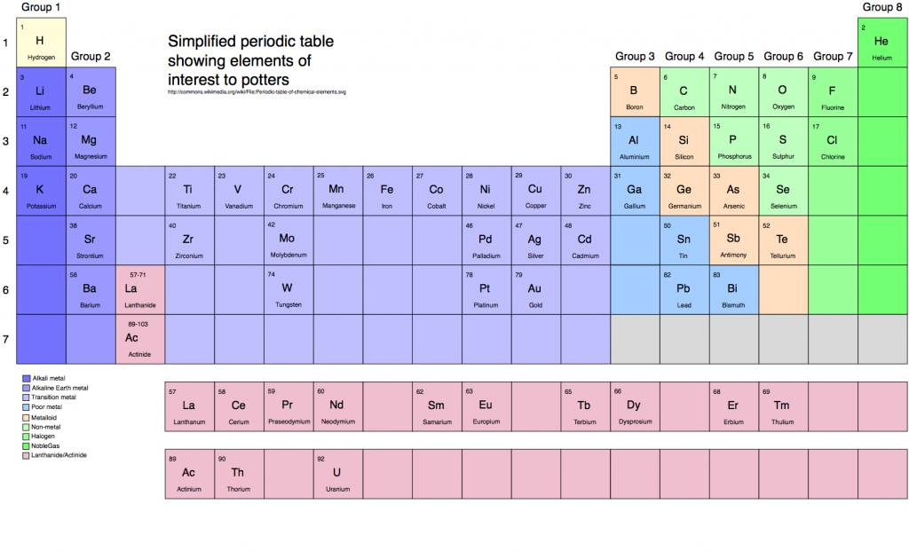
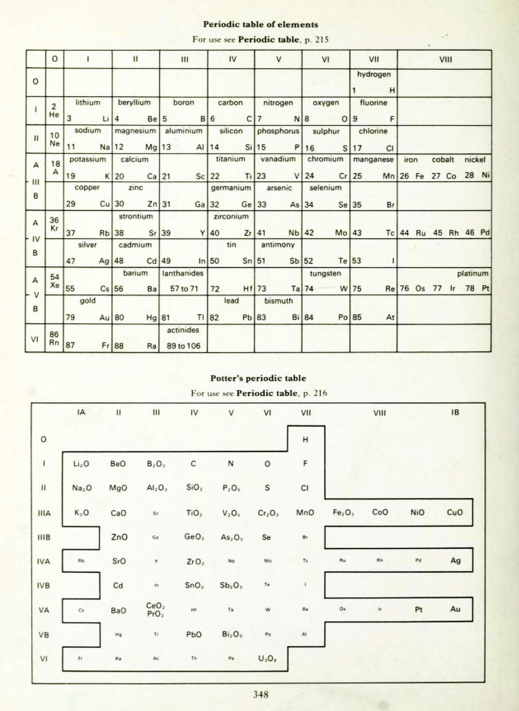

# Analyses

## The Periodic Table

### External Resources

[What Is the Importance of Color on the Periodic Table?](https://www.thoughtco.com/color-on-the-periodic-table-608827)  

[CPK coloring](https://en.wikipedia.org/wiki/CPK_coloring)

[Linda Bloomfield's Chemistry for potters](https://lindabloomfield.co.uk/news/chemistry-for-potters/) includes a Periodic Table for Potters (below)

[A Simplified Ceramic Chemistry Lesson](https://ceramicartsnetwork.org/daily/ceramic-glaze-recipes/glaze-chemistry/simplified-ceramic-chemistry-lesson/) by Linda Bloomfield

 

[The Potter's Dictionary of Materials and Techniques By Frank Hamer, Janet Hamer](https://books.google.com/books?id=TApnGTVLwxAC&printsec=frontcover#v=onepage&q&f=false)

 