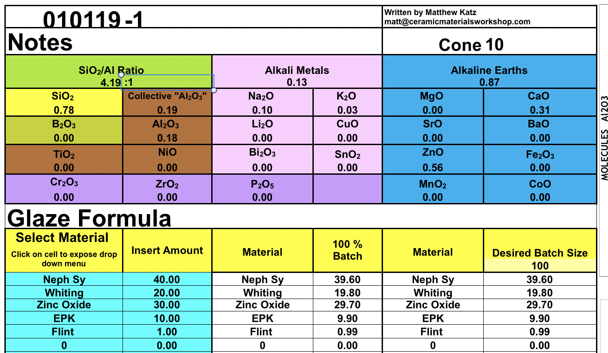
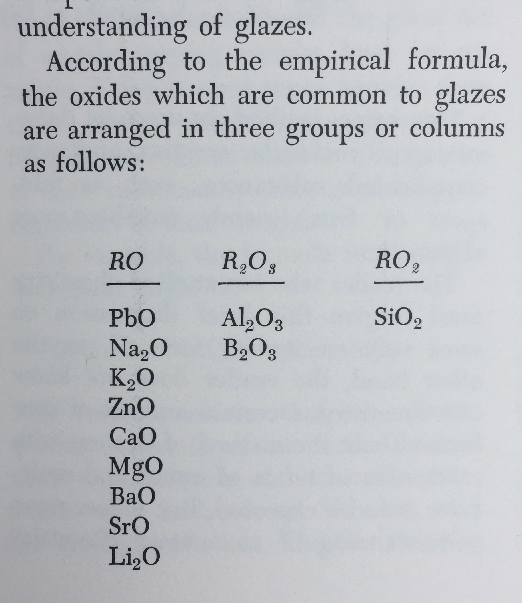
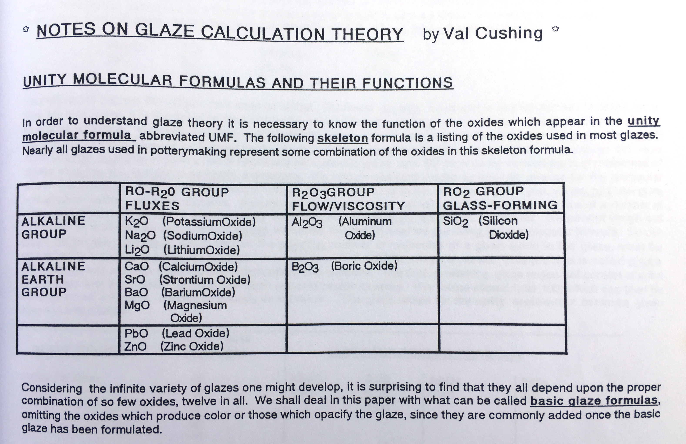
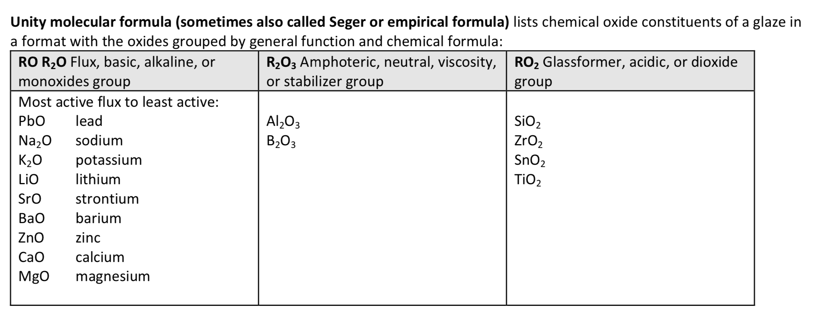
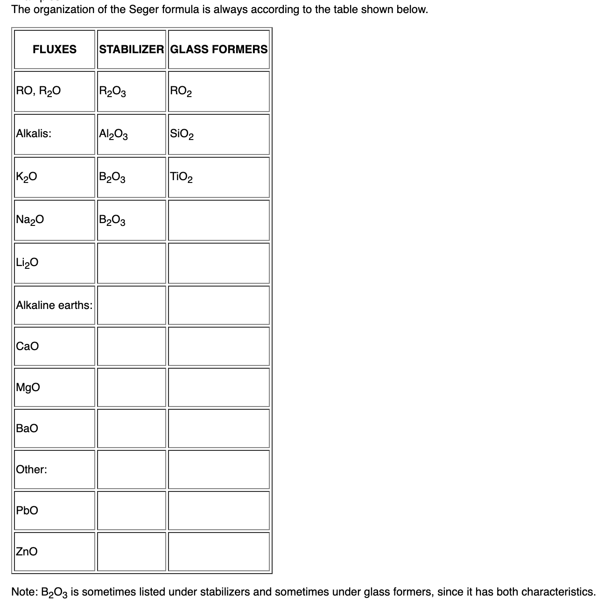

# Unity Molecular Formula (UMF)

The Unity Molecular Formula, or *UMF* or *Seger Formula*, is a very useful way to compare glaze recipes because the analysis is based on the number of molecules rather than weight, and it is  *unified* based on the *fluxes*.  Therefore we can compare the amounts of stabilizers, glass-formers, and other oxides in terms of the fluxes.  Its easy to compare different UMF analyses, as they are all unified in the same way.

Put in another way by Linda Arbuckle: 
>Silica is a glass former. Alumina modifies a glass. Fluxes reduce melting temperature. The Unity Molecular Formula (UMF) systematically relates these chemistries to each other in a useful glaze chemistry shorthand UMF shows the ratio of glass formers to fluxes and can be used to predict glaze behavior.

The fluxes are split into two different types: R2O (or Alkaline Metals) and RO (Alkaline Earths).

There are two versions of the UMF on Glazy.  The first is *traditional UMF*, which is the way most people (and glaze calculation software) have usually calculated UMF.

The second version is *Extended UMF*.  

### Traditional UMF Oxide Groups

R2O Group: Na2O, K2O, Li2O

RO Group: PbO, SrO, BaO, ZnO, CaO, MgO, MnO

R2O3 (Stabilizers) Group:  Al2O3

B2O3 (Special Case)

RO2 (Glass-Formers) Group: SiO2, ZrO2, SnO2, TiO2

Other Oxides: FeO, Fe2O3, MnO2, P2O5, F, CoO, Cr2O3, Cu2O, CuO, NiO, V2O5, ZrO, HfO2, Nb2O5, Ta2O5, MoO3, WO3, OsO2, IrO2, PtO2, Ag2O, Au2O3, GeO2, As2O3, Sb2O3, Bi2O3, SeO2, La2O3, CeO2, PrO2, Pr2O3, Nd2O3, U3O8, Sm2O3, Eu2O3, Tb2O3, Dy2O3, Ho2O3, Er2O3, Tm2O3, Yb2O3, Lu2O3

### Extended UMF

The “extended” UMF attempts to define roles for a broader range of oxides, for example CuO and CoO, that were previously viewed as secondary (e.g. “colorants”) and classified outside the unity as “other”. This version of the UMF is still a work in progress. It is based on the research of [Matthew Katz and Rose Katz from Ceramic Materials Workshop](https://www.ceramicmaterialsworkshop.com/online-classes.html). 

Rose Katz’s 2019 NCECA Lecture “COLORFORMS” discusses the roles of all major colorants:

<iframe width="560" height="315" src="https://www.youtube.com/embed/RWYCKFVy3qo" frameborder="0" allow="accelerometer; autoplay; encrypted-media; gyroscope; picture-in-picture" allowfullscreen></iframe>

Glazy's  "Extended" UMF comes directly from Matthew & Rose Katz's Experimental UMF Calculator.  [This spreadsheet calculator can be downloaded here.](https://www.ceramicmaterialsworkshop.com/umf-calculator.html) 

This Experimental Calculator is still a work in progress.  Glazy will be updated as new information comes to light.

### Extended UMF Oxide Groups

R2O Group: Na2O, K2O, Li2O, Bi2O3, CuO, SnO2

RO Group: PbO, SrO, BaO, ZnO, CaO, MgO, MnO, Fe2O3, MnO2, CoO

R2O3 (Stabilizers) Group:  Al2O3, TiO2, NiO

B2O3 (Special Case)

RO2 (Glass-Formers) Group: SiO2, ZrO2

Other Oxides: FeO, P2O5, F, Cr2O3, Cu2O, V2O5, ZrO, HfO2, Nb2O5, Ta2O5, MoO3, WO3, OsO2, IrO2, PtO2, Ag2O, Au2O3, GeO2, As2O3, Sb2O3, SeO2, La2O3, CeO2, PrO2, Pr2O3, Nd2O3, U3O8, Sm2O3, Eu2O3, Tb2O3, Dy2O3, Ho2O3, Er2O3, Tm2O3, Yb2O3, Lu2O3

https://www.youtube.com/watch?v=HyLjAg1_8_4

For more information about UMF and the importance of the flux ratio:

  * Linda Arbuckle's [Introduction to Glaze Calculation](http://lindaarbuckle.com/handouts/glaze-calc-intro.pdf)
  * [How Glazes Melt](http://mattanddavesclays.com/Science/Finkelnburg-NCECA%202012-PDF.pdf) by Dave Finkelnburg
  * Digitalfire's [Understanding Glaze Calculation](https://digitalfire.com/4sight/education/understanding_glaze_calculation_an_aid_to_potters_126.html)

## Oxides Used in Historical UMF Calculation

### Daniel Rhodes "Clay and Glazes for the Potter":

### Val Cushing's Handbook:

### Linda Arbuckle's Glaze Calc Handout

### Henrik Norsker, James Danisch: "Glazes for the Self-Reliant Potter"

