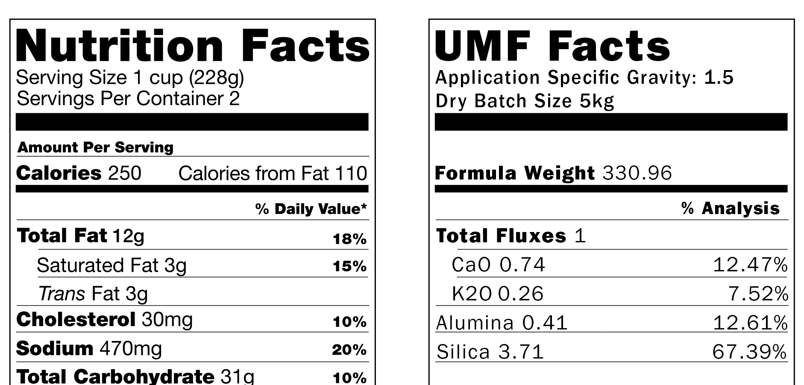

# Glaze Calculation

## Introduction

A glaze calculation works out the chemicals a particular glaze recipe contains.  You can take all the materials that make up a glaze, break them into their constituent parts and show them in proportion to one another.  This is rather like the nutrition information on a food packet - it shows what the recipe contains rather than the ingredients that made it.  Where food talks about carbohydrates, proteins, vitamins and minerals, glazes talk about silica, alumina, potassium and a host of other chemicals that produce the end result.  

This information is useful when trying to reformulate a glaze to use different materials, such as swapping one frit for another, or using a local feldspar.  It is also useful when trying to understand why a glaze behaves the way it does or to predict the way an untested glaze will look.

Linda Arbuckle explains it like this:
> The purpose of glaze calculation is to determine the total amount of each element present in a glaze, and the proportions relative to each other. With that information at hand, it is possible to calculate materials substitutions, revise melting points, and do other useful calculations. In the end, testing is the final proof, but unity molecular formula gives you a more informed method of choosing what to test.

# What makes a glaze?
Glazes may be thought of as a colorless glass, consisting of:

* glassformer - usually silica
* viscosity agent - often alumina
* flux (something that lowers the melting point) - Sodium, Calcium, Magnesium and many more

Some glaze materials are added in their pure form, such as lithium carbonate.  However, many glaze materials have a more complex composition.  These are classified as _composite materials_ and _compounds_.

* A _compound_ is a natural material that is made of a combination of differing elements.  For example, Potash Feldspar is a combination of K2O (Potassium Oxide), Al2O3 (Aluminium Oxide) and SiO2 (Silicon Dioxide).  Kaolin also falls into this category as does Gerstley Borate, Nepheline Syenite, Spodumene and many more.
* A Composite material is a man made material that combines more than one element, such a a frit, clay body or pre-mixed glaze.

## Oxides
Composite Materials & Compounds are made up of oxides joined in lattices.
TODO: Explain oxides.

## Molecular mass of common formulas

Moved to https://wiki.glazy.org/t/glaze-calculation-in-software/

## Materials

Here are four basic materials that can be combined to make a glaze:

* **Silica** is 100% SiO2
* **Potash Feldspar** is 64.8% SiO2, 18% Al2O3, and 17% K2O
* **Whiting** is 56.1% CaO
* **Kaolin** is 47.3 SiO2, 40.2 Al2O3

**Why don’t the numbers add up to 100%?**  

Because component elements like carbon in carbonate materials burn out, volatilise or materials revert to their basic oxide form which gives off gasses during firing, this is classed as Loss On Ignition (LOI).

Here are the materials again, this time with Loss On Ignition (LOI) included:

<table>
<thead>
<tr>
<th>Material</th>
<th>SiO2</th>
<th>Al2O3</th>
<th>CaO</th>
<th>K2O</th>
<th><em>KNaO</em></th>
<th>LOI</th>
<th>Total</th>
</tr>
</thead>
<tbody>
<tr>
<td>Silica</td>
<td>100%</td>
<td></td>
<td></td>
<td></td>
<td></td>
<td>0</td>
<td><i>100</i></td>
</tr>
<tr>
<td>Potash Feldspar</td>
<td>64.76%</td>
<td>18.32%</td>
<td></td>
<td>16.92%</td>
<td>16.92%</td>
<td></td>
<td><i>100</i></td>
</tr>
<tr>
<td>Whiting</td>
<td></td>
<td></td>
<td>56.10%</td>
<td></td>
<td></td>
<td>43.90</td>
<td><i>100</i></td>
</tr>
<tr>
<td>Kaolin</td>
<td>47.29%</td>
<td>40.21%</td>
<td></td>
<td></td>
<td></td>
<td>12.50</td>
<td><i>100</i></td>
</tr>
</tbody>
</table>

## Theoretical Materials

All material analyses are to some extent _theoretical_ in that they approximate actual real-world materials.  The actual materials we use in the studio come from various natural sources and contain impurities and inconsistencies.  For example, there are many types of Potash Feldspar, and each type has a different analysis.  Even within types of Potash Feldspar, there may be different analyses for different batches of material at different times.

Imagine you are at a grocery store but didn't know what to cook.  So you  and find the following recipe via an app on your phone:

**Roasted Delight**
_Ingredients:_
1 carrot
1 onion
1 pound of meat
1 teaspoon of salt
1 teaspoon of pepper

What does "1 pound of meat" mean?  It could be steak, chicken, or fish, and the final dish would be much different with each type.  You see in the recipe reviews that people used fish, but they didn't mention what type of fish.  Freshwater, saltwater?

Just as with our fictional "Roasted Delight" recipe, some older glaze recipes just list "Feldspar" (meat) or "Potash Feldspar" (fish).  

**A sample of analyses for Custer Feldspar, a type of Potash Feldspar:**

<table>
<thead>
<tr>
<th>Ingredient</th>
<th>Type</th>
<th>Parent</th>
<th>SiO2</th>
<th>Al2O3</th>
<th>MgO</th>
<th>CaO</th>
<th>K2O</th>
<th>Na2O</th>
<th>P2O5</th>
<th>Fe2O3</th>
<th>LOI</th>
</tr>
</thead>
<tbody>
<tr>
<td><a href="https://glazy.org/materials/131">Custer Feldspar</a></td>
<td>Feldspar</td>
<td><a href="https://glazy.org/materials/371">Potash Feldspar</a></td>
<td>68.50</td>
<td>17.00</td>
<td>&nbsp;</td>
<td>0.30</td>
<td>10.00</td>
<td>3.00</td>
<td>&nbsp;</td>
<td>0.10</td>
<td>0.30</td>
</tr>
<tr>
<td><a href="https://glazy.org/materials/657">Custer Feldspar (1989)</a></td>
<td>Feldspar</td>
<td><a href="https://glazy.org/materials/371">Potash Feldspar</a></td>
<td>68.64</td>
<td>17.39</td>
<td>&nbsp;</td>
<td>0.30</td>
<td>10.36</td>
<td>3.02</td>
<td>&nbsp;</td>
<td>&nbsp;</td>
<td>0.30</td>
</tr>
<tr>
<td><a href="https://glazy.org/materials/891">Custer Feldspar (2000-2012 Ron Roy)</a></td>
<td>Feldspar</td>
<td><a href="https://glazy.org/materials/371">Potash Feldspar</a></td>
<td>72.40</td>
<td>15.27</td>
<td>0.07</td>
<td>0.27</td>
<td>7.52</td>
<td>3.21</td>
<td>0.20</td>
<td>0.21</td>
<td>0.65</td>
</tr>
<tr>
<td><a href="https://glazy.org/materials/782">Custer Feldspar (pre-2000)</a></td>
<td>Feldspar</td>
<td><a href="https://glazy.org/materials/371">Potash Feldspar</a></td>
<td>68.70</td>
<td>17.25</td>
<td>0.05</td>
<td>0.18</td>
<td>10.06</td>
<td>3.04</td>
<td>0.31</td>
<td>0.12</td>
<td>0.66</td>
</tr>
</tbody>
</table>

When working with actual materials in the studio, it's best to use the most accurate analysis you can find for each material.

**Explain KNaO**

## Glaze Recipes

Imagine the following recipe for Macaroni & Cheese:

**Servings:** 4
**Units:** US
**Ingredients:**
* 8 ounces elbow macaroni
* 1⁄4 cup butter
* 1⁄4 cup flour
* 1⁄2 teaspoon salt
* 1 dash black pepper
* 2 cups milk
* 2 cups shredded cheddar cheese

Glaze recipes are similar to food recipes.

As an example we will use a commonly referenced recipe, **Leach 4321**.  Leach 4321 is so named because the recipe amounts are easy to remember (40%, 30%, 20%, and 10%).  Using the materials from above:

**Leach 4321:**
_Orton cone 9-10, Oxidation or Reduction_

<table>
<thead>
<tr>
<th>Ingredient</th>
<th>Amount</th>
</tr>
</thead>
<tbody>
<tr>
<td>Potash Feldspar</td>
<td>40%</td>
</tr>
<tr>
<td>Silica</td>
<td>30%</td>
</tr>
<tr>
<td>Whiting</td>
<td>20%</td>
</tr>
<tr>
<td>Kaolin</td>
<td>10%</td>
</tr>
<tr>
<th>Total</th>
<th>100%</th>
</tr>
</tbody>
</table>

Just as a Macaroni & Cheese recipe would describe how the ingredients should be prepared, glaze recipes also specify both a _temperature range_ (measured by Orton cone) as well as _atmosphere type_ (in this case, the glaze can be fired in either oxidation or reduction).  Other preparation notes are commonly added to glaze recipes, such as the best specific gravity and application type (e.g. pouring, spraying).

## Benefits of 100% format

_From Linda Arbuckle:_

The usual convention is to represent a glaze recipe in 100% batch form, with colorants, opacifiers, and conditioning agents (e.g. gums, bentonite, etc.) listed as additions to the basic 100% glaze. Please see the handout on calculating 100% format. Advantages of the 100% format:
* glazes are more easily compared in uniform format
* calculation of percent additions like colorants easier with 100 unit base

## Weight Units

Glaze recipes are not given in any specific weight units. The recipe can be weighed up in any units, as long as the same unit is used throughout, and the proportions of materials will be equivalent and yield the appropriate result.

## % Analysis

Show how percentage weight analysis is calculated with Leach 4321
Explain roles of various oxides in Leach 4321

To calculate the percentage analysis for Leach 4321, for each material multiply each oxide by the percentage amount.

First, let's start with Potash Feldspar.  Potash Feldspar's analysis is:

<table>
<thead>
<tr>
<th>Ingredient</th>
<th>SiO2</th>
<th>Al2O3</th>
<th>K2O</th>
<th><em>LOI</em></th>
</tr>
</thead>
<tbody>
<tr>
<td>Potash Feldspar</td>
<td>64.76%</td>
<td>18.32%</td>
<td>16.92%</td>
<td>0</td>
</tr>
</tbody>
</table>

For each oxide in Potash Feldspar, multiply by the amount (40%, or .40):

SiO2 (Silica) is 64.76 x .4 = 25.904
Al2O3 (Alumina) is 18.32 x .4 = 7.328
K2O (Potassium) is 16.92 x .4 = 6.768
Loss On Ignition (LOI) is 0 x .4 = 0

**Leach 4321 Percentage analysis for Potash Feldspar**

<table>
<thead>
<tr>
<th>Ingredient</th>
<th>Amount</th>
<th>SiO2</th>
<th>Al2O3</th>
<th>CaO</th>
<th>K2O</th>
<th><em>KNaO</em></th>
<th><em>LOI</em></th>
</tr>
</thead>
<tbody>
<tr>
<td><a href="https://glazy.org/materials/371">Potash Feldspar</a></td>
<td>40</td>
<td>25.9</td>
<td>7.33</td>
<td></td>
<td>6.77</td>
<td><em>6.77</em></td>
<td><em></em></td></tr>
</tbody>
</table>

**Completed Leach 4321 Percentage Analysis:**

<table>
<thead>
<tr>
<th>Ingredient</th>
<th>Amount</th>
<th>SiO2</th>
<th>Al2O3</th>
<th>CaO</th>
<th>K2O</th>
<th><em>KNaO</em></th>
<th><em>LOI</em></th>
</tr>
</thead>
<tbody>
<tr>
<td><a href="https://glazy.org/materials/371">Potash Feldspar</a></td>
<td>40</td>
<td>25.9</td>
<td>7.33</td>
<td></td>
<td>6.77</td>
<td><em>6.77</em></td>
<td><em></em></td></tr>
<tr>
<td><a href="https://glazy.org/materials/400">Silica</a></td>
<td>30</td>
<td>30</td>
<td></td>
<td></td>
<td></td>
<td><em></em></td>
<td><em></em></td></tr>
<tr>
<td><a href="https://glazy.org/materials/457">Whiting</a></td>
<td>20</td>
<td></td>
<td></td>
<td>11.22</td>
<td></td>
<td><em></em></td>
<td><em>8.78</em></td></tr>
<tr>
<td><a href="https://glazy.org/materials/288">Kaolin</a></td>
<td>10</td>
<td>4.73</td>
<td>4.02</td>
<td></td>
<td></td>
<td><em></em></td>
<td><em>1.25</em></td></tr>
<tr>
<td>Total</td>
<td>100</td>
<td>60.63</td>
<td>11.35</td>
<td>11.22</td>
<td>6.77</td>
<td><em>6.77</em></td>
<td><em>10.03</em></td></tr>
<tr>
<td>100% no LOI</td>
<td>&nbsp;</td>
<td>67.39</td>
<td>12.61</td>
<td>12.47</td>
<td>7.52</td>
<td><em>7.52</em></td>
<td><em></em></td></tr>        
</tbody>
</table>

Explain mol vs. weight

## Mole %

Show how to calculate Mol percent using Leach 4321
Explain differences from % analysis
Explain UMF, Seger, etc.

## UMF

For UMF, unify using the following oxides:

	Li2O
	Na2O
	K2O
	MgO
	CaO
	SrO
	BaO
	ZnO
	PbO
	FeO
	MnO

UMF Unity oxides in various software programs:

<table>
<thead>
<tr>
<th>Program</th>
<th>Li2O</th>
<th>Na2O</th>
<th>K2O</th>
<th>MgO</th>
<th>CaO</th>
<th>SrO</th>
<th>BaO</th>
<th>ZnO</th>
<th>PbO</th>
<th>FeO</th>
<th>MnO</th>
<th>CuO</th>
<th>CoO</th>
<th>NiO</th>
<th>P2O5</th>
<th>Notes</th>
</tr>
</thead>
<tbody>
<tr>
<td><em>Desktop Insight</em></th>
<td>Li2O</td>
<td>Na2O</td>
<td>K2O</td>
<td>MgO</td>
<td>CaO</td>
<td>SrO</td>
<td>BaO</td>
<td>ZnO</td>
<td>PbO</td>
<td></td>
<td></td>
<td></td>
<td></td>
<td></td>
<td>P2O5</td>
<td>I think can be modified?</td>
</tr>
<tr>
<td><em>Matrix</em></th>
<td>Li2O</td>
<td>Na2O (as KNO)</td>
<td>K2O (as KNO)</td>
<td>MgO</td>
<td>CaO</td>
<td>SrO</td>
<td>BaO</td>
<td>ZnO</td>
<td>PbO</td>
<td></td>
<td></td>
<td></td>
<td></td>
<td></td>
<td></td>
<td>Unity oxides can be changed.  Can also include colorants and B2O3.</td>
</tr>
<tr>
<td><em>GlazeMaster</em></th>
<td>Li2O</td>
<td>Na2O</td>
<td>K2O</td>
<td>MgO</td>
<td>CaO</td>
<td>SrO</td>
<td>BaO</td>
<td>ZnO</td>
<td>PbO</td>
<td>?</td>
<td>?</td>
<td>?</td>
<td>?</td>
<td>?</td>
<td></td>
<td>?</td>
</tr>
<tr>
<td><em>HyperGlaze</em></th>
<td>Li2O</td>
<td>Na2O</td>
<td>K2O</td>
<td>MgO</td>
<td>CaO</td>
<td>SrO</td>
<td>BaO</td>
<td>ZnO</td>
<td>PbO</td>
<td></td>
<td></td>
<td>CuO</td>
<td>CoO</td>
<td>NiO</td>
<td></td>
<td>Unity oxides can be changed.  Can also include colorants and B2O3.</td>
</tr>
<tr>
<td><em>Matt Katz's Spreadsheet</em></th>
<td>Li2O</td>
<td>Na2O</td>
<td>K2O</td>
<td>MgO</td>
<td>CaO</td>
<td>SrO</td>
<td>BaO</td>
<td>ZnO</td>
<td></td>
<td></td>
<td></td>
<td></td>
<td></td>
<td></td>
<td></td>
<td></td>
</tr>
<tr>
<td><em>Glazy</em></th>
<td>Li2O</td>
<td>Na2O</td>
<td>K2O</td>
<td>MgO</td>
<td>CaO</td>
<td>SrO</td>
<td>BaO</td>
<td>ZnO</td>
<td>PbO</td>
<td>FeO ?</td>
<td>MnO ?</td>
<td></td>
<td></td>
<td></td>
<td></td>
<td>Unity oxides cannot be changed.</td>
</tr>
</tbody>
</table>

https://youtu.be/HyLjAg1_8_4
