# Temperature and Heatwork

## What are cones?

Firing ceramics in a kiln is a bit like cooking a pizza in the oven.  As with Italian wood-fired stoves, you could set your oven on very high heat and cook the pizza in just four minutes.  Or you could cook the pizza for a longer amount of time at lower heat.  Either way, you'll end up with edible pizza.

Pyrometric cones are a measurement of the total amount of _heatwork_.  _Heatwork_ is the combination of time _and_ temperature.  We can say that two pizzas received a similar amount of heatwork if they are both fully cooked, even if they were cooked at different temperatures for different durations of time.  Similarly, we can say that two ceramic vases were fired to a certain _cone_ (e.g. similar amount of heatwork) even if the firings were different in temperature & time.

It's important to note that firings are often _uneven_: a kiln may have cool and hot spots, and the difference in temperature may be one or more cones.  Just because a cone has fallen doesn't mean the entire kiln (including the ceramics and kiln furniture) has also reached that cone temperature.  So it's a good idea to sometimes place extra cones throughout the kiln to determine if the firing is even.

For more information on cones, see the excellent Digitalfire article
[Interpreting Orton Cones](https://digitalfire.com/4sight/education/interpreting_orton_cones_193.html) as well as Orton's [Pyrometric Cones Resources](https://www.ortonceramic.com/Resources/Pyrometric_Cones/).

## Setting & Reading Cones

_The quantity of cones and cone packs as well as their arrangement and placement vary from potter to potter, kiln to kiln. The following is only one approach._

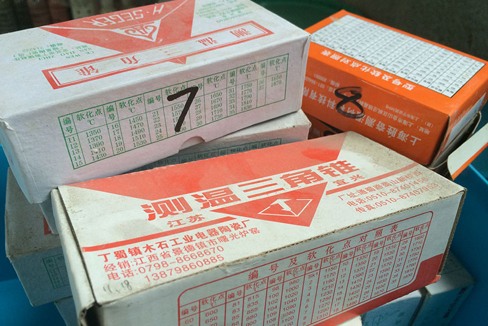

There are a number of different cone manufacturers. Each brand has unique cone formulations and firing characteristics. Cone numbers between brands may be quite different, for instance the Chinese "Seger" cone 9 is approximately Orton cone 12. Even when cone numbers between brands are rated for the same temperature, actual firing behaviour may be quite different. Glazy recommends using Orton cones as they seem to be the most reliable and accurate.

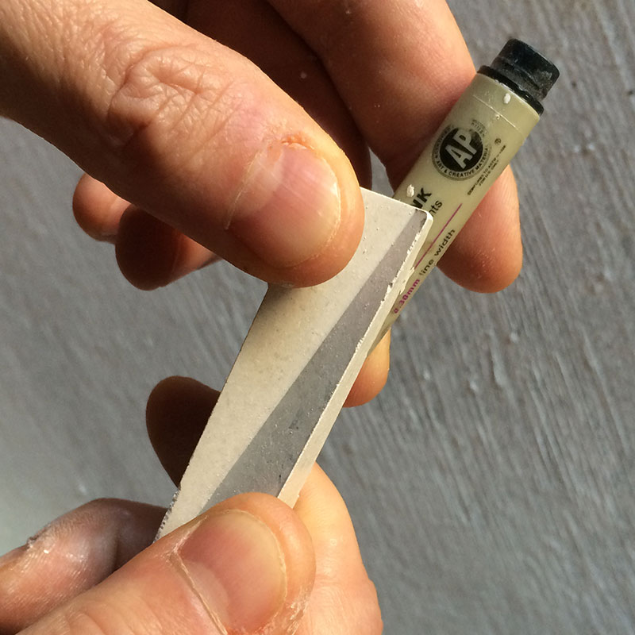
_Breaking apart pairs of Orton cones using a cylindrical support._

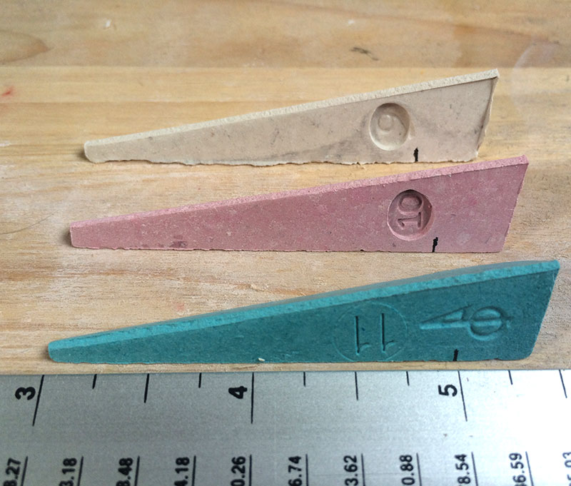
_Length of large cones above cone plaque._

According to Orton:

> "Large Cones are normally mounted so exactly 2" of the cone is exposed above the top of the cone plaque or clay pat. Small Cones are mounted so that 15/16" of the cone is exposed above the top of the plaque or pat."

Measure your cones and memorize how deeply they should be mounted.

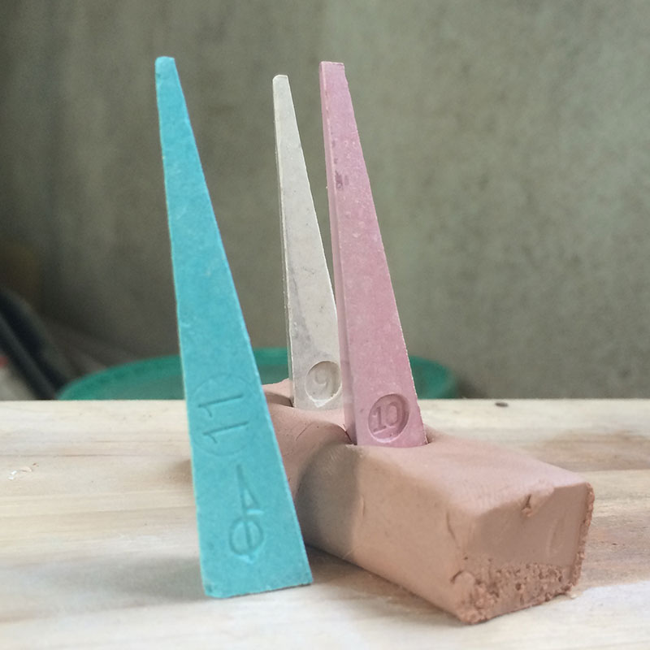
_After flattening a coil of clay, push cones downwards so that the angle is identical with a cone placed directly on the flat surface._

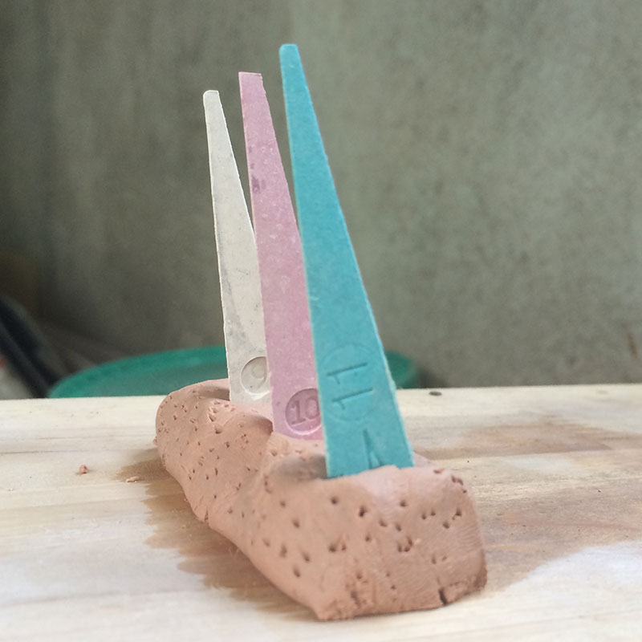
_Wet cone packs can explode.  Make your packs in advance or poke holes into the pack to let steam to escape._

This cone pack is for an Orton cone 10 firing.

The _guide_ cone 9 will alert us when we are close to temperature.
The _guard_ cone 11 will let us know if we are beginning to overfire.

While more expensive, pre-made cone plaques and self-supporting cones eliminate height and angle inconsistencies.

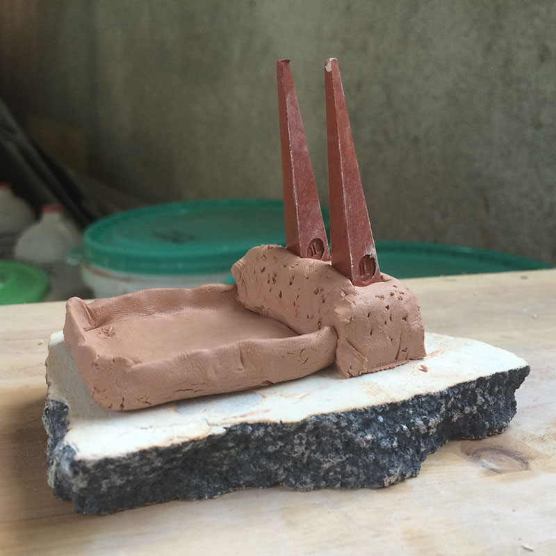
_For mid and high fire, a "boat" is made to catch low-temperature cones.  This boat is a folded slab._

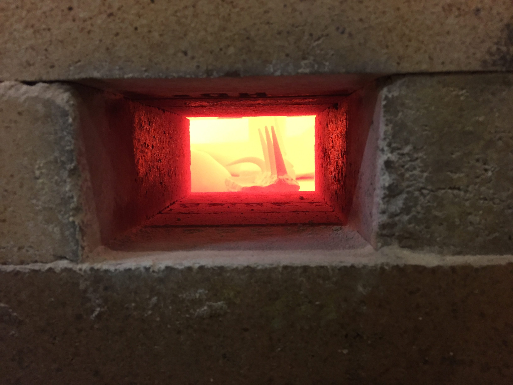
_Viewing low-temperature cones in the kiln at about 900°C. Cone 010 is bending, while 08, 1, and 3 have not moved. It's advisable to place cone packs at the top and bottom of your kiln in order to understand and control temperature differences while firing._

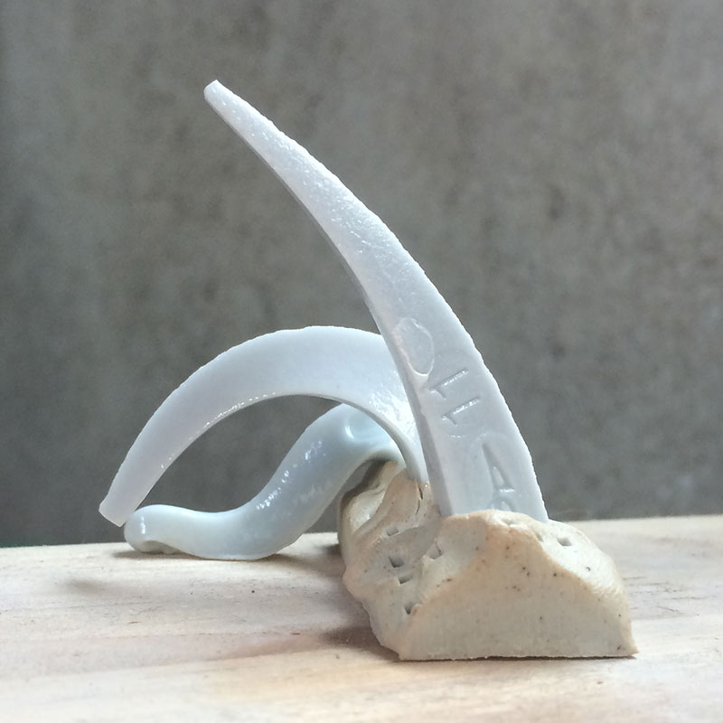
_A cone pack after firing. In this firing, once cone 9 fell to 5 o'clock the kiln was intentionally stalled. Even though the temperature did not rise, cone 10 completely fell after about one hour. Cones measure **heatwork**, the effect of both temperature **and** time._

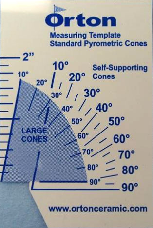
The [Orton Cone Template](https://www.ortonceramic.com/en/Cone%20Template%20Centigrade/cat/13150) can be used to determine the degree of deformation for Orton cones.

_Inexpensive Chinese cones.  Cones 7 and 9 are down, but cone 8 is still standing. The entire box of cones should be thrown away.  But which cone is defective, 8 or 9? Compared to the cost of a firing and the work inside, the cost of cones is negligible. Buy the most reliable cones you can find._

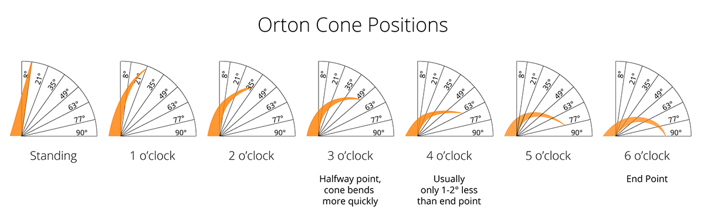

Download PDF chart of Orton Cone positions:
<a class="attachment" href="./img/ConeDiagram2.pdf">Color</a> (566.2 KB)
<a class="attachment" href="./img/ConeDiagramPrintA4.pdf">A4 Black & White</a> (78.2 KB)

## Viewing Cones

_Warning: Prolonged or cumulative long-term exposure to infrared and ultraviolet light can seriously damage your eyes._

ANSI-compliant infrared and ultraviolet eye-protection glasses are a must when viewing
inside the kiln at high temperatures.

**Sunglasses that only filter ultraviolet light are NOT sufficient.**

For more information, see [Eye Protection in the Pottery Studio](http://ceramicartsdaily.org/uncategorized/eye-protection-in-the-pottery-studio/)

There are many tricks for seeing cones more clearly inside the kiln.

The simplest method is using a high-intensity LED flashlight with an output of at least 400 lumens and a focused beam.

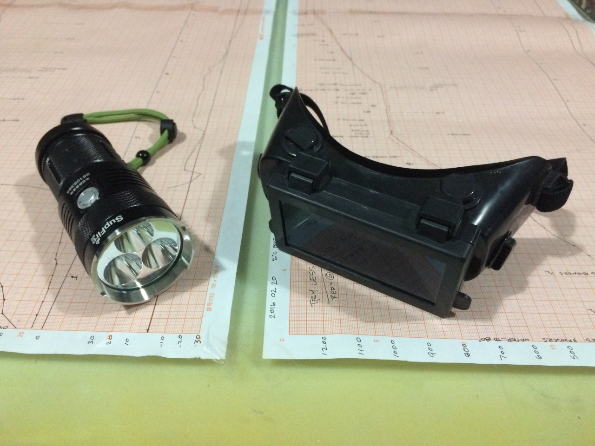
_#5 welding goggles and 2000 lumens LED flashlight._

## Temperature Equivalent Charts for Cones

References:
* [Orton - Pyrometric Cones](https://www.ortonceramic.com/Resources/Pyrometric_Cones/)
* [Digitalfire - Interpreting Orton Cones](http://digitalfire.com/4sight/education/interpreting_orton_cones_193.html)

## Orton Pyrometric Cones Celsius (°C)
                    
<table class="table table-striped table-bordered table-hover table-condensed">
<thead>
<tr>
<th></th>
<th colspan="6">Self Supporting Cones</th>
<th colspan="4">Large Cones</th>
<th colspan="1">Small Cones</th>
</tr>
<tr>
<th></th>
<th class="info" colspan="3"><small>Regular</small></th>
<th colspan="3"><small>Iron Free</small></th>
<th class="info" colspan="2"><small>Regular</small></th>
<th colspan="2"><small>Iron Free</small></th>
<th class="info" colspan="1"><small>Regular</small></th>
</tr>
<tr>
<th></th>
<th colspan="10"><small><em>Heating Rate  ̊C/hour (last 100 ̊C of firing)</em></small></th>
<th></th>
</tr>
<tr>
<th><small>Cone</small></th>
<th class="info"><small>15</small></th>
<th class="info"><small>60</small></th>
<th class="info"><small>150</small></th>
<th><small>15</small></th>
<th><small>60</small></th>
<th><small>150</small></th>
<th class="info"><small>60</small></th>
<th class="info"><small>150</small></th>
<th><small>60</small></th>
<th><small>150</small></th>
<th class="info"><small>300</small></th>
</tr>
</thead>
<tbody>
<tr>
<td style="background-color: #CC0000;"><strong>022</strong></td> <!-- Cone -->
<td class="info"></td> <!-- Regular 15 -->
<td class="info">586</td> <!-- Regular 60 -->
<td class="info">590</td> <!-- Regular 150 -->
<td>&nbsp;</td> <!-- Iron Free 15 -->
<td>&nbsp;</td> <!-- Iron Free 60 -->
<td>&nbsp;</td> <!-- Iron Free 150 -->
<td class="info">N/A</td> <!-- Regular 60 -->
<td class="info">N/A</td> <!-- Regular 150 -->
<td>&nbsp;</td> <!-- Iron Free 60 -->
<td>&nbsp;</td> <!-- Iron Free 150 -->
<td class="info">630</td> <!-- Regular 300-->
</tr>
<tr>
<td style="background-color: #D30000;"><strong>021</strong></td> <!-- Cone -->
<td class="info"></td> <!-- Regular 15 -->
<td class="info">600</td> <!-- Regular 60 -->
<td class="info">617</td> <!-- Regular 150 -->
<td>&nbsp;</td> <!-- Iron Free 15 -->
<td>&nbsp;</td> <!-- Iron Free 60 -->
<td>&nbsp;</td> <!-- Iron Free 150 -->
<td class="info">N/A</td> <!-- Regular 60 -->
<td class="info">N/A</td> <!-- Regular 150 -->
<td>&nbsp;</td> <!-- Iron Free 60 -->
<td>&nbsp;</td> <!-- Iron Free 150 -->
<td class="info">643</td> <!-- Regular 300-->
</tr>
<tr>
<td style="background-color: #D60000;"><strong>020</strong></td> <!-- Cone -->
<td class="info"></td> <!-- Regular 15 -->
<td class="info">626</td> <!-- Regular 60 -->
<td class="info">638</td> <!-- Regular 150 -->
<td>&nbsp;</td> <!-- Iron Free 15 -->
<td>&nbsp;</td> <!-- Iron Free 60 -->
<td>&nbsp;</td> <!-- Iron Free 150 -->
<td class="info">N/A</td> <!-- Regular 60 -->
<td class="info">N/A</td> <!-- Regular 150 -->
<td>&nbsp;</td> <!-- Iron Free 60 -->
<td>&nbsp;</td> <!-- Iron Free 150 -->
<td class="info">666</td> <!-- Regular 300-->
</tr>
<tr>
<td style="background-color: #D90000;"><strong>019</strong></td> <!-- Cone -->
<td class="info">656</td> <!-- Regular 15 -->
<td class="info">678</td> <!-- Regular 60 -->
<td class="info">695</td> <!-- Regular 150 -->
<td>&nbsp;</td> <!-- Iron Free 15 -->
<td>&nbsp;</td> <!-- Iron Free 60 -->
<td>&nbsp;</td> <!-- Iron Free 150 -->
<td class="info">676</td> <!-- Regular 60 -->
<td class="info">693</td> <!-- Regular 150 -->
<td>&nbsp;</td> <!-- Iron Free 60 -->
<td>&nbsp;</td> <!-- Iron Free 150 -->
<td class="info">723</td> <!-- Regular 300-->
</tr>
<tr>
<td style="background-color: #DD0000;"><strong>018</strong></td> <!-- Cone -->
<td class="info">686</td> <!-- Regular 15 -->
<td class="info">715</td> <!-- Regular 60 -->
<td class="info">734</td> <!-- Regular 150 -->
<td>&nbsp;</td> <!-- Iron Free 15 -->
<td>&nbsp;</td> <!-- Iron Free 60 -->
<td>&nbsp;</td> <!-- Iron Free 150 -->
<td class="info">712</td> <!-- Regular 60 -->
<td class="info">732</td> <!-- Regular 150 -->
<td>&nbsp;</td> <!-- Iron Free 60 -->
<td>&nbsp;</td> <!-- Iron Free 150 -->
<td class="info">752</td> <!-- Regular 300-->
</tr>
<tr>
<td style="background-color: #E30000;"><strong>017</strong></td> <!-- Cone -->
<td class="info">705</td> <!-- Regular 15 -->
<td class="info">738</td> <!-- Regular 60 -->
<td class="info">763</td> <!-- Regular 150 -->
<td>&nbsp;</td> <!-- Iron Free 15 -->
<td>&nbsp;</td> <!-- Iron Free 60 -->
<td>&nbsp;</td> <!-- Iron Free 150 -->
<td class="info">736</td> <!-- Regular 60 -->
<td class="info">761</td> <!-- Regular 150 -->
<td>&nbsp;</td> <!-- Iron Free 60 -->
<td>&nbsp;</td> <!-- Iron Free 150 -->
<td class="info">784</td> <!-- Regular 300-->
</tr>
<tr>
<td style="background-color: #E60000;"><strong>016</strong></td> <!-- Cone -->
<td class="info">742</td> <!-- Regular 15 -->
<td class="info">772</td> <!-- Regular 60 -->
<td class="info">796</td> <!-- Regular 150 -->
<td>&nbsp;</td> <!-- Iron Free 15 -->
<td>&nbsp;</td> <!-- Iron Free 60 -->
<td>&nbsp;</td> <!-- Iron Free 150 -->
<td class="info">769</td> <!-- Regular 60 -->
<td class="info">794</td> <!-- Regular 150 -->
<td>&nbsp;</td> <!-- Iron Free 60 -->
<td>&nbsp;</td> <!-- Iron Free 150 -->
<td class="info">825</td> <!-- Regular 300-->
</tr>
<tr>
<td style="background-color: #E90000;"><strong>015</strong></td> <!-- Cone -->
<td class="info">750</td> <!-- Regular 15 -->
<td class="info">791</td> <!-- Regular 60 -->
<td class="info">818</td> <!-- Regular 150 -->
<td>&nbsp;</td> <!-- Iron Free 15 -->
<td>&nbsp;</td> <!-- Iron Free 60 -->
<td>&nbsp;</td> <!-- Iron Free 150 -->
<td class="info">788</td> <!-- Regular 60 -->
<td class="info">816</td> <!-- Regular 150 -->
<td>&nbsp;</td> <!-- Iron Free 60 -->
<td>&nbsp;</td> <!-- Iron Free 150 -->
<td class="info">843</td> <!-- Regular 300-->
</tr>
<tr>
<td style="background-color: #EE0000;"><strong>014</strong></td> <!-- Cone -->
<td class="info">757</td> <!-- Regular 15 -->
<td class="info">807</td> <!-- Regular 60 -->
<td class="info">838</td> <!-- Regular 150 -->
<td>&nbsp;</td> <!-- Iron Free 15 -->
<td>&nbsp;</td> <!-- Iron Free 60 -->
<td>&nbsp;</td> <!-- Iron Free 150 -->
<td class="info">807</td> <!-- Regular 60 -->
<td class="info">836</td> <!-- Regular 150 -->
<td>&nbsp;</td> <!-- Iron Free 60 -->
<td>&nbsp;</td> <!-- Iron Free 150 -->
<td class="info">870</td> <!-- Regular 300-->
</tr>
<tr>
<td style="background-color: #F60000;"><strong>013</strong></td> <!-- Cone -->
<td class="info">807</td> <!-- Regular 15 -->
<td class="info">837</td> <!-- Regular 60 -->
<td class="info">861</td> <!-- Regular 150 -->
<td>&nbsp;</td> <!-- Iron Free 15 -->
<td>&nbsp;</td> <!-- Iron Free 60 -->
<td>&nbsp;</td> <!-- Iron Free 150 -->
<td class="info">837</td> <!-- Regular 60 -->
<td class="info">859</td> <!-- Regular 150 -->
<td>&nbsp;</td> <!-- Iron Free 60 -->
<td>&nbsp;</td> <!-- Iron Free 150 -->
<td class="info">880</td> <!-- Regular 300-->
</tr>
<tr>
<td style="background-color: #FF0000;"><strong>012</strong></td> <!-- Cone -->
<td class="info">843</td> <!-- Regular 15 -->
<td class="info">861</td> <!-- Regular 60 -->
<td class="info">882</td> <!-- Regular 150 -->
<td>&nbsp;</td> <!-- Iron Free 15 -->
<td>&nbsp;</td> <!-- Iron Free 60 -->
<td>&nbsp;</td> <!-- Iron Free 150 -->
<td class="info">858</td> <!-- Regular 60 -->
<td class="info">880</td> <!-- Regular 150 -->
<td>&nbsp;</td> <!-- Iron Free 60 -->
<td>&nbsp;</td> <!-- Iron Free 150 -->
<td class="info">900</td> <!-- Regular 300-->
</tr>
<tr>
<td style="background-color: #FF2200;"><strong>011</strong></td> <!-- Cone -->
<td class="info">857</td> <!-- Regular 15 -->
<td class="info">875</td> <!-- Regular 60 -->
<td class="info">894</td> <!-- Regular 150 -->
<td>&nbsp;</td> <!-- Iron Free 15 -->
<td>&nbsp;</td> <!-- Iron Free 60 -->
<td>&nbsp;</td> <!-- Iron Free 150 -->
<td class="info">873</td> <!-- Regular 60 -->
<td class="info">892</td> <!-- Regular 150 -->
<td>&nbsp;</td> <!-- Iron Free 60 -->
<td>&nbsp;</td> <!-- Iron Free 150 -->
<td class="info">915</td> <!-- Regular 300-->
</tr>
<tr>
<td style="background-color: #FF4400;"><strong>010</strong></td> <!-- Cone -->
<td class="info">891</td> <!-- Regular 15 -->
<td class="info">903</td> <!-- Regular 60 -->
<td class="info">915</td> <!-- Regular 150 -->
<td>871</td> <!-- Iron Free 15 -->
<td>886</td> <!-- Iron Free 60 -->
<td>893</td> <!-- Iron Free 150 -->
<td class="info">898</td> <!-- Regular 60 -->
<td class="info">913</td> <!-- Regular 150 -->
<td>884</td> <!-- Iron Free 60 -->
<td>891</td> <!-- Iron Free 150 -->
<td class="info">919</td> <!-- Regular 300-->
</tr>
<tr>
<td style="background-color: #FF5500;"><strong>09</strong></td> <!-- Cone -->
<td class="info">907</td> <!-- Regular 15 -->
<td class="info">920</td> <!-- Regular 60 -->
<td class="info">930</td> <!-- Regular 150 -->
<td>899</td> <!-- Iron Free 15 -->
<td>919</td> <!-- Iron Free 60 -->
<td>928</td> <!-- Iron Free 150 -->
<td class="info">917</td> <!-- Regular 60 -->
<td class="info">928</td> <!-- Regular 150 -->
<td>917</td> <!-- Iron Free 60 -->
<td>926</td> <!-- Iron Free 150 -->
<td class="info">955</td> <!-- Regular 300-->
</tr>
<tr>
<td style="background-color: #FF6600;"><strong>08</strong></td> <!-- Cone -->
<td class="info">922</td> <!-- Regular 15 -->
<td class="info">942</td> <!-- Regular 60 -->
<td class="info">956</td> <!-- Regular 150 -->
<td>924</td> <!-- Iron Free 15 -->
<td>946</td> <!-- Iron Free 60 -->
<td>957</td> <!-- Iron Free 150 -->
<td class="info">942</td> <!-- Regular 60 -->
<td class="info">954</td> <!-- Regular 150 -->
<td>945</td> <!-- Iron Free 60 -->
<td>955</td> <!-- Iron Free 150 -->
<td class="info">983</td> <!-- Regular 300-->
</tr>
<tr>
<td style="background-color: #FF7700;"><strong>07</strong></td> <!-- Cone -->
<td class="info">962</td> <!-- Regular 15 -->
<td class="info">976</td> <!-- Regular 60 -->
<td class="info">987</td> <!-- Regular 150 -->
<td>953</td> <!-- Iron Free 15 -->
<td>971</td> <!-- Iron Free 60 -->
<td>982</td> <!-- Iron Free 150 -->
<td class="info">973</td> <!-- Regular 60 -->
<td class="info">985</td> <!-- Regular 150 -->
<td>970</td> <!-- Iron Free 60 -->
<td>980</td> <!-- Iron Free 150 -->
<td class="info">1008</td> <!-- Regular 300-->
</tr>
<tr>
<td style="background-color: #FF8800;"><strong>06</strong></td> <!-- Cone -->
<td class="info">981</td> <!-- Regular 15 -->
<td class="info">998</td> <!-- Regular 60 -->
<td class="info">1013</td> <!-- Regular 150 -->
<td>969</td> <!-- Iron Free 15 -->
<td>991</td> <!-- Iron Free 60 -->
<td>998</td> <!-- Iron Free 150 -->
<td class="info">995</td> <!-- Regular 60 -->
<td class="info">1011</td> <!-- Regular 150 -->
<td>991</td> <!-- Iron Free 60 -->
<td>996</td> <!-- Iron Free 150 -->
<td class="info">1023</td> <!-- Regular 300-->
</tr>
<tr>
<td style="background-color: #FF9900;"><strong>05 1/2</strong></td> <!-- Cone -->
<td class="info">1004</td> <!-- Regular 15 -->
<td class="info">1015</td> <!-- Regular 60 -->
<td class="info">1025</td> <!-- Regular 150 -->
<td>990</td> <!-- Iron Free 15 -->
<td>1012</td> <!-- Iron Free 60 -->
<td>1021</td> <!-- Iron Free 150 -->
<td class="info">1012</td> <!-- Regular 60 -->
<td class="info">1023</td> <!-- Regular 150 -->
<td>1011</td> <!-- Iron Free 60 -->
<td>1020</td> <!-- Iron Free 150 -->
<td class="info">1043</td> <!-- Regular 300-->
</tr>
<tr>
<td style="background-color: #FFAA00;"><strong>05</strong></td> <!-- Cone -->
<td class="info">1021</td> <!-- Regular 15 -->
<td class="info">1031</td> <!-- Regular 60 -->
<td class="info">1044</td> <!-- Regular 150 -->
<td>1013</td> <!-- Iron Free 15 -->
<td>1037</td> <!-- Iron Free 60 -->
<td>1046</td> <!-- Iron Free 150 -->
<td class="info">1030</td> <!-- Regular 60 -->
<td class="info">1046</td> <!-- Regular 150 -->
<td>1032</td> <!-- Iron Free 60 -->
<td>1044</td> <!-- Iron Free 150 -->
<td class="info">1062</td> <!-- Regular 300-->
</tr>
<tr>
<td style="background-color: #FFBB00;"><strong>04</strong></td> <!-- Cone -->
<td class="info">1046</td> <!-- Regular 15 -->
<td class="info">1063</td> <!-- Regular 60 -->
<td class="info">1077</td> <!-- Regular 150 -->
<td>1043</td> <!-- Iron Free 15 -->
<td>1061</td> <!-- Iron Free 60 -->
<td>1069</td> <!-- Iron Free 150 -->
<td class="info">1060</td> <!-- Regular 60 -->
<td class="info">1070</td> <!-- Regular 150 -->
<td>1060</td> <!-- Iron Free 60 -->
<td>1067</td> <!-- Iron Free 150 -->
<td class="info">1098</td> <!-- Regular 300-->
</tr>
<tr>
<td style="background-color: #FFCC00;"><strong>03</strong></td> <!-- Cone -->
<td class="info">1071</td> <!-- Regular 15 -->
<td class="info">1086</td> <!-- Regular 60 -->
<td class="info">1104</td> <!-- Regular 150 -->
<td>1066</td> <!-- Iron Free 15 -->
<td>1088</td> <!-- Iron Free 60 -->
<td>1093</td> <!-- Iron Free 150 -->
<td class="info">1086</td> <!-- Regular 60 -->
<td class="info">1101</td> <!-- Regular 150 -->
<td>1087</td> <!-- Iron Free 60 -->
<td>1091</td> <!-- Iron Free 150 -->
<td class="info">1131</td> <!-- Regular 300-->
</tr>
<tr>
<td style="background-color: #FFDD00;"><strong>02</strong></td> <!-- Cone -->
<td class="info">1078</td> <!-- Regular 15 -->
<td class="info">1102</td> <!-- Regular 60 -->
<td class="info">1122</td> <!-- Regular 150 -->
<td>1084</td> <!-- Iron Free 15 -->
<td>1105</td> <!-- Iron Free 60 -->
<td>1115</td> <!-- Iron Free 150 -->
<td class="info">1101</td> <!-- Regular 60 -->
<td class="info">1120</td> <!-- Regular 150 -->
<td>1102</td> <!-- Iron Free 60 -->
<td>1113</td> <!-- Iron Free 150 -->
<td class="info">1148</td> <!-- Regular 300-->
</tr>
<tr>
<td style="background-color: #FFEE00;"><strong>01</strong></td> <!-- Cone -->
<td class="info">1093</td> <!-- Regular 15 -->
<td class="info">1119</td> <!-- Regular 60 -->
<td class="info">1138</td> <!-- Regular 150 -->
<td>1101</td> <!-- Iron Free 15 -->
<td>1123</td> <!-- Iron Free 60 -->
<td>1134</td> <!-- Iron Free 150 -->
<td class="info">1117</td> <!-- Regular 60 -->
<td class="info">1137</td> <!-- Regular 150 -->
<td>1122</td> <!-- Iron Free 60 -->
<td>1132</td> <!-- Iron Free 150 -->
<td class="info">1178</td> <!-- Regular 300-->
</tr>
<tr>
<td style="background-color: #FFFF00;"><strong>1</strong></td> <!-- Cone -->
<td class="info">1109</td> <!-- Regular 15 -->
<td class="info">1137</td> <!-- Regular 60 -->
<td class="info">1154</td> <!-- Regular 150 -->
<td>1119</td> <!-- Iron Free 15 -->
<td>1139</td> <!-- Iron Free 60 -->
<td>1148</td> <!-- Iron Free 150 -->
<td class="info">1136</td> <!-- Regular 60 -->
<td class="info">1154</td> <!-- Regular 150 -->
<td>1137</td> <!-- Iron Free 60 -->
<td>1146</td> <!-- Iron Free 150 -->
<td class="info">1184</td> <!-- Regular 300-->
</tr>
<tr>
<td style="background-color: #FFFF22;"><strong>2</strong></td> <!-- Cone -->
<td class="info">1112</td> <!-- Regular 15 -->
<td class="info">1142</td> <!-- Regular 60 -->
<td class="info">1164</td> <!-- Regular 150 -->
<td>&nbsp;</td> <!-- Iron Free 15 -->
<td>&nbsp;</td> <!-- Iron Free 60 -->
<td>&nbsp;</td> <!-- Iron Free 150 -->
<td class="info">1142</td> <!-- Regular 60 -->
<td class="info">1162</td> <!-- Regular 150 -->
<td>&nbsp;</td> <!-- Iron Free 60 -->
<td>&nbsp;</td> <!-- Iron Free 150 -->
<td class="info">1190</td> <!-- Regular 300-->
</tr>
<tr>
<td style="background-color: #FFFF44;"><strong>3</strong></td> <!-- Cone -->
<td class="info">1115</td> <!-- Regular 15 -->
<td class="info">1152</td> <!-- Regular 60 -->
<td class="info">1170</td> <!-- Regular 150 -->
<td>1130</td> <!-- Iron Free 15 -->
<td>1154</td> <!-- Iron Free 60 -->
<td>1162</td> <!-- Iron Free 150 -->
<td class="info">1152</td> <!-- Regular 60 -->
<td class="info">1168</td> <!-- Regular 150 -->
<td>1151</td> <!-- Iron Free 60 -->
<td>1160</td> <!-- Iron Free 150 -->
<td class="info">1196</td> <!-- Regular 300-->
</tr>
<tr>
<td style="background-color: #FFFF66;"><strong>4</strong></td> <!-- Cone -->
<td class="info">1141</td> <!-- Regular 15 -->
<td class="info">1162</td> <!-- Regular 60 -->
<td class="info">1183</td> <!-- Regular 150 -->
<td>&nbsp;</td> <!-- Iron Free 15 -->
<td>&nbsp;</td> <!-- Iron Free 60 -->
<td>&nbsp;</td> <!-- Iron Free 150 -->
<td class="info">1160</td> <!-- Regular 60 -->
<td class="info">1181</td> <!-- Regular 150 -->
<td>&nbsp;</td> <!-- Iron Free 60 -->
<td>&nbsp;</td> <!-- Iron Free 150 -->
<td class="info">1209</td> <!-- Regular 300-->
</tr>
<tr>
<td style="background-color: #FFFF88;"><strong>5</strong></td> <!-- Cone -->
<td class="info">1159</td> <!-- Regular 15 -->
<td class="info">1186</td> <!-- Regular 60 -->
<td class="info">1207</td> <!-- Regular 150 -->
<td>&nbsp;</td> <!-- Iron Free 15 -->
<td>&nbsp;</td> <!-- Iron Free 60 -->
<td>&nbsp;</td> <!-- Iron Free 150 -->
<td class="info">1184</td> <!-- Regular 60 -->
<td class="info">1205</td> <!-- Regular 150 -->
<td>&nbsp;</td> <!-- Iron Free 60 -->
<td>&nbsp;</td> <!-- Iron Free 150 -->
<td class="info">1221</td> <!-- Regular 300-->
</tr>
<tr>
<td style="background-color: #FFFFAA;"><strong>5 1/2</strong></td> <!-- Cone -->
<td class="info">1167</td> <!-- Regular 15 -->
<td class="info">1203</td> <!-- Regular 60 -->
<td class="info">1225</td> <!-- Regular 150 -->
<td>&nbsp;</td> <!-- Iron Free 15 -->
<td>&nbsp;</td> <!-- Iron Free 60 -->
<td>&nbsp;</td> <!-- Iron Free 150 -->
<td class="info">N/A</td> <!-- Regular 60 -->
<td class="info">N/A</td> <!-- Regular 150 -->
<td>&nbsp;</td> <!-- Iron Free 60 -->
<td>&nbsp;</td> <!-- Iron Free 150 -->
<td class="info">N/A</td> <!-- Regular 300-->
</tr>
<tr>
<td style="background-color: #FFFFBB;"><strong>6</strong></td> <!-- Cone -->
<td class="info">1185</td> <!-- Regular 15 -->
<td class="info">1222</td> <!-- Regular 60 -->
<td class="info">1243</td> <!-- Regular 150 -->
<td>&nbsp;</td> <!-- Iron Free 15 -->
<td>&nbsp;</td> <!-- Iron Free 60 -->
<td>&nbsp;</td> <!-- Iron Free 150 -->
<td class="info">1220</td> <!-- Regular 60 -->
<td class="info">1241</td> <!-- Regular 150 -->
<td>&nbsp;</td> <!-- Iron Free 60 -->
<td>&nbsp;</td> <!-- Iron Free 150 -->
<td class="info">1255</td> <!-- Regular 300-->
</tr>
<tr>
<td style="background-color: #FFFFCC;"><strong>7</strong></td> <!-- Cone -->
<td class="info">1201</td> <!-- Regular 15 -->
<td class="info">1239</td> <!-- Regular 60 -->
<td class="info">1257</td> <!-- Regular 150 -->
<td>&nbsp;</td> <!-- Iron Free 15 -->
<td>&nbsp;</td> <!-- Iron Free 60 -->
<td>&nbsp;</td> <!-- Iron Free 150 -->
<td class="info">1237</td> <!-- Regular 60 -->
<td class="info">1255</td> <!-- Regular 150 -->
<td>&nbsp;</td> <!-- Iron Free 60 -->
<td>&nbsp;</td> <!-- Iron Free 150 -->
<td class="info">1264</td> <!-- Regular 300-->
</tr>
<tr>
<td style="background-color: #FFFFDD;"><strong>8</strong></td> <!-- Cone -->
<td class="info">1211</td> <!-- Regular 15 -->
<td class="info">1249</td> <!-- Regular 60 -->
<td class="info">1271</td> <!-- Regular 150 -->
<td>&nbsp;</td> <!-- Iron Free 15 -->
<td>&nbsp;</td> <!-- Iron Free 60 -->
<td>&nbsp;</td> <!-- Iron Free 150 -->
<td class="info">1247</td> <!-- Regular 60 -->
<td class="info">1269</td> <!-- Regular 150 -->
<td>&nbsp;</td> <!-- Iron Free 60 -->
<td>&nbsp;</td> <!-- Iron Free 150 -->
<td class="info">1300</td> <!-- Regular 300-->
</tr>
<tr>
<td style="background-color: #FFFFEE;"><strong>9</strong></td> <!-- Cone -->
<td class="info">1224</td> <!-- Regular 15 -->
<td class="info">1260</td> <!-- Regular 60 -->
<td class="info">1280</td> <!-- Regular 150 -->
<td>&nbsp;</td> <!-- Iron Free 15 -->
<td>&nbsp;</td> <!-- Iron Free 60 -->
<td>&nbsp;</td> <!-- Iron Free 150 -->
<td class="info">1257</td> <!-- Regular 60 -->
<td class="info">1278</td> <!-- Regular 150 -->
<td>&nbsp;</td> <!-- Iron Free 60 -->
<td>&nbsp;</td> <!-- Iron Free 150 -->
<td class="info">1317</td> <!-- Regular 300-->
</tr>
<tr>
<td style="background-color: #FFFFFF;"><strong>10</strong></td> <!-- Cone -->
<td class="info">1251</td> <!-- Regular 15 -->
<td class="info">1285</td> <!-- Regular 60 -->
<td class="info">1305</td> <!-- Regular 150 -->
<td>&nbsp;</td> <!-- Iron Free 15 -->
<td>&nbsp;</td> <!-- Iron Free 60 -->
<td>&nbsp;</td> <!-- Iron Free 150 -->
<td class="info">1282</td> <!-- Regular 60 -->
<td class="info">1303</td> <!-- Regular 150 -->
<td>&nbsp;</td> <!-- Iron Free 60 -->
<td>&nbsp;</td> <!-- Iron Free 150 -->
<td class="info">1330</td> <!-- Regular 300-->
</tr>
<tr>
<td style="background-color: #FFFFFF;"><strong>11</strong></td> <!-- Cone -->
<td class="info">1272</td> <!-- Regular 15 -->
<td class="info">1294</td> <!-- Regular 60 -->
<td class="info">1315</td> <!-- Regular 150 -->
<td>&nbsp;</td> <!-- Iron Free 15 -->
<td>&nbsp;</td> <!-- Iron Free 60 -->
<td>&nbsp;</td> <!-- Iron Free 150 -->
<td class="info">1293</td> <!-- Regular 60 -->
<td class="info">1312</td> <!-- Regular 150 -->
<td>&nbsp;</td> <!-- Iron Free 60 -->
<td>&nbsp;</td> <!-- Iron Free 150 -->
<td class="info">1336</td> <!-- Regular 300-->
</tr>
<tr>
<td style="background-color: #FFFFFF;"><strong>12</strong></td> <!-- Cone -->
<td class="info">1285</td> <!-- Regular 15 -->
<td class="info">1306</td> <!-- Regular 60 -->
<td class="info">1326</td> <!-- Regular 150 -->
<td>&nbsp;</td> <!-- Iron Free 15 -->
<td>&nbsp;</td> <!-- Iron Free 60 -->
<td>&nbsp;</td> <!-- Iron Free 150 -->
<td class="info">1304</td> <!-- Regular 60 -->
<td class="info">1324</td> <!-- Regular 150 -->
<td>&nbsp;</td> <!-- Iron Free 60 -->
<td>&nbsp;</td> <!-- Iron Free 150 -->
<td class="info">1355</td> <!-- Regular 300-->
</tr>
<tr>
<td style="background-color: #FFFFFF;"><strong>13</strong></td> <!-- Cone -->
<td class="info">1310</td> <!-- Regular 15 -->
<td class="info">1331</td> <!-- Regular 60 -->
<td class="info">1348</td> <!-- Regular 150 -->
<td>&nbsp;</td> <!-- Iron Free 15 -->
<td>&nbsp;</td> <!-- Iron Free 60 -->
<td>&nbsp;</td> <!-- Iron Free 150 -->
<td class="info">1321</td> <!-- Regular 60 -->
<td class="info">1346</td> <!-- Regular 150 -->
<td>&nbsp;</td> <!-- Iron Free 60 -->
<td>&nbsp;</td> <!-- Iron Free 150 -->
<td class="info">N/A</td> <!-- Regular 300-->
</tr>
<tr>
<td style="background-color: #FFFFFF;"><strong>14</strong></td> <!-- Cone -->
<td class="info">1351</td> <!-- Regular 15 -->
<td class="info">1365</td> <!-- Regular 60 -->
<td class="info">1384</td> <!-- Regular 150 -->
<td>&nbsp;</td> <!-- Iron Free 15 -->
<td>&nbsp;</td> <!-- Iron Free 60 -->
<td>&nbsp;</td> <!-- Iron Free 150 -->
<td class="info">1388</td> <!-- Regular 60 -->
<td class="info">1366</td> <!-- Regular 150 -->
<td>&nbsp;</td> <!-- Iron Free 60 -->
<td>&nbsp;</td> <!-- Iron Free 150 -->
<td class="info">N/A</td> <!-- Regular 300-->
</tr>

</tbody>
</table>

## Orton Pyrometric Cones Fahrenheit (°F)

<table class="table table-striped table-bordered table-hover table-condensed">
<thead>
<tr>
<th></th>
<th colspan="6">Self Supporting Cones</th>
<th colspan="4">Large Cones</th>
<th colspan="1">Small Cones</th>
</tr>
<tr>
<th></th>
<th class="info" colspan="3"><small>Regular</small></th>
<th colspan="3"><small>Iron Free</small></th>
<th class="info" colspan="2"><small>Regular</small></th>
<th colspan="2"><small>Iron Free</small></th>
<th class="info" colspan="1"><small>Regular</small></th>
</tr>
<tr>
<th></th>
<th colspan="10"><small><em>Heating Rate  ̊F/hour (last 200 ̊F of firing)</em></small></th>
<th></th>
</tr>
<tr>
<th><small>Cone</small></th>
<th class="info"><small>27</small></th>
<th class="info"><small>108</small></th>
<th class="info"><small>270</small></th>
<th><small>27</small></th>
<th><small>108</small></th>
<th><small>270</small></th>
<th class="info"><small>108</small></th>
<th class="info"><small>270</small></th>
<th><small>108</small></th>
<th><small>270</small></th>
<th class="info"><small>540</small></th>
</tr>
</thead>
<tbody>
<tr>
<td style="background-color: #CC0000;"><strong>022</strong></td> <!-- Cone -->
<td class="info"></td> <!-- Regular 15 -->
<td class="info">1087</td> <!-- Regular 60 -->
<td class="info">1094</td> <!-- Regular 150 -->
<td>&nbsp;</td> <!-- Iron Free 15 -->
<td>&nbsp;</td> <!-- Iron Free 60 -->
<td>&nbsp;</td> <!-- Iron Free 150 -->
<td class="info">N/A</td> <!-- Regular 60 -->
<td class="info">N/A</td> <!-- Regular 150 -->
<td>&nbsp;</td> <!-- Iron Free 60 -->
<td>&nbsp;</td> <!-- Iron Free 150 -->
<td class="info">1166</td> <!-- Regular 300-->
</tr>
<tr>
<td style="background-color: #D30000;"><strong>021</strong></td> <!-- Cone -->
<td class="info"></td> <!-- Regular 15 -->
<td class="info">1112</td> <!-- Regular 60 -->
<td class="info">1143</td> <!-- Regular 150 -->
<td>&nbsp;</td> <!-- Iron Free 15 -->
<td>&nbsp;</td> <!-- Iron Free 60 -->
<td>&nbsp;</td> <!-- Iron Free 150 -->
<td class="info">N/A</td> <!-- Regular 60 -->
<td class="info">N/A</td> <!-- Regular 150 -->
<td>&nbsp;</td> <!-- Iron Free 60 -->
<td>&nbsp;</td> <!-- Iron Free 150 -->
<td class="info">1189</td> <!-- Regular 300-->
</tr>
<tr>
<td style="background-color: #D60000;"><strong>020</strong></td> <!-- Cone -->
<td class="info"></td> <!-- Regular 15 -->
<td class="info">1159</td> <!-- Regular 60 -->
<td class="info">1180</td> <!-- Regular 150 -->
<td>&nbsp;</td> <!-- Iron Free 15 -->
<td>&nbsp;</td> <!-- Iron Free 60 -->
<td>&nbsp;</td> <!-- Iron Free 150 -->
<td class="info">N/A</td> <!-- Regular 60 -->
<td class="info">N/A</td> <!-- Regular 150 -->
<td>&nbsp;</td> <!-- Iron Free 60 -->
<td>&nbsp;</td> <!-- Iron Free 150 -->
<td class="info">1231</td> <!-- Regular 300-->
</tr>
<tr>
<td style="background-color: #D90000;"><strong>019</strong></td> <!-- Cone -->
<td class="info">1213</td> <!-- Regular 15 -->
<td class="info">1252</td> <!-- Regular 60 -->
<td class="info">1283</td> <!-- Regular 150 -->
<td>&nbsp;</td> <!-- Iron Free 15 -->
<td>&nbsp;</td> <!-- Iron Free 60 -->
<td>&nbsp;</td> <!-- Iron Free 150 -->
<td class="info">1249</td> <!-- Regular 60 -->
<td class="info">1279</td> <!-- Regular 150 -->
<td>&nbsp;</td> <!-- Iron Free 60 -->
<td>&nbsp;</td> <!-- Iron Free 150 -->
<td class="info">1333</td> <!-- Regular 300-->
</tr>
<tr>
<td style="background-color: #DD0000;"><strong>018</strong></td> <!-- Cone -->
<td class="info">1267</td> <!-- Regular 15 -->
<td class="info">1319</td> <!-- Regular 60 -->
<td class="info">1353</td> <!-- Regular 150 -->
<td>&nbsp;</td> <!-- Iron Free 15 -->
<td>&nbsp;</td> <!-- Iron Free 60 -->
<td>&nbsp;</td> <!-- Iron Free 150 -->
<td class="info">1314</td> <!-- Regular 60 -->
<td class="info">1350</td> <!-- Regular 150 -->
<td>&nbsp;</td> <!-- Iron Free 60 -->
<td>&nbsp;</td> <!-- Iron Free 150 -->
<td class="info">1386</td> <!-- Regular 300-->
</tr>
<tr>
<td style="background-color: #E30000;"><strong>017</strong></td> <!-- Cone -->
<td class="info">1301</td> <!-- Regular 15 -->
<td class="info">1360</td> <!-- Regular 60 -->
<td class="info">1405</td> <!-- Regular 150 -->
<td>&nbsp;</td> <!-- Iron Free 15 -->
<td>&nbsp;</td> <!-- Iron Free 60 -->
<td>&nbsp;</td> <!-- Iron Free 150 -->
<td class="info">1357</td> <!-- Regular 60 -->
<td class="info">1402</td> <!-- Regular 150 -->
<td>&nbsp;</td> <!-- Iron Free 60 -->
<td>&nbsp;</td> <!-- Iron Free 150 -->
<td class="info">1443</td> <!-- Regular 300-->
</tr>
<tr>
<td style="background-color: #E60000;"><strong>016</strong></td> <!-- Cone -->
<td class="info">1368</td> <!-- Regular 15 -->
<td class="info">1422</td> <!-- Regular 60 -->
<td class="info">1465</td> <!-- Regular 150 -->
<td>&nbsp;</td> <!-- Iron Free 15 -->
<td>&nbsp;</td> <!-- Iron Free 60 -->
<td>&nbsp;</td> <!-- Iron Free 150 -->
<td class="info">1416</td> <!-- Regular 60 -->
<td class="info">1461</td> <!-- Regular 150 -->
<td>&nbsp;</td> <!-- Iron Free 60 -->
<td>&nbsp;</td> <!-- Iron Free 150 -->
<td class="info">1517</td> <!-- Regular 300-->
</tr>
<tr>
<td style="background-color: #E90000;"><strong>015</strong></td> <!-- Cone -->
<td class="info">1382</td> <!-- Regular 15 -->
<td class="info">1456</td> <!-- Regular 60 -->
<td class="info">1504</td> <!-- Regular 150 -->
<td>&nbsp;</td> <!-- Iron Free 15 -->
<td>&nbsp;</td> <!-- Iron Free 60 -->
<td>&nbsp;</td> <!-- Iron Free 150 -->
<td class="info">1450</td> <!-- Regular 60 -->
<td class="info">1501</td> <!-- Regular 150 -->
<td>&nbsp;</td> <!-- Iron Free 60 -->
<td>&nbsp;</td> <!-- Iron Free 150 -->
<td class="info">1549</td> <!-- Regular 300-->
</tr>
<tr>
<td style="background-color: #EE0000;"><strong>014</strong></td> <!-- Cone -->
<td class="info">1395</td> <!-- Regular 15 -->
<td class="info">1485</td> <!-- Regular 60 -->
<td class="info">1540</td> <!-- Regular 150 -->
<td>&nbsp;</td> <!-- Iron Free 15 -->
<td>&nbsp;</td> <!-- Iron Free 60 -->
<td>&nbsp;</td> <!-- Iron Free 150 -->
<td class="info">1485</td> <!-- Regular 60 -->
<td class="info">1537</td> <!-- Regular 150 -->
<td>&nbsp;</td> <!-- Iron Free 60 -->
<td>&nbsp;</td> <!-- Iron Free 150 -->
<td class="info">1598</td> <!-- Regular 300-->
</tr>
<tr>
<td style="background-color: #F60000;"><strong>013</strong></td> <!-- Cone -->
<td class="info">1485</td> <!-- Regular 15 -->
<td class="info">1539</td> <!-- Regular 60 -->
<td class="info">1582</td> <!-- Regular 150 -->
<td>&nbsp;</td> <!-- Iron Free 15 -->
<td>&nbsp;</td> <!-- Iron Free 60 -->
<td>&nbsp;</td> <!-- Iron Free 150 -->
<td class="info">1539</td> <!-- Regular 60 -->
<td class="info">1578</td> <!-- Regular 150 -->
<td>&nbsp;</td> <!-- Iron Free 60 -->
<td>&nbsp;</td> <!-- Iron Free 150 -->
<td class="info">1616</td> <!-- Regular 300-->
</tr>
<tr>
<td style="background-color: #FF0000;"><strong>012</strong></td> <!-- Cone -->
<td class="info">1549</td> <!-- Regular 15 -->
<td class="info">1582</td> <!-- Regular 60 -->
<td class="info">1620</td> <!-- Regular 150 -->
<td>&nbsp;</td> <!-- Iron Free 15 -->
<td>&nbsp;</td> <!-- Iron Free 60 -->
<td>&nbsp;</td> <!-- Iron Free 150 -->
<td class="info">1576</td> <!-- Regular 60 -->
<td class="info">1616</td> <!-- Regular 150 -->
<td>&nbsp;</td> <!-- Iron Free 60 -->
<td>&nbsp;</td> <!-- Iron Free 150 -->
<td class="info">1652</td> <!-- Regular 300-->
</tr>
<tr>
<td style="background-color: #FF2200;"><strong>011</strong></td> <!-- Cone -->
<td class="info">1575</td> <!-- Regular 15 -->
<td class="info">1607</td> <!-- Regular 60 -->
<td class="info">1641</td> <!-- Regular 150 -->
<td>&nbsp;</td> <!-- Iron Free 15 -->
<td>&nbsp;</td> <!-- Iron Free 60 -->
<td>&nbsp;</td> <!-- Iron Free 150 -->
<td class="info">1603</td> <!-- Regular 60 -->
<td class="info">1638</td> <!-- Regular 150 -->
<td>&nbsp;</td> <!-- Iron Free 60 -->
<td>&nbsp;</td> <!-- Iron Free 150 -->
<td class="info">1679</td> <!-- Regular 300-->
</tr>
<tr>
<td style="background-color: #FF4400;"><strong>010</strong></td> <!-- Cone -->
<td class="info">1636</td> <!-- Regular 15 -->
<td class="info">1657</td> <!-- Regular 60 -->
<td class="info">1679</td> <!-- Regular 150 -->
<td>1600</td> <!-- Iron Free 15 -->
<td>1627</td> <!-- Iron Free 60 -->
<td>1639</td> <!-- Iron Free 150 -->
<td class="info">1648</td> <!-- Regular 60 -->
<td class="info">1675</td> <!-- Regular 150 -->
<td>1623</td> <!-- Iron Free 60 -->
<td>1636</td> <!-- Iron Free 150 -->
<td class="info">1686</td> <!-- Regular 300-->
</tr>
<tr>
<td style="background-color: #FF5500;"><strong>09</strong></td> <!-- Cone -->
<td class="info">1665</td> <!-- Regular 15 -->
<td class="info">1688</td> <!-- Regular 60 -->
<td class="info">1706</td> <!-- Regular 150 -->
<td>1650</td> <!-- Iron Free 15 -->
<td>1686</td> <!-- Iron Free 60 -->
<td>1702</td> <!-- Iron Free 150 -->
<td class="info">1683</td> <!-- Regular 60 -->
<td class="info">1702</td> <!-- Regular 150 -->
<td>1683</td> <!-- Iron Free 60 -->
<td>1699</td> <!-- Iron Free 150 -->
<td class="info">1751</td> <!-- Regular 300-->
</tr>
<tr>
<td style="background-color: #FF6600;"><strong>08</strong></td> <!-- Cone -->
<td class="info">1692</td> <!-- Regular 15 -->
<td class="info">1728</td> <!-- Regular 60 -->
<td class="info">1753</td> <!-- Regular 150 -->
<td>1695</td> <!-- Iron Free 15 -->
<td>1735</td> <!-- Iron Free 60 -->
<td>1755</td> <!-- Iron Free 150 -->
<td class="info">1728</td> <!-- Regular 60 -->
<td class="info">1749</td> <!-- Regular 150 -->
<td>1733</td> <!-- Iron Free 60 -->
<td>1751</td> <!-- Iron Free 150 -->
<td class="info">1801</td> <!-- Regular 300-->
</tr>
<tr>
<td style="background-color: #FF7700;"><strong>07</strong></td> <!-- Cone -->
<td class="info">1764</td> <!-- Regular 15 -->
<td class="info">1789</td> <!-- Regular 60 -->
<td class="info">1809</td> <!-- Regular 150 -->
<td>1747</td> <!-- Iron Free 15 -->
<td>1780</td> <!-- Iron Free 60 -->
<td>1800</td> <!-- Iron Free 150 -->
<td class="info">1783</td> <!-- Regular 60 -->
<td class="info">1805</td> <!-- Regular 150 -->
<td>1778</td> <!-- Iron Free 60 -->
<td>1796</td> <!-- Iron Free 150 -->
<td class="info">1846</td> <!-- Regular 300-->
</tr>
<tr>
<td style="background-color: #FF8800;"><strong>06</strong></td> <!-- Cone -->
<td class="info">1798</td> <!-- Regular 15 -->
<td class="info">1828</td> <!-- Regular 60 -->
<td class="info">1855</td> <!-- Regular 150 -->
<td>1776</td> <!-- Iron Free 15 -->
<td>1816</td> <!-- Iron Free 60 -->
<td>1828</td> <!-- Iron Free 150 -->
<td class="info">1823</td> <!-- Regular 60 -->
<td class="info">1852</td> <!-- Regular 150 -->
<td>1816</td> <!-- Iron Free 60 -->
<td>1825</td> <!-- Iron Free 150 -->
<td class="info">1873</td> <!-- Regular 300-->
</tr>
<tr>
<td style="background-color: #FF9900;"><strong>05 1/2</strong></td> <!-- Cone -->
<td class="info">1839</td> <!-- Regular 15 -->
<td class="info">1859</td> <!-- Regular 60 -->
<td class="info">1877</td> <!-- Regular 150 -->
<td>1814</td> <!-- Iron Free 15 -->
<td>1854</td> <!-- Iron Free 60 -->
<td>1870</td> <!-- Iron Free 150 -->
<td class="info">1854</td> <!-- Regular 60 -->
<td class="info">1873</td> <!-- Regular 150 -->
<td>1852</td> <!-- Iron Free 60 -->
<td>1868</td> <!-- Iron Free 150 -->
<td class="info">1909</td> <!-- Regular 300-->
</tr>
<tr>
<td style="background-color: #FFAA00;"><strong>05</strong></td> <!-- Cone -->
<td class="info">1870</td> <!-- Regular 15 -->
<td class="info">1888</td> <!-- Regular 60 -->
<td class="info">1911</td> <!-- Regular 150 -->
<td>1855</td> <!-- Iron Free 15 -->
<td>1899</td> <!-- Iron Free 60 -->
<td>1915</td> <!-- Iron Free 150 -->
<td class="info">1886</td> <!-- Regular 60 -->
<td class="info">1915</td> <!-- Regular 150 -->
<td>1890</td> <!-- Iron Free 60 -->
<td>1911</td> <!-- Iron Free 150 -->
<td class="info">1944</td> <!-- Regular 300-->
</tr>
<tr>
<td style="background-color: #FFBB00;"><strong>04</strong></td> <!-- Cone -->
<td class="info">1915</td> <!-- Regular 15 -->
<td class="info">1945</td> <!-- Regular 60 -->
<td class="info">1971</td> <!-- Regular 150 -->
<td>1909</td> <!-- Iron Free 15 -->
<td>1942</td> <!-- Iron Free 60 -->
<td>1956</td> <!-- Iron Free 150 -->
<td class="info">1940</td> <!-- Regular 60 -->
<td class="info">1958</td> <!-- Regular 150 -->
<td>1940</td> <!-- Iron Free 60 -->
<td>1953</td> <!-- Iron Free 150 -->
<td class="info">2008</td> <!-- Regular 300-->
</tr>
<tr>
<td style="background-color: #FFCC00;"><strong>03</strong></td> <!-- Cone -->
<td class="info">1960</td> <!-- Regular 15 -->
<td class="info">1987</td> <!-- Regular 60 -->
<td class="info">2019</td> <!-- Regular 150 -->
<td>1951</td> <!-- Iron Free 15 -->
<td>1990</td> <!-- Iron Free 60 -->
<td>1999</td> <!-- Iron Free 150 -->
<td class="info">1987</td> <!-- Regular 60 -->
<td class="info">2014</td> <!-- Regular 150 -->
<td>1989</td> <!-- Iron Free 60 -->
<td>1996</td> <!-- Iron Free 150 -->
<td class="info">2068</td> <!-- Regular 300-->
</tr>
<tr>
<td style="background-color: #FFDD00;"><strong>02</strong></td> <!-- Cone -->
<td class="info">1972</td> <!-- Regular 15 -->
<td class="info">2016</td> <!-- Regular 60 -->
<td class="info">2052</td> <!-- Regular 150 -->
<td>1983</td> <!-- Iron Free 15 -->
<td>2021</td> <!-- Iron Free 60 -->
<td>2039</td> <!-- Iron Free 150 -->
<td class="info">2014</td> <!-- Regular 60 -->
<td class="info">2048</td> <!-- Regular 150 -->
<td>2016</td> <!-- Iron Free 60 -->
<td>2035</td> <!-- Iron Free 150 -->
<td class="info">2098</td> <!-- Regular 300-->
</tr>
<tr>
<td style="background-color: #FFEE00;"><strong>01</strong></td> <!-- Cone -->
<td class="info">1999</td> <!-- Regular 15 -->
<td class="info">2046</td> <!-- Regular 60 -->
<td class="info">2080</td> <!-- Regular 150 -->
<td>2014</td> <!-- Iron Free 15 -->
<td>2053</td> <!-- Iron Free 60 -->
<td>2073</td> <!-- Iron Free 150 -->
<td class="info">2043</td> <!-- Regular 60 -->
<td class="info">2079</td> <!-- Regular 150 -->
<td>2052</td> <!-- Iron Free 60 -->
<td>2070</td> <!-- Iron Free 150 -->
<td class="info">2152</td> <!-- Regular 300-->
</tr>
<tr>
<td style="background-color: #FFFF00;"><strong>1</strong></td> <!-- Cone -->
<td class="info">2028</td> <!-- Regular 15 -->
<td class="info">2079</td> <!-- Regular 60 -->
<td class="info">2109</td> <!-- Regular 150 -->
<td>2046</td> <!-- Iron Free 15 -->
<td>2082</td> <!-- Iron Free 60 -->
<td>2098</td> <!-- Iron Free 150 -->
<td class="info">2077</td> <!-- Regular 60 -->
<td class="info">2109</td> <!-- Regular 150 -->
<td>2079</td> <!-- Iron Free 60 -->
<td>2095</td> <!-- Iron Free 150 -->
<td class="info">2163</td> <!-- Regular 300-->
</tr>
<tr>
<td style="background-color: #FFFF22;"><strong>2</strong></td> <!-- Cone -->
<td class="info">2034</td> <!-- Regular 15 -->
<td class="info">2088</td> <!-- Regular 60 -->
<td class="info">2127</td> <!-- Regular 150 -->
<td>&nbsp;</td> <!-- Iron Free 15 -->
<td>&nbsp;</td> <!-- Iron Free 60 -->
<td>&nbsp;</td> <!-- Iron Free 150 -->
<td class="info">2088</td> <!-- Regular 60 -->
<td class="info">2124</td> <!-- Regular 150 -->
<td>&nbsp;</td> <!-- Iron Free 60 -->
<td>&nbsp;</td> <!-- Iron Free 150 -->
<td class="info">2174</td> <!-- Regular 300-->
</tr>
<tr>
<td style="background-color: #FFFF44;"><strong>3</strong></td> <!-- Cone -->
<td class="info">2039</td> <!-- Regular 15 -->
<td class="info">2106</td> <!-- Regular 60 -->
<td class="info">2138</td> <!-- Regular 150 -->
<td>2066</td> <!-- Iron Free 15 -->
<td>2109</td> <!-- Iron Free 60 -->
<td>2124</td> <!-- Iron Free 150 -->
<td class="info">2106</td> <!-- Regular 60 -->
<td class="info">2134</td> <!-- Regular 150 -->
<td>2104</td> <!-- Iron Free 60 -->
<td>2120</td> <!-- Iron Free 150 -->
<td class="info">2185</td> <!-- Regular 300-->
</tr>
<tr>
<td style="background-color: #FFFF66;"><strong>4</strong></td> <!-- Cone -->
<td class="info">2086</td> <!-- Regular 15 -->
<td class="info">2124</td> <!-- Regular 60 -->
<td class="info">2161</td> <!-- Regular 150 -->
<td>&nbsp;</td> <!-- Iron Free 15 -->
<td>&nbsp;</td> <!-- Iron Free 60 -->
<td>&nbsp;</td> <!-- Iron Free 150 -->
<td class="info">2120</td> <!-- Regular 60 -->
<td class="info">2158</td> <!-- Regular 150 -->
<td>&nbsp;</td> <!-- Iron Free 60 -->
<td>&nbsp;</td> <!-- Iron Free 150 -->
<td class="info">2208</td> <!-- Regular 300-->
</tr>
<tr>
<td style="background-color: #FFFF88;"><strong>5</strong></td> <!-- Cone -->
<td class="info">2118</td> <!-- Regular 15 -->
<td class="info">2167</td> <!-- Regular 60 -->
<td class="info">2205</td> <!-- Regular 150 -->
<td>&nbsp;</td> <!-- Iron Free 15 -->
<td>&nbsp;</td> <!-- Iron Free 60 -->
<td>&nbsp;</td> <!-- Iron Free 150 -->
<td class="info">2163</td> <!-- Regular 60 -->
<td class="info">2201</td> <!-- Regular 150 -->
<td>&nbsp;</td> <!-- Iron Free 60 -->
<td>&nbsp;</td> <!-- Iron Free 150 -->
<td class="info">2230</td> <!-- Regular 300-->
</tr>
<tr>
<td style="background-color: #FFFFAA;"><strong>5 1/2</strong></td> <!-- Cone -->
<td class="info">2133</td> <!-- Regular 15 -->
<td class="info">2197</td> <!-- Regular 60 -->
<td class="info">2237</td> <!-- Regular 150 -->
<td>&nbsp;</td> <!-- Iron Free 15 -->
<td>&nbsp;</td> <!-- Iron Free 60 -->
<td>&nbsp;</td> <!-- Iron Free 150 -->
<td class="info">2194</td> <!-- Regular 60 -->
<td class="info">2233</td> <!-- Regular 150 -->
<td>&nbsp;</td> <!-- Iron Free 60 -->
<td>&nbsp;</td> <!-- Iron Free 150 -->
<td class="info">N/A</td> <!-- Regular 300-->
</tr>
<tr>
<td style="background-color: #FFFFBB;"><strong>6</strong></td> <!-- Cone -->
<td class="info">2165</td> <!-- Regular 15 -->
<td class="info">2232</td> <!-- Regular 60 -->
<td class="info">2269</td> <!-- Regular 150 -->
<td>&nbsp;</td> <!-- Iron Free 15 -->
<td>&nbsp;</td> <!-- Iron Free 60 -->
<td>&nbsp;</td> <!-- Iron Free 150 -->
<td class="info">2228</td> <!-- Regular 60 -->
<td class="info">2266</td> <!-- Regular 150 -->
<td>&nbsp;</td> <!-- Iron Free 60 -->
<td>&nbsp;</td> <!-- Iron Free 150 -->
<td class="info">2291</td> <!-- Regular 300-->
</tr>
<tr>
<td style="background-color: #FFFFCC;"><strong>7</strong></td> <!-- Cone -->
<td class="info">2194</td> <!-- Regular 15 -->
<td class="info">2262</td> <!-- Regular 60 -->
<td class="info">2295</td> <!-- Regular 150 -->
<td>&nbsp;</td> <!-- Iron Free 15 -->
<td>&nbsp;</td> <!-- Iron Free 60 -->
<td>&nbsp;</td> <!-- Iron Free 150 -->
<td class="info">2259</td> <!-- Regular 60 -->
<td class="info">2291</td> <!-- Regular 150 -->
<td>&nbsp;</td> <!-- Iron Free 60 -->
<td>&nbsp;</td> <!-- Iron Free 150 -->
<td class="info">2307</td> <!-- Regular 300-->
</tr>
<tr>
<td style="background-color: #FFFFDD;"><strong>8</strong></td> <!-- Cone -->
<td class="info">2212</td> <!-- Regular 15 -->
<td class="info">2280</td> <!-- Regular 60 -->
<td class="info">2320</td> <!-- Regular 150 -->
<td>&nbsp;</td> <!-- Iron Free 15 -->
<td>&nbsp;</td> <!-- Iron Free 60 -->
<td>&nbsp;</td> <!-- Iron Free 150 -->
<td class="info">2277</td> <!-- Regular 60 -->
<td class="info">2316</td> <!-- Regular 150 -->
<td>&nbsp;</td> <!-- Iron Free 60 -->
<td>&nbsp;</td> <!-- Iron Free 150 -->
<td class="info">2372</td> <!-- Regular 300-->
</tr>
<tr>
<td style="background-color: #FFFFEE;"><strong>9</strong></td> <!-- Cone -->
<td class="info">2235</td> <!-- Regular 15 -->
<td class="info">2300</td> <!-- Regular 60 -->
<td class="info">2336</td> <!-- Regular 150 -->
<td>&nbsp;</td> <!-- Iron Free 15 -->
<td>&nbsp;</td> <!-- Iron Free 60 -->
<td>&nbsp;</td> <!-- Iron Free 150 -->
<td class="info">2295</td> <!-- Regular 60 -->
<td class="info">2332</td> <!-- Regular 150 -->
<td>&nbsp;</td> <!-- Iron Free 60 -->
<td>&nbsp;</td> <!-- Iron Free 150 -->
<td class="info">2403</td> <!-- Regular 300-->
</tr>
<tr>
<td style="background-color: #FFFFFF;"><strong>10</strong></td> <!-- Cone -->
<td class="info">2284</td> <!-- Regular 15 -->
<td class="info">2345</td> <!-- Regular 60 -->
<td class="info">2381</td> <!-- Regular 150 -->
<td>&nbsp;</td> <!-- Iron Free 15 -->
<td>&nbsp;</td> <!-- Iron Free 60 -->
<td>&nbsp;</td> <!-- Iron Free 150 -->
<td class="info">2340</td> <!-- Regular 60 -->
<td class="info">2377</td> <!-- Regular 150 -->
<td>&nbsp;</td> <!-- Iron Free 60 -->
<td>&nbsp;</td> <!-- Iron Free 150 -->
<td class="info">2426</td> <!-- Regular 300-->
</tr>
<tr>
<td style="background-color: #FFFFFF;"><strong>11</strong></td> <!-- Cone -->
<td class="info">2322</td> <!-- Regular 15 -->
<td class="info">2361</td> <!-- Regular 60 -->
<td class="info">2399</td> <!-- Regular 150 -->
<td>&nbsp;</td> <!-- Iron Free 15 -->
<td>&nbsp;</td> <!-- Iron Free 60 -->
<td>&nbsp;</td> <!-- Iron Free 150 -->
<td class="info">2359</td> <!-- Regular 60 -->
<td class="info">2394</td> <!-- Regular 150 -->
<td>&nbsp;</td> <!-- Iron Free 60 -->
<td>&nbsp;</td> <!-- Iron Free 150 -->
<td class="info">2437</td> <!-- Regular 300-->
</tr>
<tr>
<td style="background-color: #FFFFFF;"><strong>12</strong></td> <!-- Cone -->
<td class="info">2345</td> <!-- Regular 15 -->
<td class="info">2383</td> <!-- Regular 60 -->
<td class="info">2419</td> <!-- Regular 150 -->
<td>&nbsp;</td> <!-- Iron Free 15 -->
<td>&nbsp;</td> <!-- Iron Free 60 -->
<td>&nbsp;</td> <!-- Iron Free 150 -->
<td class="info">2379</td> <!-- Regular 60 -->
<td class="info">2415</td> <!-- Regular 150 -->
<td>&nbsp;</td> <!-- Iron Free 60 -->
<td>&nbsp;</td> <!-- Iron Free 150 -->
<td class="info">2471</td> <!-- Regular 300-->
</tr>
<tr>
<td style="background-color: #FFFFFF;"><strong>13</strong></td> <!-- Cone -->
<td class="info">2389</td> <!-- Regular 15 -->
<td class="info">2428</td> <!-- Regular 60 -->
<td class="info">2458</td> <!-- Regular 150 -->
<td>&nbsp;</td> <!-- Iron Free 15 -->
<td>&nbsp;</td> <!-- Iron Free 60 -->
<td>&nbsp;</td> <!-- Iron Free 150 -->
<td class="info">2410</td> <!-- Regular 60 -->
<td class="info">2455</td> <!-- Regular 150 -->
<td>&nbsp;</td> <!-- Iron Free 60 -->
<td>&nbsp;</td> <!-- Iron Free 150 -->
<td class="info">N/A</td> <!-- Regular 300-->
</tr>
<tr>
<td style="background-color: #FFFFFF;"><strong>14</strong></td> <!-- Cone -->
<td class="info">2464</td> <!-- Regular 15 -->
<td class="info">2489</td> <!-- Regular 60 -->
<td class="info">2523</td> <!-- Regular 150 -->
<td>&nbsp;</td> <!-- Iron Free 15 -->
<td>&nbsp;</td> <!-- Iron Free 60 -->
<td>&nbsp;</td> <!-- Iron Free 150 -->
<td class="info">2530</td> <!-- Regular 60 -->
<td class="info">2491</td> <!-- Regular 150 -->
<td>&nbsp;</td> <!-- Iron Free 60 -->
<td>&nbsp;</td> <!-- Iron Free 150 -->
<td class="info">N/A</td> <!-- Regular 300-->
</tr>

</tbody>
</table>