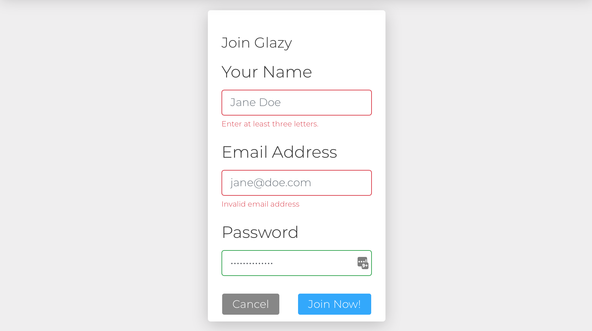
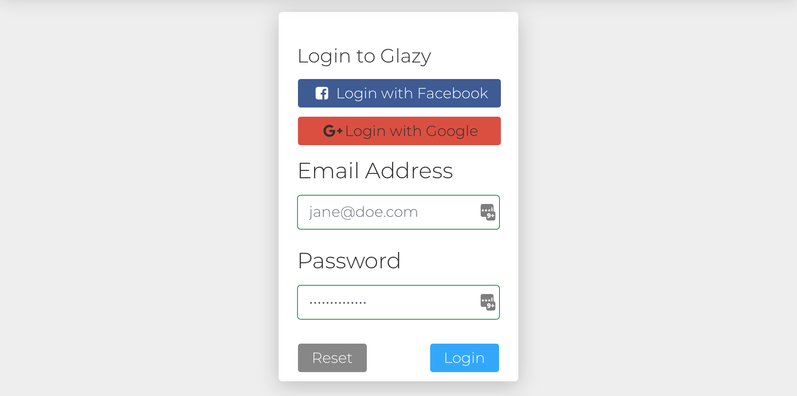

# Getting Started
  
Before doing anything, please read the
[Disclaimer & Health Warning](/about/health-warning.html)
and be aware of the dangers when mixing, working with and firing
ceramic materials.

## Getting Help

Ideas for improving Glazy?  Encounter a bug?  Questions about glazes in general?  Please join the official Glazy Support Group:  

[https://www.facebook.com/groups/glazysupport/](https://www.facebook.com/groups/glazysupport/)

If you don't use Facebook, you can always post a question to the Glazy Wiki:

[https://wiki.glazy.org](https://wiki.glazy.org)

## Joining Glazy

Some functions, like searching recipes, viewing recipes 
and using the calculator do not require you to have a
Glazy account.

However, to take advantage of the full power of Glazy,
please create a free Glazy account and login.

Glazy is 100% free for use by anyone.  Glazy doesn't spy on you, sell your information to third parties,
or otherwise profit on you in any way.
  
However, before joining Glazy, please read the
[Privacy Policy](/about/privacy.html) and
[Terms of Service](/about/terms-of-service.html).

To join Glazy, all we need is an email address and name:

 

Once you have joined Glazy, you should receive an email with your user details.

## Login to Glazy

To login to Glazy, just enter your email address and password:

 

