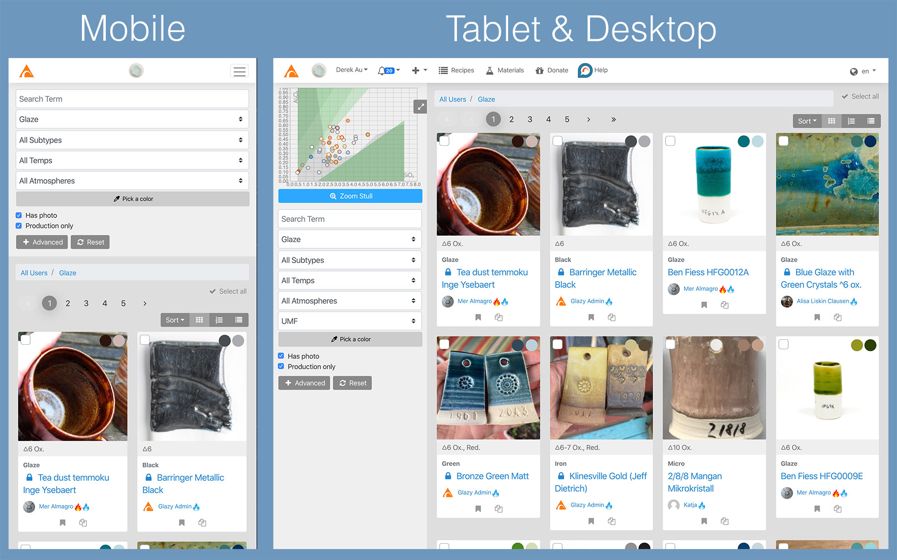
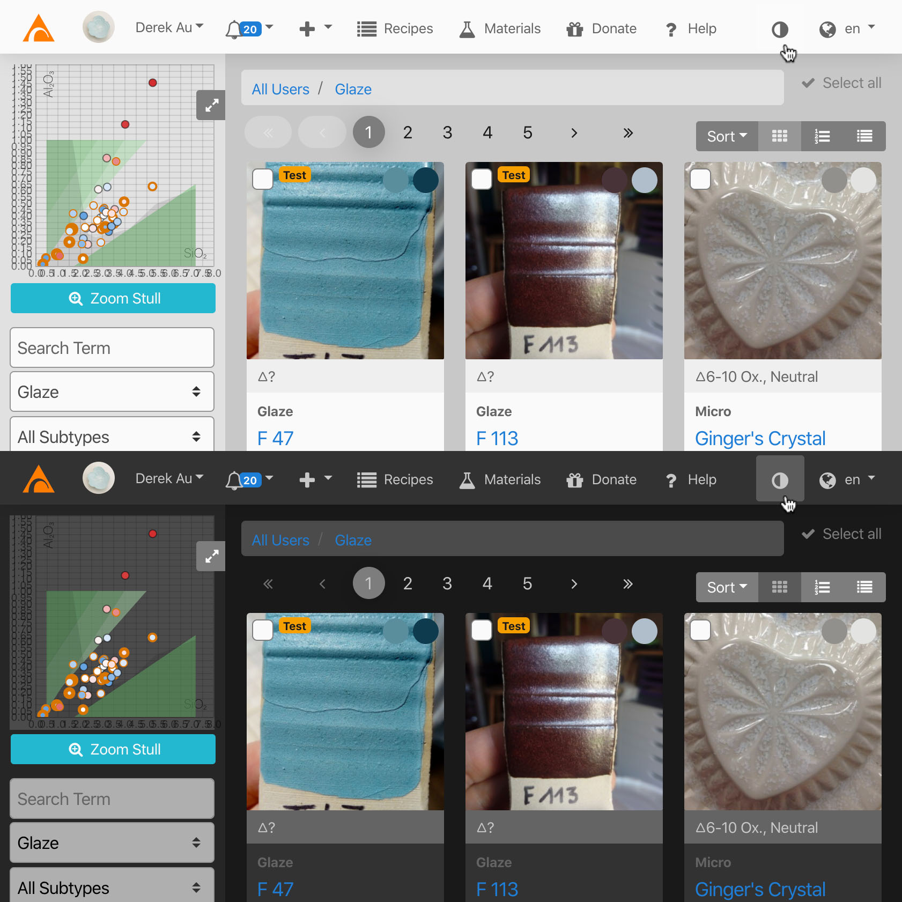

# Getting Started
  
Before doing anything, please read the
[Disclaimer & Health Warning](/about/health-warning.html)
and be aware of the dangers when mixing, working with and firing
ceramic materials.

## What Device?

Glazy will work on mobile, tablet, and desktop devices.  However, due to limited screen size, some information and features may not be displayed on mobile devices.  It's recommended to use tablets or desktops for Glazy if you intend to access more complex Glazy features like creating recipes in the Calculator.

## What Browser?

In an ideal world, there would be multiple healthy browsers that support the same web standards.  
In reality, each browser is slightly different, and it takes time and effort to make a website run on each browser.

Because Glazy lacks resources, we can only test against a single browser, Google Chrome.  
Chrome can be installed on almost any device, from computers to mobile phones.

[Download Google Chrome Now!](https://www.google.com/chrome/)

While Google Chrome is the only "officially" supported browser, [Safari](https://www.apple.com/safari/) and [Firefox](https://www.mozilla.org/en-US/firefox/) also seem to work just fine!

## Getting Help

If you cannot login, please email **derek [at] glazy [dot] org**.

Ideas for improving Glazy?  Encounter a bug?  Questions about glazes in general?  Just log into Glazy and click the "? Help" button to create a new Glazy Help Post (see screenshot below).

## Joining Glazy

Some functions, like searching recipe and viewing recipes do not require you to have a Glazy account.

However, to take advantage of the full power of Glazy, please create a free Glazy account and login.

Glazy is 100% free for use by anyone.  Glazy doesn't spy on you, sell your information to third parties, or otherwise profit on you in any way.
  
However, before joining Glazy, please read the
[Privacy Policy](/about/privacy.html) and
[Terms of Service](/about/terms-of-service.html).

To join Glazy, all we need is an email address and name:

<iframe width="640" height="360" src="https://www.youtube.com/embed/ubMgitnBhOo" frameborder="0" allow="accelerometer; autoplay; encrypted-media; gyroscope; picture-in-picture" allowfullscreen></iframe>

## Updating Your User Profile

You can add social media links, change your user photo, download your data, and edit settings by updating your User Profile:

<iframe width="640" height="360" src="https://www.youtube.com/embed/ETvsshkeaVI" frameborder="0" allow="accelerometer; autoplay; encrypted-media; gyroscope; picture-in-picture" allowfullscreen></iframe>

## Dark Mode

[Glazy Patrons](/support.html#glazy-patron-special-features) get access to the Dark Mode special feature.  Just click the contrast button in the top-right corner of the menu (see screenshot below) to switch Glazy between Light and Dark mode.

