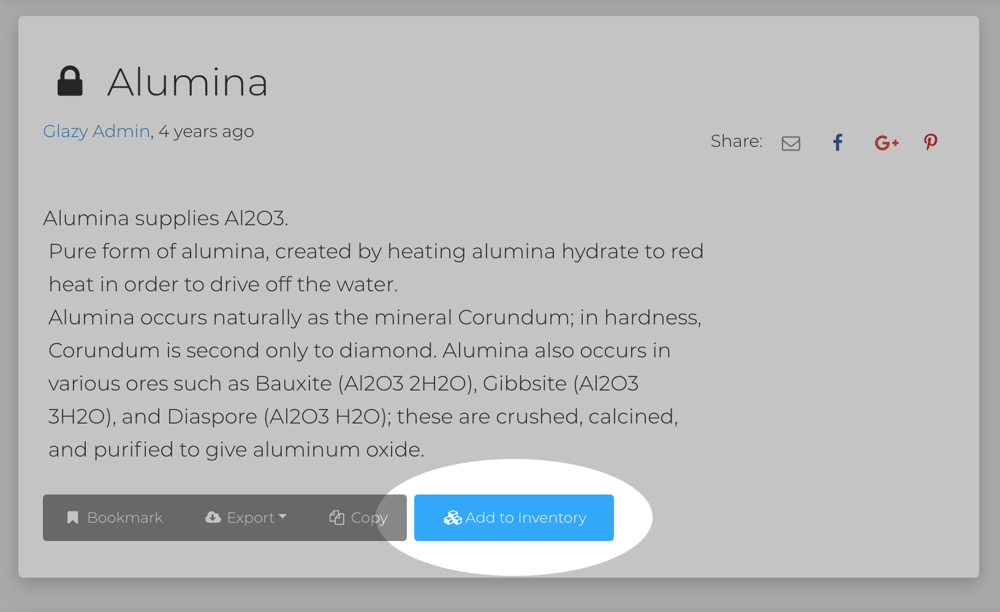

# Calculator

## Why are materials missing from the calculator?

In the first version of Glazy, _all_ materials in the database were shown in the calculator.  Not only did this slow down the calculator, it also gave users too many  options that they would most likely never use.

For the new version of Glazy, materials in the calculator are limited to your **inventory**.  To view your inventory, just visit [https://glazy.org/inventory](https://glazy.org/inventory)

_(In the future, the inventory page will be able to keep track of how much materials you use, and which materials you currently have in stock.)_

### How do I add a material to my inventory (and the calculator)?

1. Log in to Glazy
2. Find the material you want to add at https://glazy.org/materials/
3. Click the **"Add to Inventory"** button.

The material is now available in your inventory (https://glazy.org/inventory) and calculator (https://glazy.org/calculator).