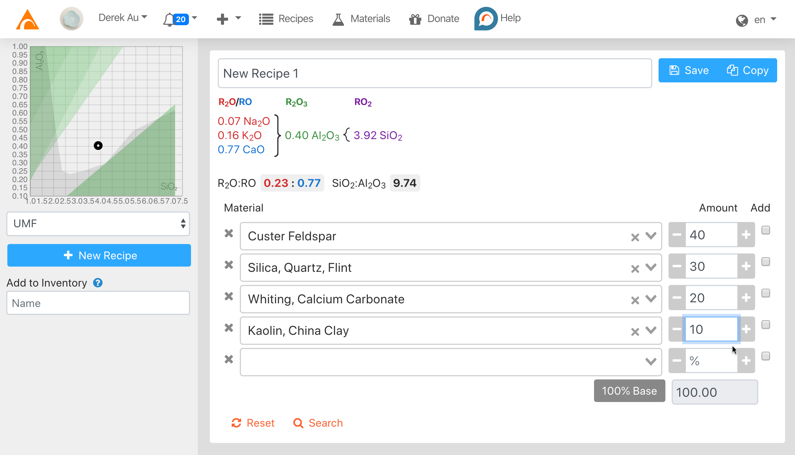
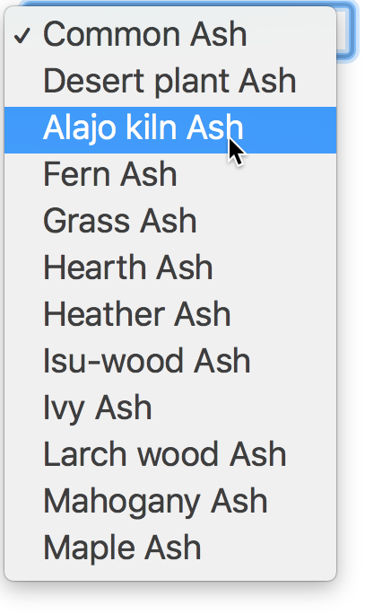
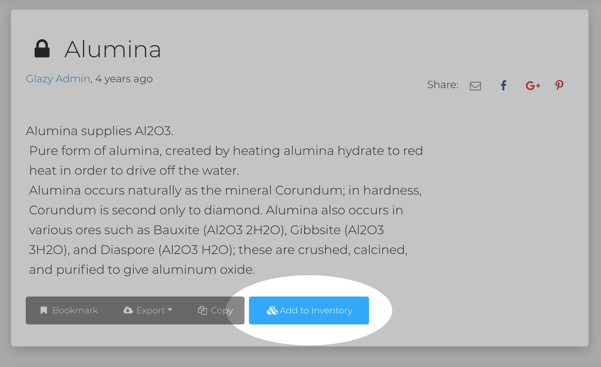
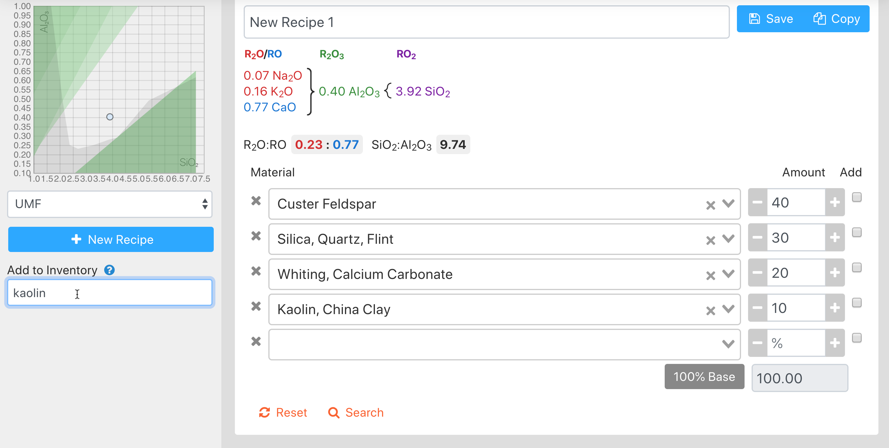
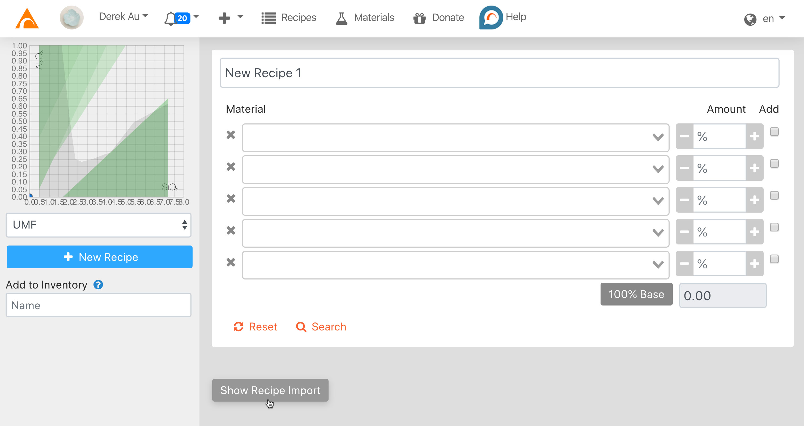

# Calculator

The **Calculator** allows you to make **Recipes**.

As **Materials** and **Amounts** are added to the Calculator form,
the **Chemical Analysis** of the recipe is automatically calculated.

The recipe is also automatically plotted on the Si:Al chart.

## How to Create a Recipe 

This video shows how to create a recipe using the Calculator:

<iframe width="640" height="360" src="https://www.youtube.com/embed/bcN8rqt0z74" frameborder="0" allow="accelerometer; autoplay; encrypted-media; gyroscope; picture-in-picture" allowfullscreen></iframe>

## Why are materials missing from the calculator?

In the first version of Glazy, _all_ materials in the database were shown in the calculator.  Not only did this slow down the calculator, it also gave users too many  options that they would most likely never use.

For the new version of Glazy, materials in the calculator are limited to your **inventory**.  To view your inventory, just visit [https://glazy.org/inventory](https://glazy.org/inventory)

_(In the future, the inventory page will be able to keep track of how much materials you use, and which materials you currently have in stock.)_

### How do I add a material to my inventory (and the calculator)?

1. Log in to Glazy
2. Find the material you want to add at https://glazy.org/materials/
3. Click the **"Add to Inventory"** button.

The material is now available in your
[inventory](https://glazy.org/inventory) and
[calculator](https://glazy.org/calculator).

### Adding materials to inventory from the Calculator

You can also add materials to your inventory directly from the Calculator.  Just type the name of the material you are looking for:

## Automatically Importing Recipes

Glazy lets you automatically import recipes by simply copying & pasting.  Glazy will do it's best to interpret the pasted recipe, but sometimes automatic import might not work.  For example, the recipe to be imported may include a material that does not exist in Glazy.

To begin importing recipes, just click the "Show Recipe Import" button:

This video demonstrates how to import recipes in various formats:

<iframe width="640" height="360" src="https://www.youtube.com/embed/jMLBuBtfw4s" frameborder="0" allow="accelerometer; autoplay; encrypted-media; gyroscope; picture-in-picture" allowfullscreen></iframe>

## Calculator Examples

### Material Substitution

How to make a glaze material substitution in Glazy

<iframe width="640" height="360" src="https://www.youtube.com/embed/8Yj32Yjp4m0" frameborder="0" allow="accelerometer; autoplay; encrypted-media; gyroscope; picture-in-picture" allowfullscreen></iframe>

### Substituting Local Materials

If you want to try a recipe you find in Glazy but don't have all the materials, you may be able to substitute local materials instead.  This video will show you how.

<iframe width="640" height="360" src="https://www.youtube.com/embed/FJQZSgZqK_g" frameborder="0" allow="accelerometer; autoplay; encrypted-media; gyroscope; picture-in-picture" allowfullscreen></iframe>

### Material Substitution 2

Another example of how to substitute glaze recipe materials in Glazy.

<iframe width="640" height="360" src="https://www.youtube.com/embed/mbsF-NMzpHs" frameborder="0" allow="accelerometer; autoplay; encrypted-media; gyroscope; picture-in-picture" allowfullscreen></iframe>