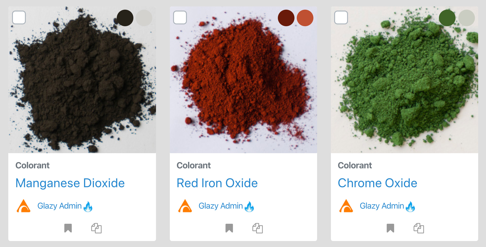
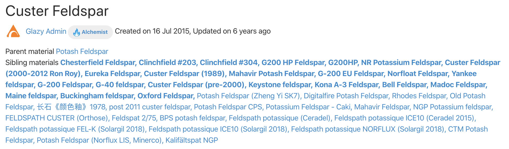

# Materials

## What is a Material?

Strictly speaking, a Glazy **Material** is just a chemical analysis
that represents a real-world material.

The _accuracy_ of the analysis may vary.  The actual composition of
each bag of your material may differ more or less from the analysis.

## Theoretical Materials

All material analyses are to some extent _theoretical_ in that 
they approximate actual real-world materials.  The actual materials
we use in the studio come from various natural sources and contain 
impurities and inconsistencies.  For example, there are many types 
of Potash Feldspar, and each type has a different analysis.  Even 
within types of Potash Feldspar, there may be different analyses 
for different batches of material at different times.

Imagine you are at a grocery store but didn't know what to cook.
So you  and find the following recipe via an app on your phone:

#### Roasted Delight

_Ingredients:_

  * 1 carrot
  * 1 onion
  * 1 pound of meat
  * 1 teaspoon of salt
  * 1 teaspoon of pepper

What does "1 pound of meat" mean?  It could be steak, chicken, 
or fish, and the final dish would be much different with each 
type.  You see in the recipe reviews that people used fish, but 
they didn't mention what type of fish.  Freshwater, saltwater?

Just as with our fictional "Roasted Delight" recipe, some older 
glaze recipes just list "Feldspar" (meat) or "Potash Feldspar" 
(fish).  

**A sample of analyses for Custer Feldspar, a type of Potash Feldspar:**

<table>
<thead>
<tr>
<th>Ingredient</th>
<th>Type</th>
<th>Parent</th>
<th>SiO2</th>
<th>Al2O3</th>
<th>MgO</th>
<th>CaO</th>
<th>K2O</th>
<th>Na2O</th>
<th>P2O5</th>
<th>Fe2O3</th>
<th>LOI</th>
</tr>
</thead>
<tbody>
<tr>
<td><a href="https://glazy.org/materials/131">Custer Feldspar</a></td>
<td>Feldspar</td>
<td><a href="https://glazy.org/materials/371">Potash Feldspar</a></td>
<td>68.50</td>
<td>17.00</td>
<td>&nbsp;</td>
<td>0.30</td>
<td>10.00</td>
<td>3.00</td>
<td>&nbsp;</td>
<td>0.10</td>
<td>0.30</td>
</tr>
<tr>
<td><a href="https://glazy.org/materials/657">Custer Feldspar (1989)</a></td>
<td>Feldspar</td>
<td><a href="https://glazy.org/materials/371">Potash Feldspar</a></td>
<td>68.64</td>
<td>17.39</td>
<td>&nbsp;</td>
<td>0.30</td>
<td>10.36</td>
<td>3.02</td>
<td>&nbsp;</td>
<td>&nbsp;</td>
<td>0.30</td>
</tr>
<tr>
<td><a href="https://glazy.org/materials/891">Custer Feldspar (2000-2012 Ron Roy)</a></td>
<td>Feldspar</td>
<td><a href="https://glazy.org/materials/371">Potash Feldspar</a></td>
<td>72.40</td>
<td>15.27</td>
<td>0.07</td>
<td>0.27</td>
<td>7.52</td>
<td>3.21</td>
<td>0.20</td>
<td>0.21</td>
<td>0.65</td>
</tr>
<tr>
<td><a href="https://glazy.org/materials/782">Custer Feldspar (pre-2000)</a></td>
<td>Feldspar</td>
<td><a href="https://glazy.org/materials/371">Potash Feldspar</a></td>
<td>68.70</td>
<td>17.25</td>
<td>0.05</td>
<td>0.18</td>
<td>10.06</td>
<td>3.04</td>
<td>0.31</td>
<td>0.12</td>
<td>0.66</td>
</tr>
</tbody>
</table>

When working with actual materials in the studio, it's best to use the 
most accurate analysis you can find for each material.

## Material Metadata 

### Subtype

Materials can be set as a subtype of one of the following values:

*Alumina, Ash, Clay, Colorant, Miscellaneous, Feldspar, Flux, Frit, Opacifier, Silica*

This list of subtypes was inherited from imported recipe data and are still used 
because no one has yet suggested a better list.  The subtype is simply an organizational 
tool used to group materials together.

### Parent Material

While not a required field, *Parent Material* is quite important for the functions of Glazy.
Namely, this field is used to determine whether or not materials and the recipes that
use these materials, are similar.

As an example, let's look at the classic Leach 4321:
 * 40 Potash Feldspar
 * 30 Silica
 * 20 Whiting
 * 10 Kaolin

Now imagine you wish to make a batch of this recipe.  You look everywhere in your 
studio for materials called "Potash Feldspar" and "Kaolin" but cannot find them.
However, you do find "Custer Feldspar" and "EPK", and you realize that these materials
are *types* of Potash Feldspar and Kaolin, respectively.  Your final recipe batch of Leach 4321 is:
 * 40 Custer Feldspar
 * 30 Silica
 * 20 Whiting
 * 10 EPK
 
While technically both of the above recipes are "Leach 4321", they differ in both materials 
used as well as final chemical analysis.  However, when comparing glaze recipes we often want to 
overlook slight differences in chemistry between similar materials (in this case, 
types of Potash Feldspar and Kaolin).  That is not to say that these differences are not *significant*,
and in fact some material substitutions may give quite different results.

In Glazy, materials are organized into a *tree*.  In other words, materials can have
*parents* and *children*.  In the case above using Leach 4321, "Custer Feldspar" is 
the *child* of "Potash Feldspar".  Similarly, "EPK" is a child of "Kaolin".  This is 
because there are many types of "Potash Feldspar" and "Kaolin", 
"Custer Feldspar" and "EPK" being just a couple of them.

When Glazy attempts to find *similar* base recipes, it does so using the immediate parent
materials.  In the above batch of Leach 4321:
 * 40 Custer Feldspar (Parent: Potash Feldspar)
 * 30 Silica (No Parent)
 * 20 Whiting (No Parent)
 * 10 EPK (Parent: Kaolin)

In this case, the recipe used for comparison is:
 * 40 Potash Feldspar
 * 30 Silica
 * 20 Whiting
 * 10 Kaolin

Obviously, this is the same recipe as our original Leach 4321.  So Glazy recognizes these 
two recipes as *equivalent*.

When adding new materials to Glazy, it is advisable to specify a Parent Material if possible.

For example most Potassium Feldspars, the parent should be "Potash Feldspar" (owned by the Glazy Admin).
If adding EPK, SSP, or Helmar Kaolin, the parent should be "Kaolin".

### Parent & Siblings

In the Material page you will see a *Parent Material* listed along with any *Sibling Materials*.  Sibling Materials are simply materials that have the same *Parent* as the current Material.  In the case below, Custer Feldspar's *Parent* is Potash Feldspar, and its *Siblings* include other Potash Feldspars like Mahavir Potash Feldspar.

### Status

There are currently only three status levels:

 * **Testing:** A material that is not actively being used in the studio.
 * **Production:** A material that is actively used in the studio.
 * **Discontinued:** A material that is no longer available, for example the mine has closed down.

Only materials with a status of **Production** are displayed in the default Glazy search page.

### Country

Often it can be useful to associate a material with a Country.  While *theoretical* materials
like "Feldspar" don't have a location, others like "Mahavir Feldspar" is tied to a specific mine.
Some ceramicists prefer to use locally-sourced materials, and the **Country** field can
help guide them.

## Create a Material

You can easily add your own materials to Glazy:

<iframe width="640" height="360" src="https://www.youtube.com/embed/Dj8391mN6VA" frameborder="0" allow="accelerometer; autoplay; encrypted-media; gyroscope; picture-in-picture" allowfullscreen></iframe>