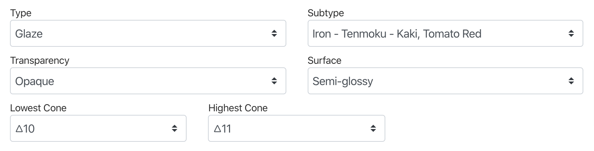
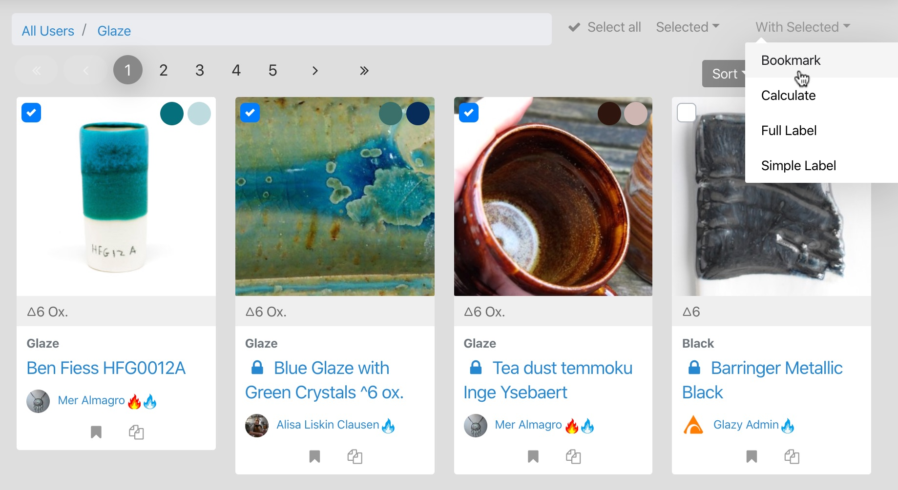
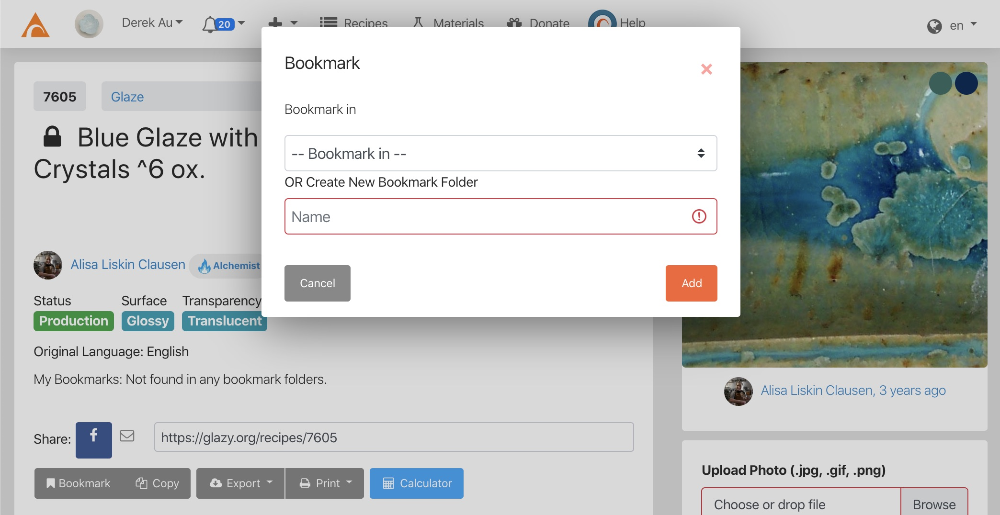
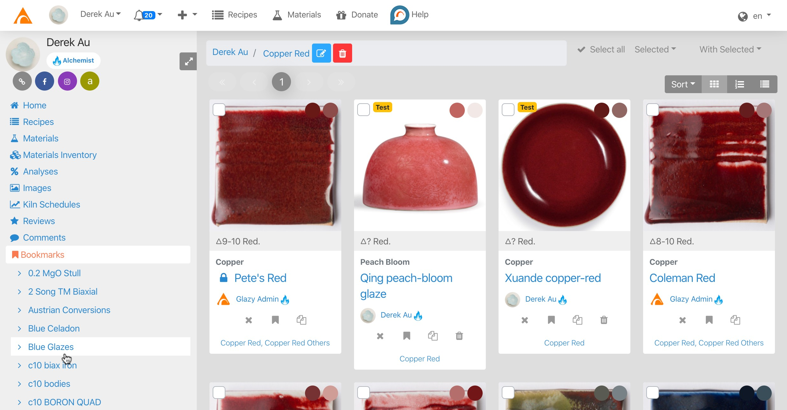

# Organizing

You can organize recipes and materials in Glazy in two ways:
* Fill in recipe and material *metadata* including the *type* & *subtype* (e.g. "Celadon" or "Flux"), *cone temperature*, *atmosphere*, etc.
* *Bookmark* recipes and materials into *Bookmark Folders*

## Metadata

It's important to add metadata so that you and others can easily find recipes and materials.  

For example, imagine you are looking for a blue glaze.  You can search for the keyword *"blue"*, but only recipes with the actual word *"blue"* in the name or description will be found.  But there are many blue recipes that don't actually have the word *"blue"* in the name or description.  Glazy also has many blue glazes contributed by users from other countries, and they have written *"blue"* in their own language.

So in general, it is much better to search by the multilingual *Type* & *Subtype* fields (e.g. "Glaze -> Blue") rather than by keywords.  Correspondingly, it's important for users to correctly categorize their recipes and materials using the metadata fields like *Type* & *Subtype*.

## Bookmarking Recipes

You can easily bookmark individual or multiple Recipes from the Search page:

<iframe width="640" height="360" src="https://www.youtube.com/embed/lHObxACJ_N8" frameborder="0" allow="accelerometer; autoplay; encrypted-media; gyroscope; picture-in-picture" allowfullscreen></iframe>

In this screenshot, you can see multiple recipes being checked and bookmarked:

You can bookmark a single recipe by clicking the Bookmark button:

In the Bookmark dialogue, either select an existing Bookmark Folder or create a new Folder by typing in a name.

## Viewing Your Bookmark Folders

Your Bookmark Folders are displayed on the search form on your home page:

