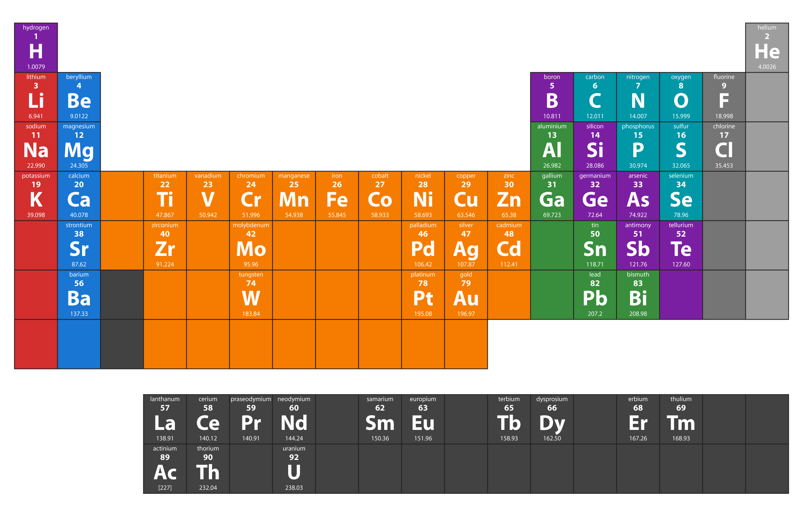

# Periodic Table and Oxides

## Color-coding for oxides

In Glazy, multiple color systems are used in different contexts.

For example, the Glazy [Unity Molecular Formula (UMF) Chart](/guide/recipes/#the-unity-molecular-formula-umf-chart) uses color to differentiate between Stull Regions as well as R2O:RO Ratio.

In Glazy, metallic oxides are also color-coded according to their element group.

### Glazy Periodic Table Color Coding

 

### External Resources

[What Is the Importance of Color on the Periodic Table?](https://www.thoughtco.com/color-on-the-periodic-table-608827)  

[CPK coloring](https://en.wikipedia.org/wiki/CPK_coloring)

[Linda Bloomfield's Chemistry for potters](https://lindabloomfield.co.uk/news/chemistry-for-potters/)  

  
  
  
