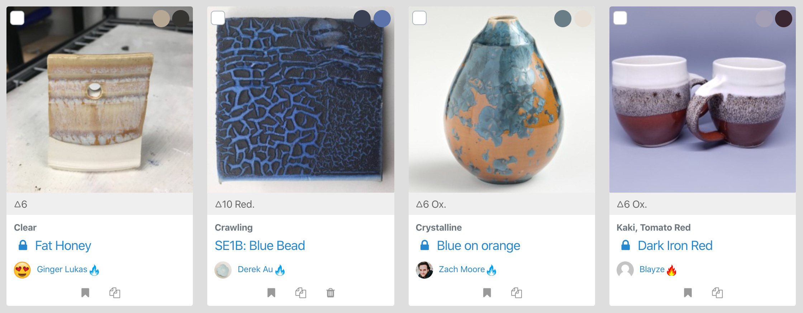
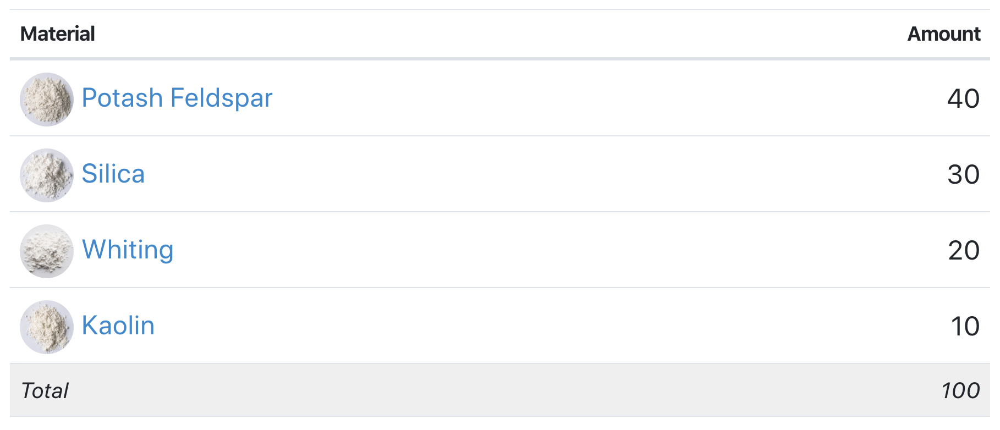
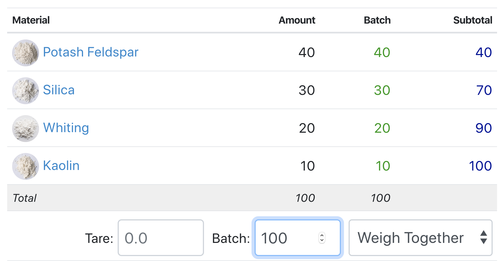
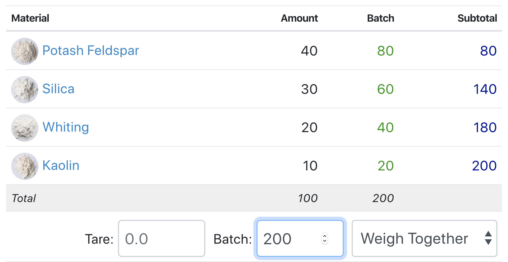
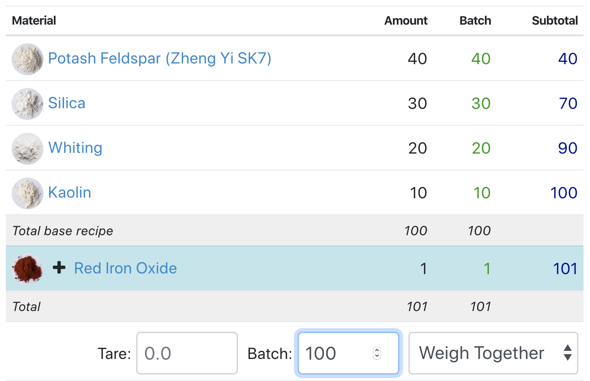
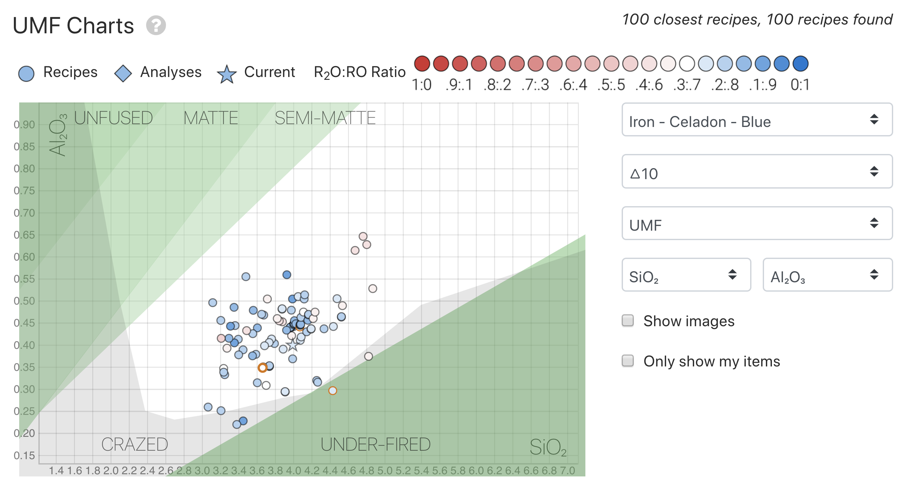
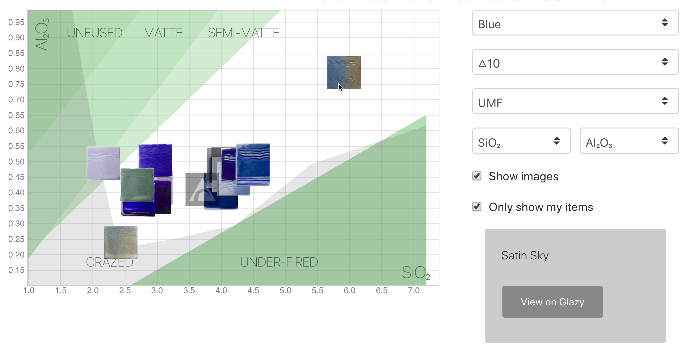
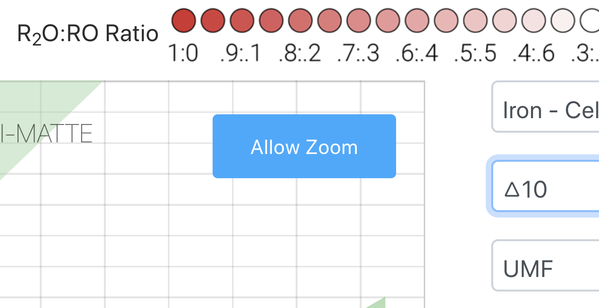
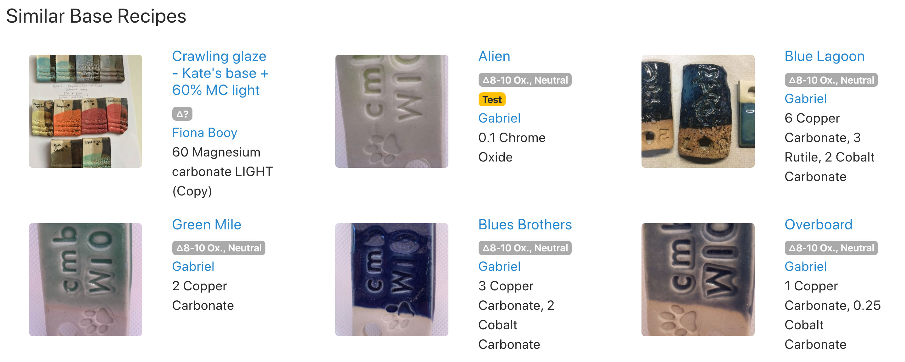

# Recipes

## What is a Recipe?

Recipes are combinations of one or more ceramic materials.
Recipes specify the _proportion_ of one material to another.
When mixed together, the recipe's materials form a new type
of material- a clay suitable for throwing, a beautiful, 
shiny glaze, or a colorful underglaze.

The recipe below is a classic recipe called 
**"Leach 4321"**.  **Leach 4321** is often used as an example 
because its recipe is very simple and it works well:

#### Leach 4321 

Because the recipe lists the _proportion_ of ingredients, 
you can think of the amounts as _percentages_.  **Leach 4321** 
is a recipe made up of: 
  * **40%** Potash Feldspar, 
  * **30%** Silica,
  * **20%** Whiting, and 
  * **10%** Kaolin,
  
For a combined total of **100%**.

It is not unusual to see recipes that do not total to 
100.  Often, recipes in workshops are written down as **batches** 
rather than 100% proportions.  For example, Leach 4321 can
also be written as:
  * **4000g** Potash Feldspar, 
  * **3000g** Silica,
  * **2000g** Whiting, and 
  * **1000g** Kaolin,
  
For a combined total of **10,000g**.  

It's important to realize that
_this is the same recipe as listed above_, just multiplied by 100
and specifying a unit of measurement.
Potters often write down recipes in **batch sizes** that they work
with to make mixing glazes easier.
A batch size of **10,000g** (like the one above) is often 
used when making up a large bucket of glaze or clay.

_Note: All recipes are measured by weight, not volume!_

## Recipe Basics

Learn how to bookmark, print, export, and make batches of recipes:

<iframe width="640" height="360" src="https://www.youtube.com/embed/q8-thIhLdBk" frameborder="0" allow="accelerometer; autoplay; encrypted-media; gyroscope; picture-in-picture" allowfullscreen></iframe>

## Create a Recipe

Please see the [Calculator section](/guide/calculator/)

## Batches

**batch**, _noun_

2. A quantity required for or produced as the result of one 
operation: _made a batch of cookie dough; mixed a batch of cement._ 
[link](https://www.thefreedictionary.com/batch)

Because recipes list _proportions_ of ingredients, no units of 
measurement are used.  To make this recipe, you can measure in 
ounces or grams, even kilograms or tons!

For convenience ceramicists usually stick to the 
[Metric System](https://en.wikipedia.org/wiki/Metric_system).
Batches of recipes are measured in _grams_ and _kilograms_.
Small _test batches_ are usually only 100 or 200 grams, while 
batches for daily studio use can be 10 or 20 kilograms.

More information about mixing up batches: 
[Mixing Test Recipes](/testing/mixing-tests/)

### The Batch Calculator

Underneath each recipe listing is a **Calculate Batch** input
box.  After entering a number into this box, Glazy will
calculate the total amount for each ingredient.

Here we calculate a batch size of 100:

And here we calculate a batch size of 200:

## Base Recipes & Additional Ingredients

Recipes are often divided into two sections:
the _base recipe_ and _additional ingredients_.

Imagine a recipe for pizza.  The _base recipe_ would
include the ingredients for making the dough and sauce,
while toppings like mushrooms and sausage would be
listed as _additional ingredients_.

For glaze recipes, the _base recipe_ is usually a plain 
glaze without any color.  _Additional ingredients_ like
colorants and opacifiers can be added to change the
look and character of the original _base recipe_.

Below is the same **Leach 4321** recipe, but with an additional
ingredient of 1% Red Iron Oxide:

#### Leach 4321 Celadon

Notice that the name of this recipe has changed.  Because this
version includes 1% _additive_ Red Iron Oxide, the type of 
glaze changes to a _celadon_.

Also notice that when calculating a **batch**, _additional 
ingredients_ are added _in addition to_ the batch amount.
(The batch amount is actually the _base batch amount_.)
So the total batch amount for this batch is 101, not 100.

## Recipe Information

Each Recipe has descriptive information, or *metadata*, that describes it.  
In general, the more metadata is added to a recipe, the easier it is to 
categorize, compare, and search recipes.

Glazy uses *highly structured* data, meaning that instead of allowing users to define descriptive 
"tags" for recipes (like hashtags in Instagram), users are only allowed to select from a pre-defined, 
finite list of categories.  Unfortunately, the names of these categories are currently only available
in the English language.  If you do not agree with a category, please contact Glazy and we can discuss
changing it.

### Type and Subtype

Defining a useful, universal *taxonomy* for glazes is very difficult.  Some of the recipe types and subtypes in Glazy were originally imported from old databases, while other
types were inspired by John Britt's [High-Fire Glazes](https://johnbrittpottery.com/shop/the-complete-guide-to-high-fire-glazes-glazing-firing-at-cone-10/).

Glazy's recipe types are constantly being refined.  If you have ideas to improve the system, please contact us.

Regardless of whether or not Glazy's system of types is adequate, when creating a recipe please
specify a type and subtype.  If glazes are categorized more specifically with subtypes like "Blue Celadon",
"Black", and "Clear" then it is much easier for both the Glazy software and users to navigate the recipes.

### Status

There are currently only three status levels:

 * **Testing:** A recipe that is not actively being used in the studio.
 * **Production:** A recipe that is actively used in the studio.
 * **Discontinued:** A recipe that is no longer used for some reason, for example an ingredient is no longer available or the glaze did not fit a clay body.

Only recipes with a status of **Production** are displayed in the default Glazy search page.

### Country

It can be useful to associate a recipe with a Country if the ingredients and firing are specific to a location.  
For example, many traditional Chinese materials are tied to specific mine and kiln locations.

## The Unity Molecular Formula (UMF) Chart

#### See Also: [Unity Molecular Formula (UMF)](/concepts/analysis/#unity-molecular-formula-umf)

Each Glazy Search and Recipe page contains a Unity Molecular Formula (UMF) Chart.
This chart shows the recipes closest to the current recipe.
The current recipe is represented by a star symbol, while neighboring 
recipes are represented by a circle.

The UMF Chart defaults to a Silica (x-axis) and Alumina (y-axis) chart, 
which is the most commonly used type of chart when looking at glaze chemistry.  But you can
easily change the two axes to any combination of oxides.

### The Stull Chart 

Overlayed on top of the UMF Chart is the Stull Chart.
Here is the original Stull Chart, first published by R. T. Stull in
[Transactions of the American Ceramic Society, Volume 14, pages 62-70](https://books.google.com/books?id=9qwYAQAAIAAJ).

This is a slightly updated version of the Stull Chart which is a little more readable:

The Stull Chart has six regions:
* **Unfused & Under-fired**:  Glazes in this region have either too much Alumina (Unfused) 
or too much Silica (Under-fired) are not fired to maturity.
* **Matte**: Glazes in this high-Alumina region are typically "true" matte glazes.
* **Bright**: In this middle-region, glazes are typically glossy glazes.
Most of the recipes in Glazy, especially clear glazes, can be found in the Bright region.
* **Crazed**: Glazes in this region tend to have a crazed surface.

#### Caveats

* The Stull chart was created for glazes with a flux ratio 0.3 R2O: 0.7 RO and fired to cone 11.
There may be variations in the chart for glazes with different flux ratios fired at different
temperatures.
* The Stull chart does **not** show or predict firing temperature.  So, just because a recipe point
lies in the "Bright" region does not mean it will be a glossy glaze at your firing temperature.
* Because **crazing** is a function of both the glaze and clay body, the Stull Crazing Region is 
highly dependent upon not only the glaze chemistry but also that of the clay body.  So the 
Crazing Region will be quite different depending upon these factors.
* *In spite of all these limitations*, the Stull Chart Regions of Unfused & Under-fired, Matte, 
Semi-matte, and Bright still hold true at a number of different temperatures with a range of 
flux ratios and flux types.  For futher information about how to apply the Stull Chart, please see 
the work of Matt Katz (some articles linked below).

Some of Matt Katz's research of the Stull:
[Introduction to Glaze Formulation Online](http://art.alfred.edu/academics/glaze-formulation.cfm), 
[Robust Mid-Temperature Glazes](http://mattanddavesclays.com/Science/Katz-NCECA%202012-PDF.pdf) 
and [How Glazes Melt](http://mattanddavesclays.com/Science/Finkelnburg-NCECA%202012-PDF.pdf).

### Glazy Stull Chart

Due to space limitations in the website, the Glazy Stull Chart looks slightly different than the above chart, 
lacking the region names and color codings, but otherwise is the same.
Each point on the chart represents a recipe.
In this example you can see that most of the recipes fall within the Stull "Bright" region.

Each point representing a recipe has two color codings.  The inner color of the point represents the **R2O:RO Ratio**, 
while the point outline represents the amount of **Boron**.

### R2O:RO Ratio

 

_The R2O:RO Ratio Scale shown in the Stull Chart._

The color of each recipe point denotes its R2O:RO ratio.
Recipes high in R2O are redder, while recipes low in
R2O are bluer.

The ratio of R2O to RO oxides has implications for glaze stability and
expansion.

Matt Katz has demonstrated that a 0.3 R2O: 0.7 RO ratio produces the
most robust glazes at a range of temperatures.

Also see Matt Katz's
[Introduction to Glaze Formulation Online](http://art.alfred.edu/academics/glaze-formulation.cfm), 
[Robust Mid-Temperature Glazes](http://mattanddavesclays.com/Science/Katz-NCECA%202012-PDF.pdf) 
and [How Glazes Melt](http://mattanddavesclays.com/Science/Finkelnburg-NCECA%202012-PDF.pdf).

### Boron Level

The outline of each recipe point represents the amount of boron.
Recipes containing boron have an orange outline, 
and the thickness of the outline represents the amount of boron.
Typically, glazes lower in temperature will contain more boron.

 

### UMF Chart Trends

The following charts show all public Glazy recipes for Low-Fire, Mid-Fire, and High-Fire.
Three trends stand out:
* The vast majority of recipes fall within the Stull "Bright" region.
* As recipes increase in temperature, so do their Silica and Alumina levels 
(points are located higher in the chart).
* As recipes decrease in temperature, Boron increases (orange outline thickens).

 

### Stull Al/Si chart showing Leach 4321 analysis using different feldspars.

The following Stull chart shows the _Leach 4321_ recipe with different feldspar and kaolin analyses.
You can see that by varying the types of ingredients (or the analyses of ingredients),
the recipe will fall at different locations on the Stull Chart.  It's good practice to use
actual ingredients with the most accurate analyses possible,
for example using "Custer Feldspar" instead of the generic "Potash Feldspar" or "Feldspar".

### Using the Glazy Stull Chart

This video shows the basics of how to use the Stull Chart in Glazy:

<iframe width="640" height="360" src="https://www.youtube.com/embed/_cxbwkdYPYs" frameborder="0" allow="accelerometer; autoplay; encrypted-media; gyroscope; picture-in-picture" allowfullscreen></iframe>

### Filtering the Chart

The chart can be filtered by using the form on the right.  The recipe
category can be changed 
(in the above screenshot, the category is Iron - Celadon - Blue), or 
the temperature can be filtered, or the axes of the graph can be 
modified.

The chart always loads as a plot of the oxides 
SiO2 and Al2O3

Because the Stull Chart is based on SiO2:Al2O3,
it will disappear if you choose a different oxide pair.

### Show Images

By clicking the "Show Images" checkbox you can display the thumbnail
photos for each recipe in the graph.  Please note that many recipes
do not have photos and will only display as a greyed-out square.

### Zooming in the chart

While the UMF Chart in the search can automatically be Pinched & Zoomed,
the UMF Chart on the recipe page initially has Pinch & Zoom disabled in 
order to avoid accidental zooming.

Just click the "Allow Zoom" button to start zooming.

## Similar Recipes & Analyses

Introduction to similar recipes and analyses in Glazy:

<iframe width="640" height="360" src="https://www.youtube.com/embed/0iWGkC7qomE" frameborder="0" allow="accelerometer; autoplay; encrypted-media; gyroscope; picture-in-picture" allowfullscreen></iframe>

## Similar Base Recipes

If two recipes consist of the same base materials (not including
additional materials) in the same amounts (within 1%), then they are
considered similar.
  * Two Leach 4321 glazes (40% Feldspar, 30% Silica, 20% Whiting, 10%
Kaolin) may be similar even if their additional oxides differ. For
instance, Leach White is a 4321 glaze with added Zircopax, while Leach
Celadon is a 4321 glaze with added iron. These two glazes are considered
similar by Glazy.
  * A Leach 4321 glaze recipe with 40% Potash Feldspar is similar to the
same glaze recipe with 40% Custer Feldspar because the materials or
their parent materials are the same.
  * A Leach 4321 glaze recipe with 40% Potash Feldspar is not similar to the
same glaze recipe with 40% Soda Feldspar because the materials (and
their parent materials) are different.
  * A Leach 4321 glaze recipe with 39.5% Feldspar and a Leach 4321 glaze
with 40% Feldspar are considered similar because the material amounts
only vary by %1.

## Similar Analyses

Two recipes are considered to have similar unity formulas if their
oxides do not differ more than .05 For this comparison, K2O and Na2O are
combined (KNaO).

_Note: Recipes that have similar unity formulas do not necessarily exhibit
similar fired characterisitics._

## Oxide Coloring

Oxides are colored by their role in the UMF.  The role of an oxide may change depending upon whether you are viewing *Traditional UMF* or *Extended UMF*.

### Traditional UMF Coloring

R2O Group: Na2O, K2O, Li2O

RO Group: PbO, SrO, BaO, ZnO, CaO, MgO, MnO

R2O3 Group:  Al2O3

B2O3 (Special Case)

RO2 Group: SiO2, ZrO2, SnO2, TiO2

Other Oxides: FeO, Fe2O3, MnO2, P2O5, F, CoO, Cr2O3, Cu2O, CuO, NiO, V2O5, ZrO, HfO2, Nb2O5, Ta2O5, MoO3, WO3, OsO2, IrO2, PtO2, Ag2O, Au2O3, GeO2, As2O3, Sb2O3, Bi2O3, SeO2, La2O3, CeO2, PrO2, Pr2O3, Nd2O3, U3O8, Sm2O3, Eu2O3, Tb2O3, Dy2O3, Ho2O3, Er2O3, Tm2O3, Yb2O3, Lu2O3

### Extended UMF Coloring

R2O Group: Na2O, K2O, Li2O, Bi2O3, CuO, SnO2

RO Group: PbO, SrO, BaO, ZnO, CaO, MgO, MnO, Fe2O3, MnO2, CoO

R2O3 Group:  Al2O3, TiO2, NiO

B2O3 (Special Case)

RO2 Group: SiO2, ZrO2

Other Oxides: FeO, P2O5, F, Cr2O3, Cu2O, V2O5, ZrO, HfO2, Nb2O5, Ta2O5, MoO3, WO3, OsO2, IrO2, PtO2, Ag2O, Au2O3, GeO2, As2O3, Sb2O3, SeO2, La2O3, CeO2, PrO2, Pr2O3, Nd2O3, U3O8, Sm2O3, Eu2O3, Tb2O3, Dy2O3, Ho2O3, Er2O3, Tm2O3, Yb2O3, Lu2O3

## Exporting Recipes

Recipes can be exported as a Recipe Card- an image containing the recipe
photograph, name, and recipe details.

Recipes can be exported to your favorite glaze calculation software.
Currently, only Insight and GlazeChem are supported, but hopefully more
export formats will be added in the future.

To export a recipe, simply select "Export" from the menu on the recipe page. The
Recipe Card image can be saved on your computer or shared with others
online. The downloaded glaze calculation software text file can be
imported into your program.

<!--- 

## Hazards

_09/2016 Note: This is a new feature. If a recipe material is not
listed, that material's data has not yet been added. Some materials only
have GHS ratings, while others only have HMIS ratings. Warnings differ
between systems and countries. Glazy does not take any responsibility
for accuracy of linked SDS information. Contact your ceramics supplier
for safety information for your specific materials._

You must wear a NIOSH certified mask whenever mixing ceramic materials.
All materials should be handled and fired in well-ventilated areas to
avoid the risk of inhalation.

Lack of a warning does NOT mean that a material is safe.

From hazard warnings alone it is difficult to determine **when** and **how** a
given material may be harmful. Some materials might be relatively safe
to use when making glazes, but toxic when volatized during firing or
leached from a non-durable fired glaze. Other materials might be
relatively safe in a durable fired glaze, but extremely toxic in raw
form in the studio. It is up to the individual to understand the risks
of each material and take necessary precautions.

### GHS Hazard Chart

[A more detailed chart is avialable on Wikipedia here.](https://en.wikipedia.org/wiki/GHS_hazard_pictograms)

<table>
    <thead>
    <tr>
        <th>
        Pictogram
        </th>
        <th>
        Hazard Class
        </th>
        <th>
        Usage
        </th>
    </tr>
    </thead>
    <tbody>
    <tr>
        <td>
        
        </td>
        <td>
        Explosive
        </td>
        <td>
        Unstable explosives
        Explosives, divisions 1.1, 1.2, 1.3, 1.4, 1.5, 1.6
        Self-reactive substances and mixtures, types A, B
        Organic peroxides, types A, B
        </td>
    </tr>
    <tr>
        <td>
        
        </td>
        <td>
        Flammable
        </td>
        <td>
        Flammable gases, category 1
        Flammable aerosols, categories 1, 2
        Flammable liquids, categories 1, 2, 3
        Flammable solids, categories 1, 2
        Self-reactive substances and mixtures, types B, C, D, E, F
        Pyrophoric liquids, category 1
        Pyrophoric solids, category 1
        Self-heating substances and mixtures, categories 1, 2
        Substances and mixtures, which in contact with water, emit flammable gases, categories 1, 2, 3
        Organic peroxides, types B, C, D, E, F
        </td>
    </tr>
    <tr>
        <td>
        
        </td>
        <td>
        Oxidizing
        </td>
        <td>
        Oxidizing gases, category 1
        Oxidizing liquids, categories 1, 2, 3
        Oxidizing solids, categories 1, 2, 3
        </td>
    </tr>
    <tr>
        <td>
        
        </td>
        <td>
        Compressed Gas
        </td>
        <td>
        Compressed gases
        Liquefied gases
        Refrigerated liquefied gases
        Dissolved gases
        </td>
    </tr>
    <tr>
        <td>
        
        </td>
        <td>
        Corrosive
        </td>
        <td>
        Corrosive to metals, category 1
        </td>
    </tr>
    <tr>
        <td>
        
        </td>
        <td>
        Toxic
        </td>
        <td>
        Acute toxicity (oral, dermal, inhalation), categories 1, 2, 3
        </td>
    </tr>
    <tr>
        <td>
        
        </td>
        <td>
        Harmful
        </td>
        <td>
        Acute toxicity (oral, dermal, inhalation), category 4
        Skin irritation, categories 2, 3
        Eye irritation, category 2A
        Skin sensitization, category 1
        Specific target organ toxicity following single exposure, category 3
        Respiratory tract irritation
        Narcotic effects
        </td>
    </tr>
    <tr>
        <td>
        
        </td>
        <td>
        Health Hazard
        </td>
        <td>
        Respiratory sensitization, category 1
        Germ cell mutagenicity, categories 1A, 1B, 2
        Carcinogenicity, categories 1A, 1B, 2
        Reproductive toxicity, categories 1A, 1B, 2
        Specific target organ toxicity following single exposure, categories 1, 2
        Specific target organ toxicity following repeated exposure, categories 1, 2
        Aspiration hazard, categories 1, 2
        </td>
    </tr>
    <tr>
        <td>
        
        </td>
        <td>
        Corrosive
        </td>
        <td>
        Explosives, divisions 1.5, 1.6
        Flammable gases, category 2
        Self-reactive substances and mixtures, type G (see HAZMAT Class 4 Flammable solids)
        Organic peroxides, type G
        Skin corrosion, categories 1A, 1B, 1C
        Serious eye damage, category 1
        </td>
    </tr>
    <tr>
        <td>
        
        </td>
        <td>
        Environmental Hazard
        </td>
        <td>
        Acute hazards to the aquatic environment, category 1
        Chronic hazards to the aquatic environment, categories 1, 2
        </td>
    </tr>
    </tbody>
</table>

More information about the
<a href="https://en.wikipedia.org/wiki/Hazardous_Materials_Identification_System">Hazardous Materials Identification System (HMIS)</a>,
<a href="https://en.wikipedia.org/wiki/Globally_Harmonized_System_of_Classification_and_Labelling_of_Chemicals">Globally Harmonized System of Classification and Labelling of Chemicals (GHS)</a>
and
<a href="https://en.wikipedia.org/wiki/GHS_hazard_pictograms">GHS pictograms</a>
on Wikipedia.

### Articles on Safety
  * [Ceramic Arts Daily: Respirators for Potters](http://ceramicartsdaily.org/uncategorized/respirators-for-potters/)
  * [Digitalfire: Being Realistic About Toxicity and Safety in Ceramics](https://digitalfire.com/4sight/education/being_realistic_about_toxicity_and_safety_in_ceramics_278.html)
  * [Digitalfire: Ceramic Hazards](https://digitalfire.com/4sight/hazards/index.html)
 ---> 