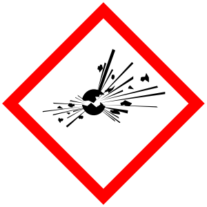
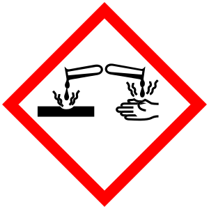
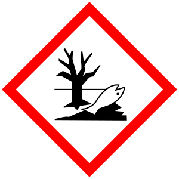

# Recipe Information

## Unity Molecular Formula (UMF)

Silica is a glass former. Alumina modifies a glass. Fluxes reduce
melting temperature. The Unity Molecular Formula (UMF) systematically
relates these chemistries to each other in a useful glaze chemistry
shorthand UMF shows the ratio of glass formers to fluxes and can be used
to predict glaze behavior.

For more information about UMF and the importance of the flux ratio:

  * Linda Arbuckle's [Introduction to Glaze Calculation](http://lindaarbuckle.com/handouts/glaze-calc-intro.pdf)
  * [How Glazes Melt](http://mattanddavesclays.com/Science/Finkelnburg-NCECA%202012-PDF.pdf) by Dave Finkelnburg
  * Digitalfire's [Understanding Glaze Calculation](https://digitalfire.com/4sight/education/understanding_glaze_calculation_an_aid_to_potters_126.html)

## Stull Chart

### Glazy Stull Chart

This chart is a work in progress and will be revised.

## Zooming in the chart

Zooming in on the Stull Chart The chart can be zoomed in by clicking and
dragging a rectangle with your mouse. On mobile devices, just pinch and
zoom into the area you want to zoom. To reset the zoom, click the "Reset
zoom" button in the top-right corner of the graph.

## R2O:RO Ratio

 
_The R2O:RO Ratio Scale shown in the Stull Chart._

## Similar Base Recipes

If two recipes consist of the same base materials (not including
additional materials) in the same amounts (within 1%), then they are
considered similar.
  * Two Leach 4321 glazes (40% Feldspar, 30% Silica, 20% Whiting, 10%
Kaolin) may be similar even if their additional oxides differ. For
instance, Leach White is a 4321 glaze with added Zircopax, while Leach
Celadon is a 4321 glaze with added iron. These two glazes are considered
similar by Glazy.
  * A Leach 4321 glaze recipe with 40% Potash Feldspar is similar to the
same glaze recipe with 40% Custer Feldspar because the materials or
their parent materials are the same.
  * A Leach 4321 glaze recipe with 40% Potash Feldspar is not similar to the
same glaze recipe with 40% Soda Feldspar because the materials (and
their parent materials) are different.
  * A Leach 4321 glaze recipe with 39.5% Feldspar and a Leach 4321 glaze
with 40% Feldspar are considered similar because the material amounts
only vary by %1.

## Similar Unity Formulas

Two recipes are considered to have similar unity formulas if their
oxides do not differ more than .05 For this comparison, K2O and Na2O are
combined (KNaO).

_Note: Recipes that have similar unity formulas do not necessarily exhibit
similar fired characterisitics._

## Exporting Recipes

Recipes can be exported as a Recipe Card- an image containing the recipe
photograph, name, and recipe details.

Recipes can be exported to your favorite glaze calculation software.
Currently, only Insight and GlazeChem are supported, but hopefully more
export formats will be added in the future.

To export a recipe, simply select "Export" from the menu on the recipe page. The
Recipe Card image can be saved on your computer or shared with others
online. The downloaded glaze calculation software text file can be
imported into your program.

## Hazards

_09/2016 Note: This is a new feature. If a recipe material is not
listed, that material's data has not yet been added. Some materials only
have GHS ratings, while others only have HMIS ratings. Warnings differ
between systems and countries. Glazy does not take any responsibility
for accuracy of linked SDS information. Contact your ceramics supplier
for safety information for your specific materials._

You must wear a NIOSH certified mask whenever mixing ceramic materials.
All materials should be handled and fired in well-ventilated areas to
avoid the risk of inhalation.

Lack of a warning does NOT mean that a material is safe.

From hazard warnings alone it is difficult to determine **when** and **how** a
given material may be harmful. Some materials might be relatively safe
to use when making glazes, but toxic when volatized during firing or
leached from a non-durable fired glaze. Other materials might be
relatively safe in a durable fired glaze, but extremely toxic in raw
form in the studio. It is up to the individual to understand the risks
of each material and take necessary precautions.

#### Explosive

  
#### Flammable

#### Oxidizing

#### Compressed Gas

#### Corrosive

#### Toxic

#### Harmful

#### Health Hazard

#### Environmental Hazard

More information about the
<a href="https://en.wikipedia.org/wiki/Hazardous_Materials_Identification_System">Hazardous Materials Identification System (HMIS)</a>,
<a href="https://en.wikipedia.org/wiki/Globally_Harmonized_System_of_Classification_and_Labelling_of_Chemicals">Globally Harmonized System of Classification and Labelling of Chemicals (GHS)</a>
and
<a href="https://en.wikipedia.org/wiki/GHS_hazard_pictograms">GHS pictograms</a>
on Wikipedia.

### Articles on Safety
  * [Ceramic Arts Daily: Respirators for Potters](http://ceramicartsdaily.org/uncategorized/respirators-for-potters/)
  * [Digitalfire: Being Realistic About Toxicity and Safety in Ceramics](https://digitalfire.com/4sight/education/being_realistic_about_toxicity_and_safety_in_ceramics_278.html)
  * [Digitalfire: Ceramic Hazards](https://digitalfire.com/4sight/hazards/index.html)
