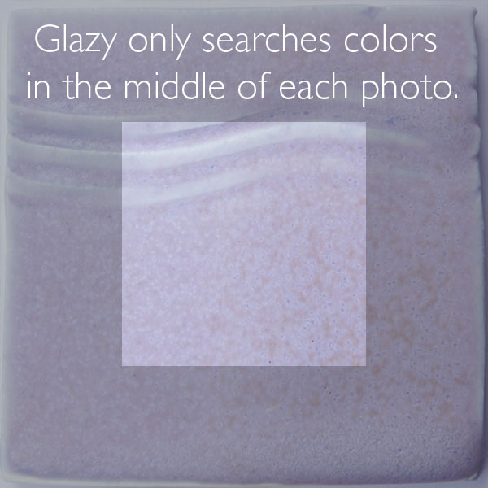
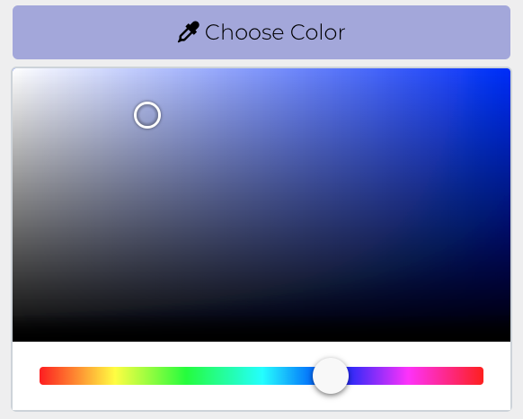
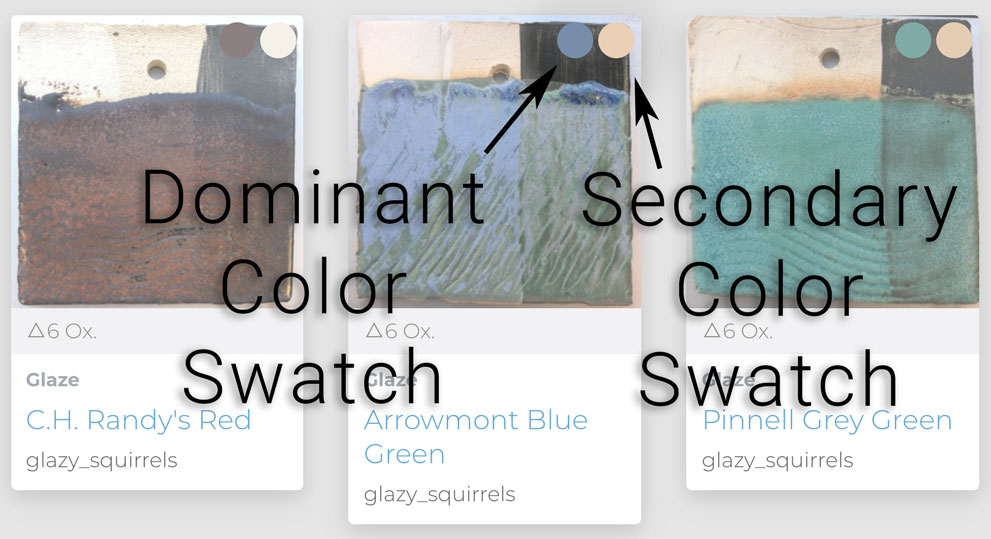

# Searching

Recipe and Material *metadata* consists of all descriptive information such as transparency, surface type, firing temperature, and color.  Because many of the recipes and materials in Glazy were imported from other databases, they may be missing such metadata.  When searching for glazes, it is best to use as few search parameters as possible in order not to "miss" or filter out a recipe or material.

## Tutorial Video

This short video describes how to search for recipes in Glazy:

<iframe width="640" height="360" src="https://www.youtube.com/embed/HAH-7QU-TM8" frameborder="0" allow="accelerometer; autoplay; encrypted-media; gyroscope; picture-in-picture" allowfullscreen></iframe>

## Keyword Search

Search for any recipes, materials or analyses that contain the keywords in *either* the **Name**, **Other Names**, or **Description** fields.

Search is case-insensitive, i.e. searching for *"Hamada"* is the same as searching for *"hamada"*.  Words less than 3 characters long are not searched.

Examples of keyword searches:

 * **"2967"**  
 Because the search term is a number, search for any recipe or material ID's equal to "2967" 
**OR** search for any items that have the string "2967" in the name or description.
 * **"Hamada Rust"**
 Search for the *exact phrase* "Hamada Rust" **OR** any item containing the words beginning with "Hamada" **AND** "Rust"
 * **"Ham Ru"**
 Search for the *exact phrase* "Ham Ru" **OR** any item containing the words beginning with "Ham" **AND** "Ru". This search will return the **Hamada Rust** recipe because it contains **both** the "Ham" and "Ru" strings.
 * **"Ham"**  Search for the *exact phrase* "Ham" **OR** any item containing the words beginning with "Ham".  This search will return items containing the words **"Hamada"**, **"Hamer"**, **"Hammer"**, etc.

## Color Search

### Dominant & Secondary Colors

The dominant color of an image is determined by Glazy during image upload.
In order to be more accurate, only the center of the image is searched for color.
When uploading glaze images, it is best if the center of the image is representative of the true glaze color.

### Searching By Color

To search by color, simply click the eyedropper button in the search form.

The color search looks for similar colors in recipe photos.
The dominant color for a photo is determined automatically by Glazy.
In some cases, the dominant color may be incorrectly determined.

Alternatively, click one of the two color swatches in the search results.

## Categories

Ceramics books use numerous approaches to categorizing glazes, from color (white, black, etc.) to predominant coloring oxide (iron, cobalt, etc.) to firing temperature.

One must be careful when categorizing recipes.  If categories are too specific it becomes more difficult to search,
while very broad categories become less meaningful.

Glazy categorizes clay bodies by type and then usage, for instance: *Porcelain - Slipcasting*

For glazes, Glazy adopts the format of John Britt's
<a href="http://johnbrittpottery.com/shop/the-complete-guide-to-high-fire-glazes-glazing-firing-at-cone-10/">The Complete Guide to High-Fire Glazes, Glazing & Firing at Cone 10</a>
The categories in this book are based on a combination of glaze color, coloring oxide, surface and firing type.

### Top-level categories:

* [Glazes](https://glazy.org/search?base_type=460)
* [Clay Bodies](https://glazy.org/search?base_type=110)
* [Slips and Engobes](https://glazy.org/search?base_type=400)
* [Overglazes](https://glazy.org/search?base_type=440)
* [Underglazes](https://glazy.org/search?base_type=450)
* [Refractory](https://glazy.org/search?base_type=1180)

### Clay Body categories:

* [Earthenware](https://glazy.org/search?base_type=110&type=120)
  * [Throwing](https://glazy.org/search?base_type=110&type=130)
  * [Slipcasting](https://glazy.org/search?base_type=110&type=140)
  * [Sculpture](https://glazy.org/search?base_type=110&type=150)
  * [Hand-building](https://glazy.org/search?base_type=110&type=160)
  * [Salt](https://glazy.org/search?base_type=110&type=170)
  * [Raku](https://glazy.org/search?base_type=110&type=180)
* [Stoneware](https://glazy.org/search?base_type=110&type=190)
  * [Throwing](https://glazy.org/search?base_type=110&type=200)
  * [Slipcasting](https://glazy.org/search?base_type=110&type=210)
  * [Sculpture](https://glazy.org/search?base_type=110&type=220)
  * [Hand-building](https://glazy.org/search?base_type=110&type=230)
  * [Salt](https://glazy.org/search?base_type=110&type=240)
  * [Raku](https://glazy.org/search?base_type=110&type=250)
* [Porcelain](https://glazy.org/search?base_type=110&type=260)
  * [Throwing](https://glazy.org/search?base_type=110&type=270)
  * [Slipcasting](https://glazy.org/search?base_type=110&type=280)
  * [Sculpture](https://glazy.org/search?base_type=110&type=290)
  * [Hand-building](https://glazy.org/search?base_type=110&type=300)
  * [Salt](https://glazy.org/search?base_type=110&type=310)
  * [Raku](https://glazy.org/search?base_type=110&type=320)
* [Flameware](https://glazy.org/search?base_type=110&type=330)
  * [Throwing](https://glazy.org/search?base_type=110&type=340)
  * [Slipcasting](https://glazy.org/search?base_type=110&type=350)
  * [Sculpture](https://glazy.org/search?base_type=110&type=360)
  * [Hand-building](https://glazy.org/search?base_type=110&type=370)
  * [Salt](https://glazy.org/search?base_type=110&type=380)
  * [Raku](https://glazy.org/search?base_type=110&type=390)

### Slips & Engobe categories:
* [Slip](https://glazy.org/search?base_type=400&type=410)
* [Engobe](https://glazy.org/search?base_type=400&type=420)
* [Terra Sigillata](https://glazy.org/search?base_type=400&type=430)

### Glaze Sub-categories

* [Clear](https://glazy.org/search?base_type=460&type=470)
* [White, Off-White](https://glazy.org/search?base_type=460&type=480)
* [Iron](https://glazy.org/search?base_type=460&type=490)
  * [Celadon](https://glazy.org/search?base_type=460&type=500)
    * [Blue](https://glazy.org/search?base_type=460&type=510)
    * [Green](https://glazy.org/search?base_type=460&type=520)
    * [Yellow](https://glazy.org/search?base_type=460&type=530)
    * [Chun](https://glazy.org/search?base_type=460&type=533)
  * [Amber](https://glazy.org/search?base_type=460&type=535)
  * [Tenmoku](https://glazy.org/search?base_type=460&type=540)
  * [Tea Dust](https://glazy.org/search?base_type=460&type=550)
  * [Hare's Fur](https://glazy.org/search?base_type=460&type=560)
  * [Kaki, Tomato Red](https://glazy.org/search?base_type=460&type=570)
  * [Oil Spot](https://glazy.org/search?base_type=460&type=580)
  * [Slip-Based](https://glazy.org/search?base_type=460&type=585)
* [Shino](https://glazy.org/search?base_type=460&type=590)
  * [Traditional](https://glazy.org/search?base_type=460&type=600)
  * [Carbon Trap](https://glazy.org/search?base_type=460&type=610)
  * [High-Alumina](https://glazy.org/search?base_type=460&type=620)
  * [White](https://glazy.org/search?base_type=460&type=630)
* [Red](https://glazy.org/search?base_type=460&type=635)
  * [Copper](https://glazy.org/search?base_type=460&type=640)
    * [Oxblood](https://glazy.org/search?base_type=460&type=650)
    * [Flambe](https://glazy.org/search?base_type=460&type=660)
    * [Peach Bloom](https://glazy.org/search?base_type=460&type=670)
  * [Pink](https://glazy.org/search?base_type=460&type=673)
  * [Stain](https://glazy.org/search?base_type=460&type=675)
* [Green](https://glazy.org/search?base_type=460&type=680)
  * [Copper](https://glazy.org/search?base_type=460&type=690)
  * [Oribe](https://glazy.org/search?base_type=460&type=700)
  * [Chrome](https://glazy.org/search?base_type=460&type=710)
  * [Titanium](https://glazy.org/search?base_type=460&type=720)
  * [Nickel](https://glazy.org/search?base_type=460&type=730)
  * [Stain](https://glazy.org/search?base_type=460&type=740)
* [Turquoise](https://glazy.org/search?base_type=460&type=745)
* [Blue](https://glazy.org/search?base_type=460&type=750)
  * [Cobalt](https://glazy.org/search?base_type=460&type=760)
  * [Rutile](https://glazy.org/search?base_type=460&type=770)
  * [Barium](https://glazy.org/search?base_type=460&type=780)
  * [Strontium](https://glazy.org/search?base_type=460&type=790)
  * [Nickel](https://glazy.org/search?base_type=460&type=800)
  * [Stain](https://glazy.org/search?base_type=460&type=810)
* [Purple](https://glazy.org/search?base_type=460&type=820)
  * [Magnesium](https://glazy.org/search?base_type=460&type=830)
  * [Nickel](https://glazy.org/search?base_type=460&type=840)
  * [Manganese](https://glazy.org/search?base_type=460&type=850)
* [Matte](https://glazy.org/search?base_type=460&type=860)
  * [Magnesium Matte](https://glazy.org/search?base_type=460&type=870)
* [Black](https://glazy.org/search?base_type=460&type=880)
  * [Slip-Based](https://glazy.org/search?base_type=460&type=890)
  * [Glossy](https://glazy.org/search?base_type=460&type=900)
  * [Satin](https://glazy.org/search?base_type=460&type=910)
* [Yellow](https://glazy.org/search?base_type=460&type=920)
  * [Iron](https://glazy.org/search?base_type=460&type=930)
  * [Barium](https://glazy.org/search?base_type=460&type=940)
  * [Manganese](https://glazy.org/search?base_type=460&type=950)
  * [Stain](https://glazy.org/search?base_type=460&type=960)
  * [Nickel](https://glazy.org/search?base_type=460&type=970)
* [Crystalline](https://glazy.org/search?base_type=460&type=980)
  * [Micro](https://glazy.org/search?base_type=460&type=990)
  * [Aventurine](https://glazy.org/search?base_type=460&type=1000)
  * [Manganese](https://glazy.org/search?base_type=460&type=1010)
  * [Macro](https://glazy.org/search?base_type=460&type=1020)
* [Single-Fire](https://glazy.org/search?base_type=460&type=1030)
* [Wood](https://glazy.org/search?base_type=460&type=1040)
* [Salt & Soda](https://glazy.org/search?base_type=460&type=1050)
* [Raku](https://glazy.org/search?base_type=460&type=1055)
* [Ash](https://glazy.org/search?base_type=460&type=1060)
  * [Nuka](https://glazy.org/search?base_type=460&type=1070)
  * [Synthetic/Fake](https://glazy.org/search?base_type=460&type=1080)
  * [Slip-Based](https://glazy.org/search?base_type=460&type=1090)
* [Majolica](https://glazy.org/search?base_type=460&type=1100)
* [Specialty](https://glazy.org/search?base_type=460&type=1130)
  * [Crackle](https://glazy.org/search?base_type=460&type=1140)
  * [Crawling](https://glazy.org/search?base_type=460&type=1150)
  * [Crater](https://glazy.org/search?base_type=460&type=1160)
  * [Metallic](https://glazy.org/search?base_type=460&type=1170)

## Temperature & Cones

<a href="{!! URL::route('content.help.cones') !!}">Temperature Equivalent Charts for Orton Cones</a>

Glazes are categorized by their Orton Cone firing temperature.

This is the ideal temperature at which the glaze recipe will mature.

In Glazy, Orton Cone is denoted by the △ character, e.g. △10.

Glazes may be recommended for a single Orton Cone or a range of cones,
for instance many high-fire glazes are listed as △9 - △10.

The terms "high-fire", "mid-fire" and "low-fire" are helpful categories that ceramicists use
to denote a firing temperature range.  The definition of these categories may vary.

In Glazy, the firing ranges are:
* **Low-fire: △022 - △3**
* **Mid-fire: △4 - △8**
* **High-fire: △9 - △14**
