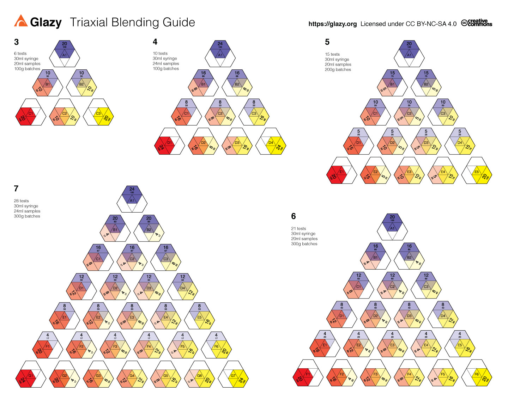
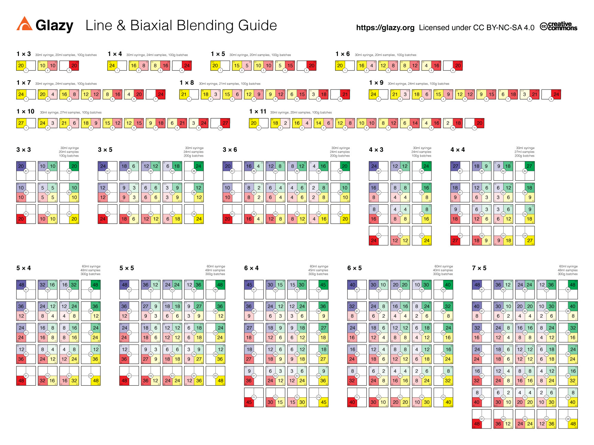

# Blending Guides

These Volumetric Blending Guides in PDF format can be downloaded and viewed on a device or printed and displayed on the wall of your glaze lab.

## How to Use these Guides

<iframe width="640" height="360" src="https://www.youtube.com/embed/Y_hxultE-cQ" frameborder="0" allow="accelerometer; autoplay; encrypted-media; gyroscope; picture-in-picture" allowfullscreen></iframe>

## Print or Download a Poster

High-quality posters are available for purchase on Glazy's Etsy shop:  [https://www.etsy.com/shop/glazyorg](https://www.etsy.com/shop/glazyorg)

Alternatively, you can download the PDF's below and either print them yourself or save them on your phone for handy reference.

## Triaxial Blending Guide

[Download the Triaxial Blending Guide (PDF, 16"x20" or A2 size)](/downloads/blending-guides/TriaxialBlendAmounts30ml_v2_COLOR_16x20_final_2020.pdf)

## Biaxial Blending Guide

[Download the Biaxial Blending Guide (PDF, 18"x24" or A1/A2 size)](/downloads/blending-guides/BiaxialBlendAmounts30ml_v2_COLOR_Percent_18x24_2020.pdf)
