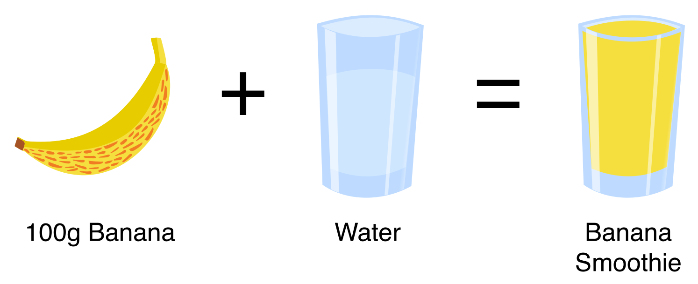
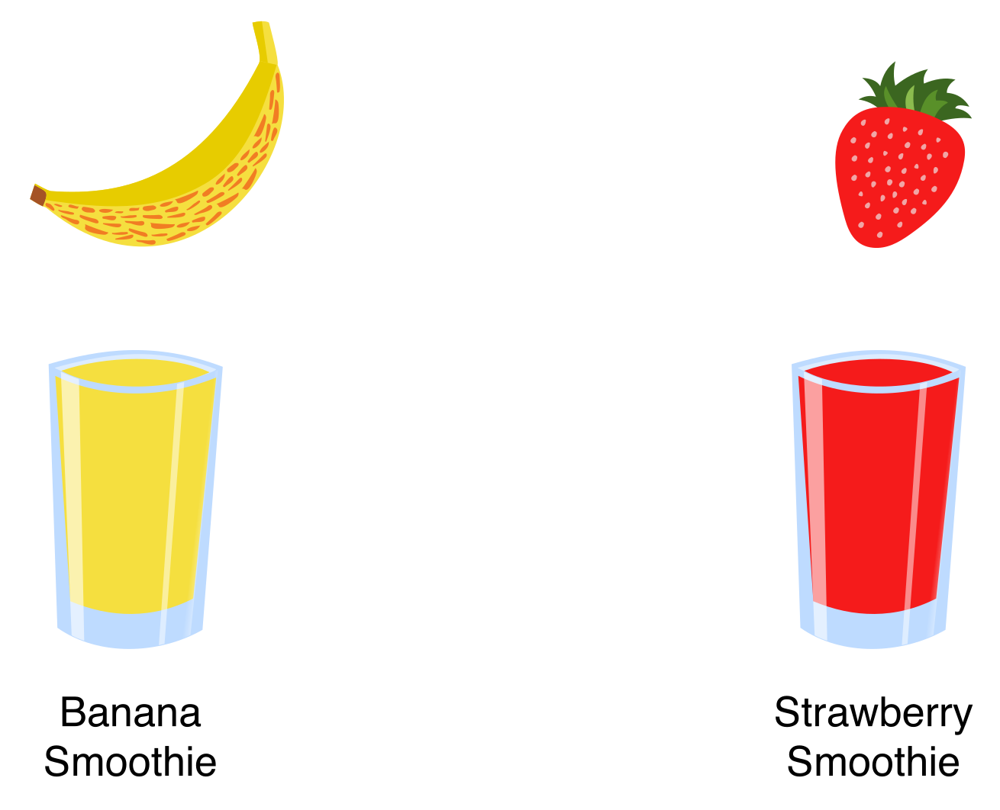
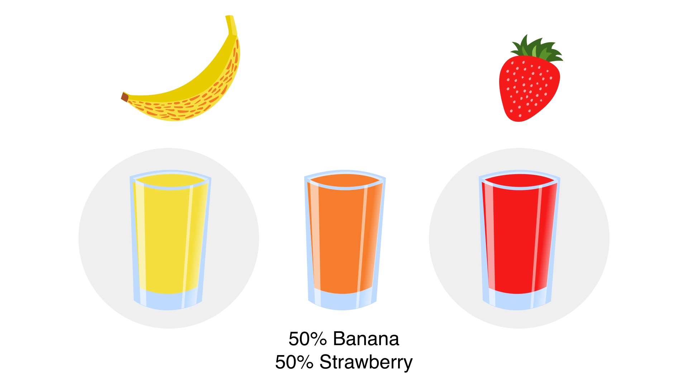
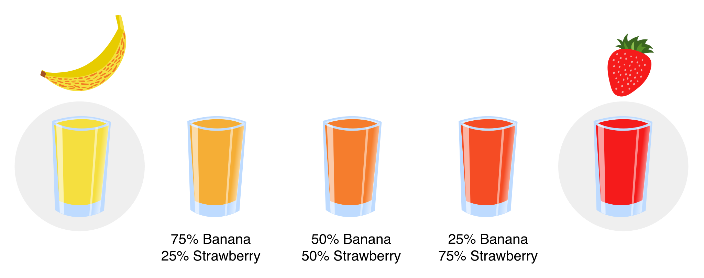
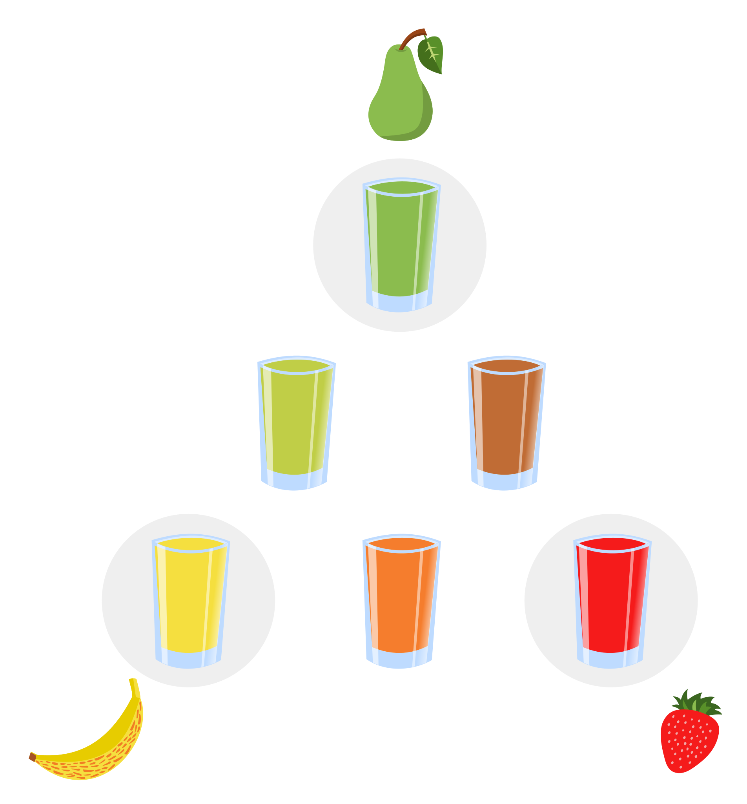
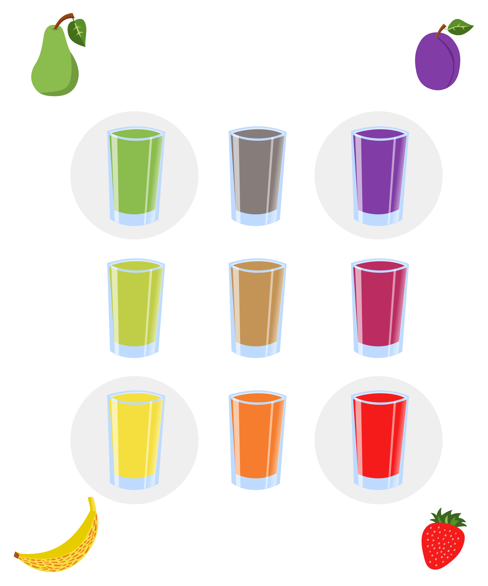
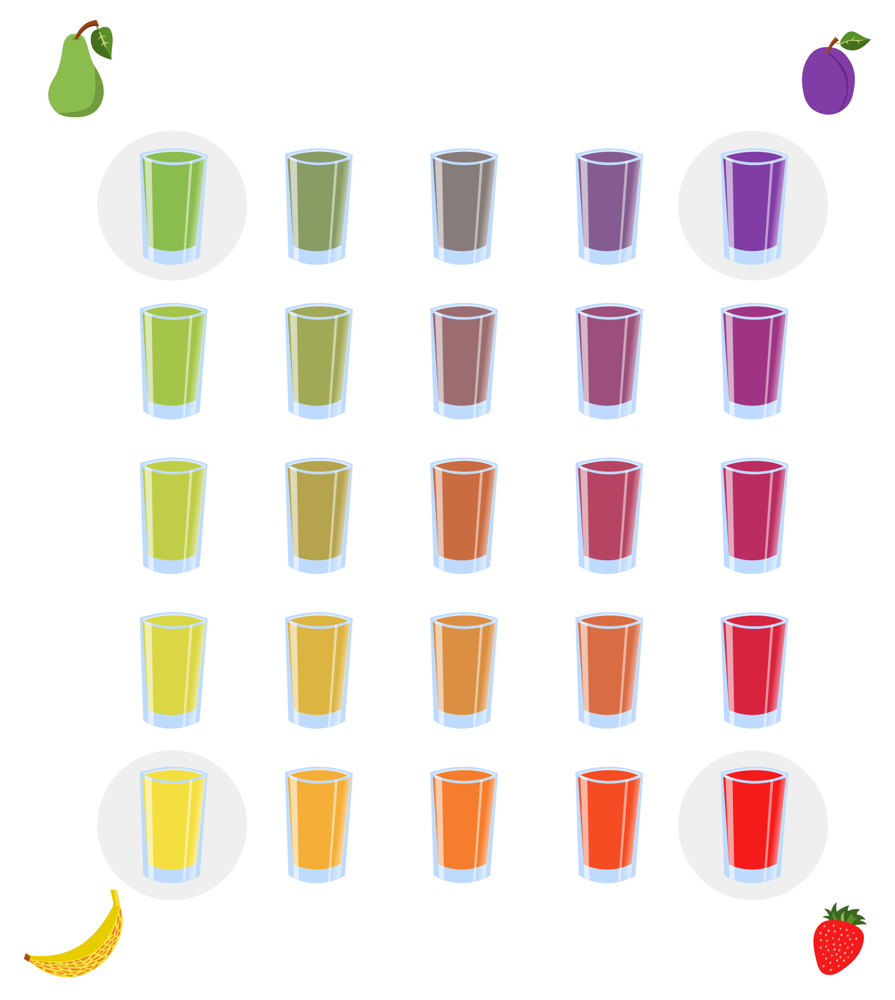
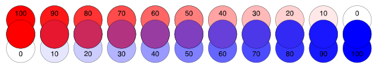
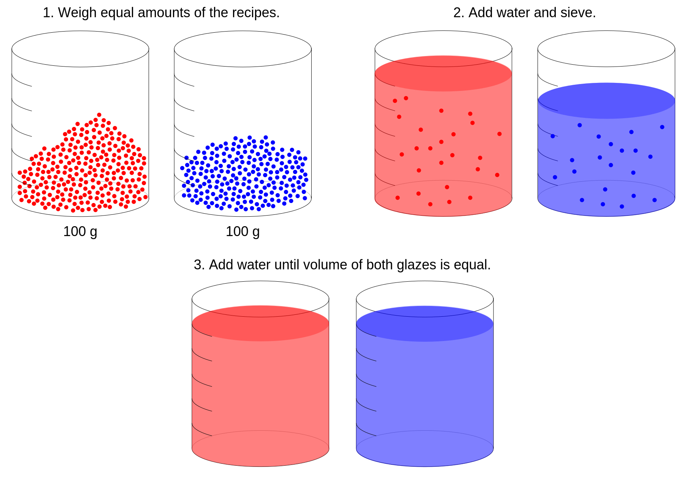
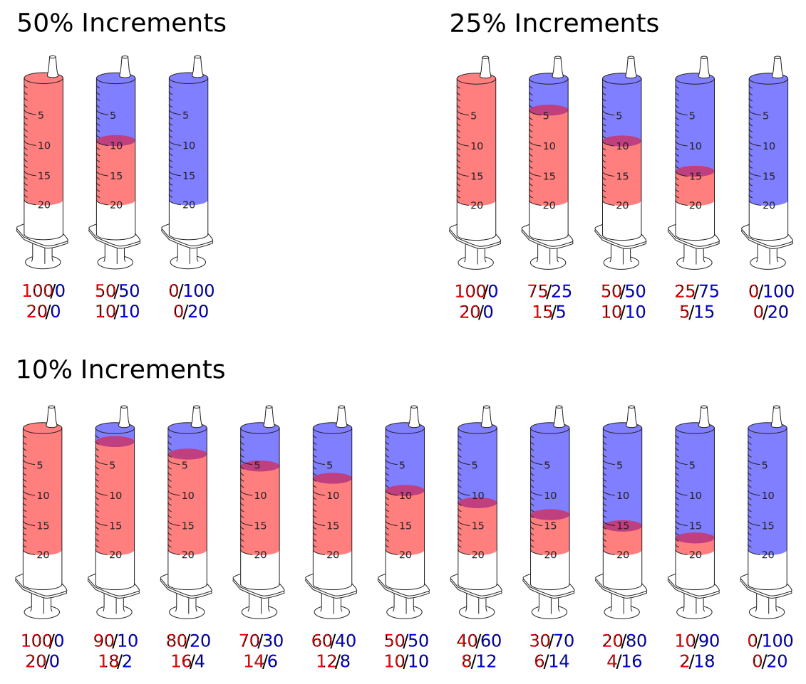

# Blend Testing

## Blending Basics

<iframe width="640" height="360" src="https://www.youtube.com/embed/ftqlsnvXTAU" frameborder="0" allow="accelerometer; autoplay; encrypted-media; gyroscope; picture-in-picture" allowfullscreen></iframe>

"Volumetric Blending" sounds fancy, but it's actually a very simple concept that can be applied to any type of recipe or ingredient.

For example, say we have a recipe for a Smoothie:  100g of fruit plus water:

We can use any type of fruit to make a smoothie, like bananas and strawberries:

Once we have two smoothies, we can blend equal volumes of each to create a combination,
in this case Strawberry & Banana.  This is known as a <em>Line Blend</em>.

We can expand the <em>Line Blend</em> to have as many steps as we like.

A line blend only allows us to mix two recipes.  We can mix three recipes by using a <em>triaxial</em>.
In the following triaxial we test blends of banana, strawberry, and pear smoothies:

The edges of a triaxial are simply line blends.
For more interesting results, we can expand the triaxial.  
In an expanded triaxial, the inner tests blend all three recipes.
In the following triaxial, the inner three tests blend banana, strawberry, and pear smoothies:

We can blend four different recipes in a <em>biaxial</em>.  In the following biaxial we blend banana, strawberry, pear, and plum smoothies.  Note that the inner test is a blend of all four smoothies:

As with the enlarged triaxial, we can test blends of all four recipes by enlarging the biaxial.  In this example, we only need to mix four smoothies (the corners) in order to create twenty-five varieties of smoothies:

## Blends in Ceramics

## Line Blends

<iframe width="640" height="360" src="https://www.youtube.com/embed/Fv6hFPpLooA" frameborder="0" allow="accelerometer; autoplay; encrypted-media; gyroscope; picture-in-picture" allowfullscreen></iframe>

Line blends are a useful tool for comparing two different 
recipes. Often, the two recipes are different glazes. For 
instance, you can blend two different celadon glazes in 
different proportions to create a new celadon recipe. Line 
blends are also commonly used for testing additions of 
coloring oxides, for instance the effect of incrementally 
adding iron oxide to a clear glaze.

The range of the line blend is arbitrary- you can start 
each variable from 0% and go up to 100% or you could choose 
any range in-between.

To illustrate a line blend, here is a sample using two RGB 
colors blending by opacity. If you already know the result 
of the outlying 100% blends, you could remove them from the 
test. However, each firing is different and it's usually 
good to test the 100% blends regardless.

You could mix each test in a line blend individually, but 
a much less time-consuming method is to only make the left 
and right-most solutions. Using a syringe, you can easily 
create each mixed blend.

## Volumetric Blending

Ian Currie popularized volumetric blending. 
([See his article here.](http://ian.currie.to/original/line_blend.htm))

First, mix the same weight of each glaze you will be 
blending. Second, add some water to the glazes and sieve 
thoroughly. Third, add water to each glaze so that their 
volumes are equal. Now the two glazes are ready for 
blending.

## Volumetric Blending in a Syringe

Below is an illustration of the blends in a 20ml syringe. 
If your test tiles are relatively small (7cm square) and 
flat, 20ml of solution should be enough for two coats of 
dipped glaze.

As you can see, for 10% increments using a 20ml syringe we 
need at least 20+18+16+14+12+10+8+6+4+2 = 110ml of each 100% 
recipe. Preparing 100 grams of glaze material for each glaze 
should be sufficient.

Each time before you take glaze into the syringe, be sure to 
re-mix the glaze and confirm it has not settled.

## Line Blend Example

As a real-world example, let's add red iron oxide the a 
reduction-fired clear glaze Leach 4321. We will create a line 
blend from 0% to 10% additional Red Iron Oxide in 1% increments. 
This is sufficient to see the gradual transition from clear to 
blue-green celadon (0.5-1%), light green celadon (2%), dark 
green celadon (3-4%), amber (5-6%), and tenmoku (7-10%).

First, two glaze batches of 100g are prepared. The first is just 
Leach 4321, while the second is Leach 4321 + 10% Red Iron Oxide.

Second, a syringe is used to mix the two glazes in increments. 
By using a 30ml syringe there is extra room in the syringe for 
drawing in air, making it easier to mix the glazes.

On the back of each test tile is written the glaze information. 
The test tile is dipped once in the glaze and then dipped again 
at an angle in order to cover half of the tile. The final line 
blend tests show a nice progression from 0% to 10% red iron 
oxide.

Here is the line blend after firing to Orton cone 10 in a 
reduction atmosphere. The tests reveal a range of interesting 
glazes.

The results of these tests can be viewed in Glazy:

  * [Leach 4321](https://glazy.org/recipes/2878)
  * [Leach 4321 + 1% Red Iron Oxide](https://glazy.org/recipes/3262)
  * [Leach 4321 + 2% Red Iron Oxide](https://glazy.org/recipes/3263)
  * [Leach 4321 + 3% Red Iron Oxide](https://glazy.org/recipes/3264)
  * [Leach 4321 + 4% Red Iron Oxide](https://glazy.org/recipes/3265)
  * [Leach 4321 + 5% Red Iron Oxide](https://glazy.org/recipes/3266)
  * [Leach 4321 + 6% Red Iron Oxide](https://glazy.org/recipes/3267)
  * [Leach 4321 + 7% Red Iron Oxide](https://glazy.org/recipes/3268)
  * [Leach 4321 + 8% Red Iron Oxide](https://glazy.org/recipes/3269)
  * [Leach 4321 + 9% Red Iron Oxide](https://glazy.org/recipes/3270)
  * [Leach 4321 + 10% Red Iron Oxide](https://glazy.org/recipes/3271)

Care should be taken when specifying the parameters of a line blend. 
For example, here is the result of a similar line blend created with 
Leach 4321 and cobalt oxide added.

As you can see, at 1% cobalt oxide the glaze is already a deep blue. 
Cobalt is a very strong oxide! It would have been more interesting 
to add cobalt in just 0.1% increments.

As you can see, at +0.1% cobalt oxide, the glaze color is already 
greatly affected. This test also highlights the need for sensitive, 
accurate scales when dealing with small batches of glaze.