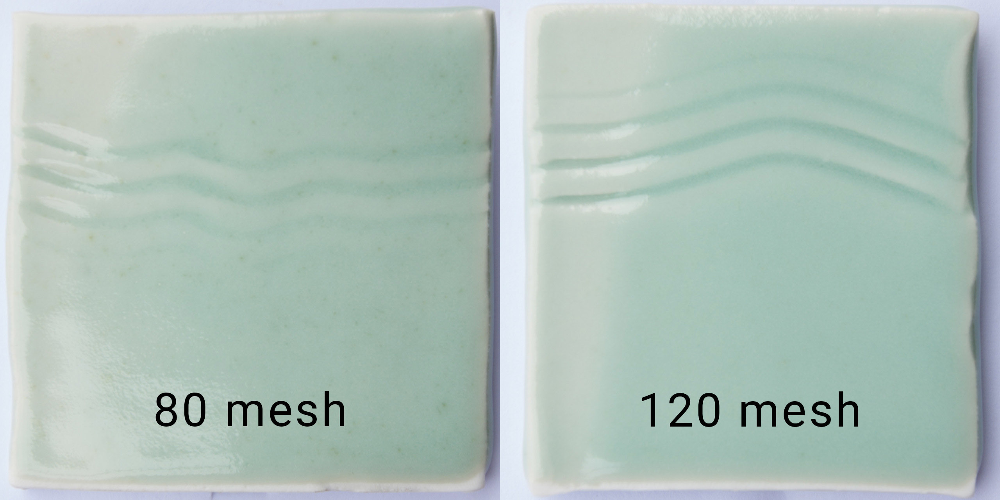

# Mixing Test Recipes

## Tutorial Videos

### Mixing Test Batches

How to mix a test batch using the Glazy batch calculator.

<iframe width="640" height="360" src="https://www.youtube.com/embed/srSQMO5sYWo" frameborder="0" allow="accelerometer; autoplay; encrypted-media; gyroscope; picture-in-picture" allowfullscreen></iframe>

### Mixing & Sieving Batches

Once you've made up a batch, how can you mix and prepare it for application?

<iframe width="640" height="360" src="https://www.youtube.com/embed/60s5uVsX0NI" frameborder="0" allow="accelerometer; autoplay; encrypted-media; gyroscope; picture-in-picture" allowfullscreen></iframe>

### Applying Glaze to Test Tiles

Now that you've mixed and/or sieved your batch, you're ready to apply the glaze to test tiles.

<iframe width="640" height="360" src="https://www.youtube.com/embed/63h5fviaxfA" frameborder="0" allow="accelerometer; autoplay; encrypted-media; gyroscope; picture-in-picture" allowfullscreen></iframe>

## Batch Sizes

Glazes “don’t travel well”, in other words materials, 
application, and firings vary from studio to studio. 
Even for well-known glazes, it’s important to first 
make a few small tests. For these tests, use 50g or 
100g of material and apply the test glaze to a number 
of different clay bodies. If a test comes out well, 
mix a larger batch of 1-2Kg. 1Kg is enough material 
to glaze small cups, 2Kg is a good amount for small 
bowls. These larger tests should reveal any problems 
with glaze suspension, application (cracking, peeling, 
etc.), and fired glaze defects. Once you have some 
nice results with 1Kg, you can finally move on to a 
big bucket of 5-10Kg.

## Batch Calculator

The batch calculator simply multiplies each 
ingredient amount. It is unit-independent. In the
example shown, it does not matter if we are making 
2000 grams, kilograms, pounds or even tonnes of glaze.

Note that additive materials such as coloring oxides 
are calculated in addition to the batch amount.

In the example below, the _base recipe_ is calculated 
to 1000 units (grams, pounds, whatever), while the 
_additional materials_ (Tin Oxide and Yellow Iron Oxide)
are added on top of 1000.

## Sieves

For “natural” glazes containing large-grained materials 
or ashes, or in cases where homogeneity is not a concern, 
it’s fine to use a larger screen of 60-80 mesh. But in 
all other cases it's good to use 120 mesh or smaller. 
Small mesh size is very important for glazes that contain 
small amounts of very important materials such as coloring 
oxides (e.g. cobalt and iron). But it’s also important to 
ensure that materials are adequately broken up and mixed 
(such as clays).

Below you can see two tests of the same batch of glaze 
fired in the same kiln. The first test was applied after 
passing the materials three times through an 80 mesh 
screen. The second test is the result of passing that 
same glaze once more through a 120 mesh screen.

## Scales

Weight measuring scales come in a wide range of types 
and prices. Purchasing a scale is a trade-off between 
cost, resolution and capacity. In general, scales that 
can weigh larger amounts of materials have lower 
resolution (e.g. 1 gram), while scales that have 
higher resolution (e.g. 0.01 grams) can only weigh 
small amounts.

For weighing small amounts of glaze materials (for 
example, 50 and 100 gram test batches), it is very 
important to use a scale that has a readability to 
at least 0.1 grams. (Some glaze materials such as 
cobalt are very strong, and a difference of even 
0.1 grams in a 100 gram batch will have a noticeable 
impact.) Ideally, your test scale will have a capacity 
of over 100 grams and readability of 0.01 grams.

Note: Just because a scale has a high resolution (e.g. 
0.01 grams) does not mean it has high accuracy. Price 
is usually a good indication of accuracy, so it's best 
to get the most expensive scale that you can reasonably
afford.

The Ohaus Scout Pro SP4001 and SP202 digital scales 
during calibration. It is important to periodically 
calibrate your scales using accurate calibration 
weights.

## Using a Beam Scale

For those on a budget, perhaps the most affordable solution for 
precise weighing of glaze materials is a _triple beam scale_.

1.  Select a container to hold glaze materials and weigh it on the scale.
In the example below, the container weighs 63 grams:

2. On the Glazy recipe page, enter the **Tare Weight**:

3. Enter the **Batch Size**.  The batch size is _unit independent_.
In the below example, we could be measuring 400 grams, 400 pounds, 
or even 400 tons of recipe material.  But in this case, we are using grams.
Notice that the final subtotal equals **463**, which is the _Tare Weight_ 
(weight of the container) plus the _Batch Size_.

4.  After measuring out the first ingredient, **EPK**, our scale should
show **251** (63 grams container weight plus 188 grams of EPK):

5.  After measuring out all of the ingredients for this batch, 
the scale should read **463** (63 gram container plus 400 gram batch):

## Mixing Test Glazes

It’s important to wear a well-fitting, NIOSH certified 
mask whenever mixing ceramic materials. All materials 
should be handled in well-ventilated area to avoid the 
risk of inhalation. For more information about the 
hazards of mixing ceramic materials, see the article 
[Studio Dust by Mark Goldberg](http://markgoldbergpottery.com/goldberg_studiodust-final.pdf).

For test glazes, try to find re-useable containers that 
fit your seives like these plastic restaurant soup bowls 
with lids. Glaze name & recipe can be written on the 
container with permanent marker.

Carefully measure out each ingredient into the bowl, 
placing into separate piles so that any extra material 
can be easily removed. The measurement displayed on the 
scale should match the "Subtotal" column in the Glazy 
Batch Calculator.

Dry mix the ingredients with a spoon until well dispersed.

For 100 grams of material, add about 50-60ml of water 
(less if your glaze has little or no clay).

Wait a few minutes until the water has thoroughly soaked 
the materials, then stir. Glaze should be fairly thick, 
do not add too much water as you will be adding more as 
you go along.

Use a fairly stiff rib to scrape the glaze through the 
sieve.

The first pass takes the most work as the clays are broken 
apart.

Try not to lose any material, especially if preparing for 
volumetric blending. Use a water sprayer to clean the 
container, spoon, and sieve after each pass. But don't 
add too much water.

Pass the glaze through the sieve two or three times. After 
the final pass, the glaze should be creamy without any 
large grains or lumps.

Now you can slowly mix in water and dip your test tiles. 
Flat test tiles require the least amount of glaze.

Test tiles can be dipped multiple times in order to see the 
result of glaze thickness. It is best to double-dip the side 
of a test tile rather than the top so that the two different 
glaze thicknesses do not run into one another.

Record as much information as you can on each test tile. 
On this tile, the type of clay has been stamped, while glaze 
information was written with an underglaze pencil. After 
firing, a permanent marker was used to record the firing 
date and actual cone reached.

