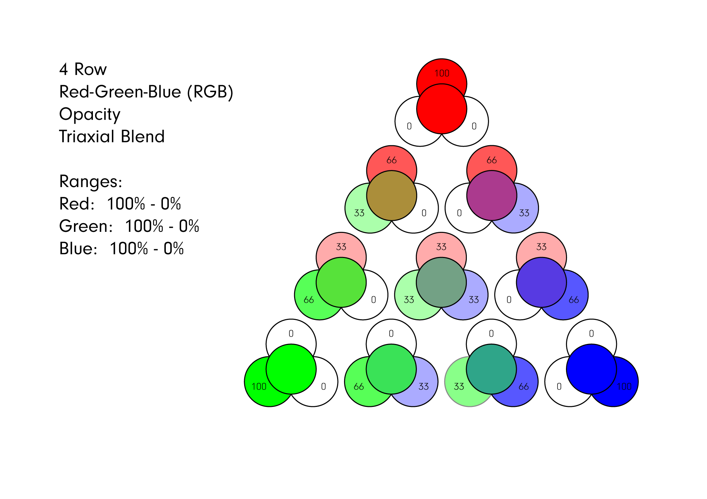
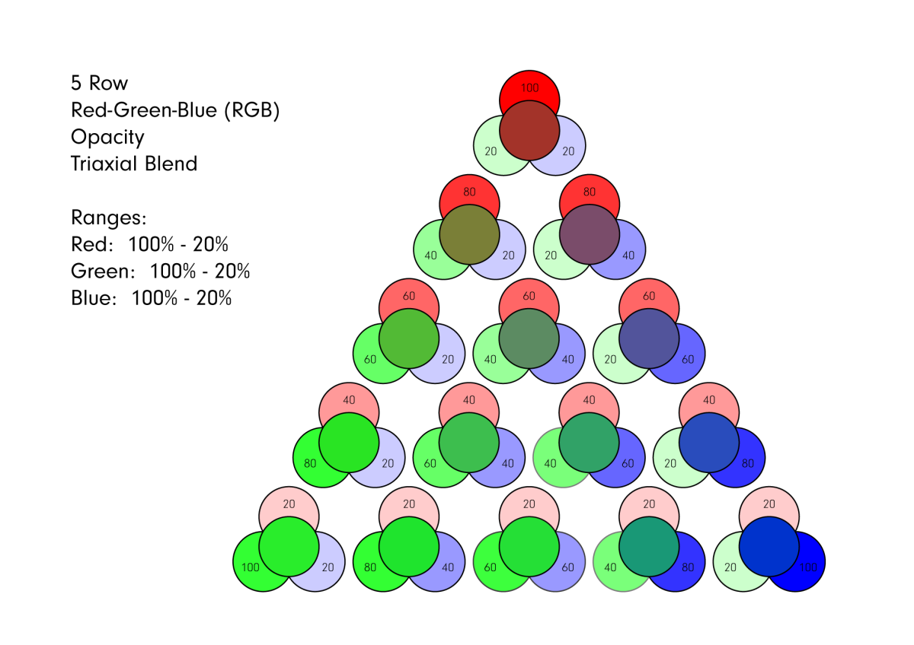
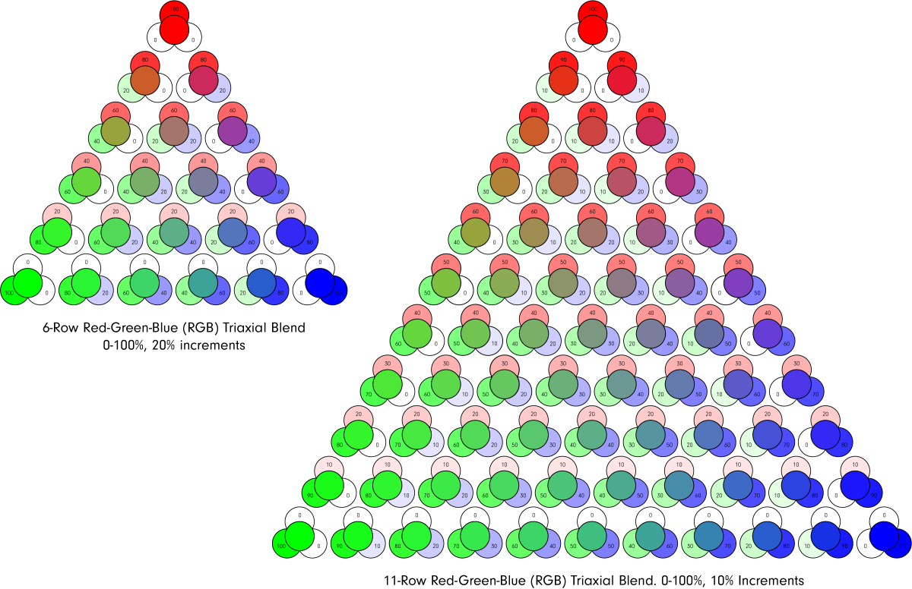

# Triaxial Blends

Triaxial blends are similar to line blends, but blend three recipes instead of just two.

Ceramics recipes are a complex interaction of multiple variables.  Triaxial blends involve three variables, making them more useful for exploring ceramic glazes and bodies.

Below is a four-row opacity triaxial blend of three colors (red, green, and blue) in RGB with a range of 0%-100% for each color. The outer edges of the blend are simply line blends of two colors, while the middle area of the blend contains mixes of all three variables.

The size, variables, and ranges of a triaxial are completely up to you.  A four-row triaxial with ranges starting at 0% is of limited use in testing mixes of all three variables.  You could adjust the four-row triaxial for ranges of 20%-80% so that each test includes at least some percentage of each variable.  Or, you could move up to a five-row triaxial for even more results.

Below is a five-row opacity triaxial blend of three colors (red, green, and blue) in RGB with a range of 20%-100% for each color. Because the range starts at 20%, each test includes all three variables.  If you instead wanted the outer blends to represent line blends, the ranges would start at 0%.

Moving up to six and eleven-row triaxials you will notice that the number of tests we are creating is growing very quickly.  Because the range is from 0%-100%, the outer edges of the triaxial represent simple two-variable line blends.

