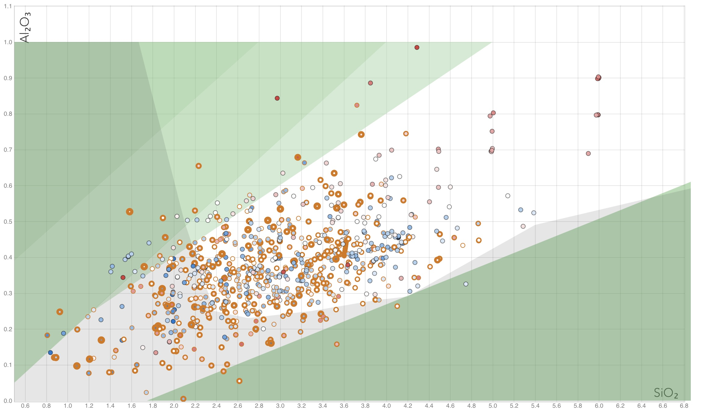
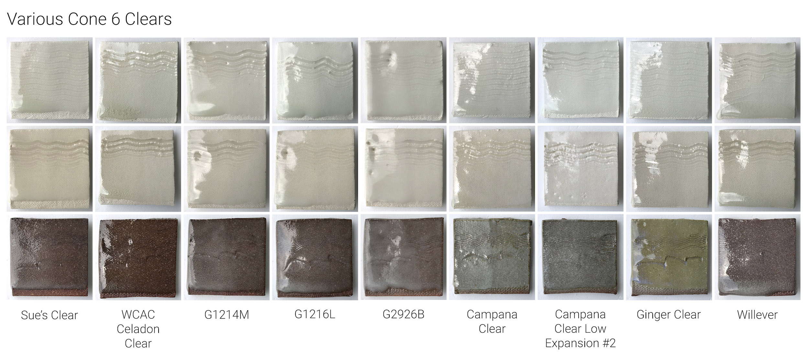

# Clear Glazes

Clear glazes are a type of "Base Glaze".  They don't have any colorants or opacifiers.
They are usually Glossy, but can also have a Satin finish.
Clear glazes are located in the middle "Bright" region of the Stull Chart.
When too much Alumina or Silica is added to a Clear glaze, then it often changes to a Matte Glaze.

In the Silica:Alumina Stull Chart above, you can see that most Clear glazes fall within the middle "Bright" region.

## Low-Fire

Unfortunately, there aren't many Clear low-fire recipes in Glazy.

[Search for Low-Fire Clear Glazes](https://glazy.org/search?base_type=460&type=470&cone=low)

## Mid-Fire

As opposed to low-fire, there are a large number of Mid-Fire Clear glazes in Glazy.  So many, in fact, that it can be difficult to decide which one to test.  One factor to consider is your clay body.  Some Clear glazes will look good on a porcelain clay body, but appear cloudy on darker stoneware clays.

Some of the glazes in this comparison image are:

* [G1214M Transparent for Cone 6 Porcelains](https://glazy.org/recipes/20546)
* [G1216L Transparent for Cone 6 Porcelains](https://glazy.org/recipes/20546)
* [Campana Clear](https://glazy.org/recipes/11007)
* [Ginger Clear](https://glazy.org/recipes/16313)

### High-boron clear

[High-boron Clear](https://glazy.org/recipes/80968)
[WCAC Clear Celadon](https://glazy.org/recipes/20547)

### Bristol Clear
